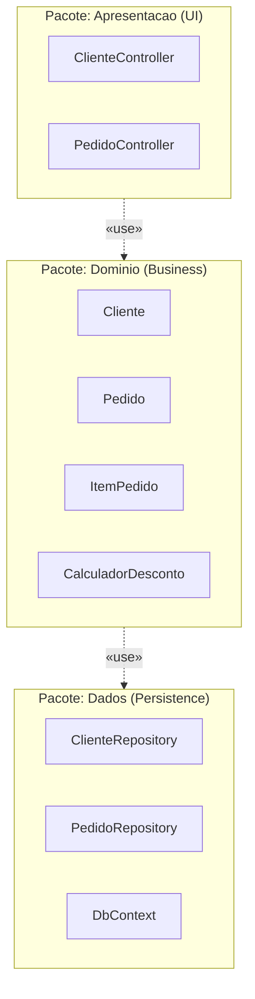

# Modelagem estrutural e modularização com diagrama de pacotes da uml

> **Contexto:** Guia completo sobre o Diagrama de Pacotes da UML, detalhando o conceito de modularização, notação gráfica de pacotes e dependências, e os critérios fundamentais para agrupamento de classes em arquitetura de software.

---

## 1. Intuição e conceito em linguagem simples

Imagine um grande arquivo físico de um escritório de advocacia. Se os advogados jogarem milhares de folhas soltas e contratos dentro de uma única gaveta gigante, encontrar qualquer documento será um pesadelo demorado e caótico. Para resolver isso, eles organizam os papéis dentro de **pastas etiquetadas por categoria** (ex.: "Contratos Trabalhistas", "Processos Cíveis", "Documentos Fiscais").

Na Engenharia de Software acontece exatamente o mesmo. Em sistemas corporativos reais, um [[07. Engenharia de Requisitos/09. Modelagem estrutural com diagrama de classes da uml.md|Diagrama de Classes]] pode conter centenas de classes. Exibir todas elas em uma única tela gera uma "poluição visual" conhecida como "diagrama em teia de aranha" (*spaghetti diagram*), tornando a arquitetura incompreensível.

Para solucionar essa complexidade, a UML fornece o **Diagrama de Pacotes**. 

O Diagrama de Pacotes é um diagrama estrutural usado para **modularizar e organizar** elementos de modelagem (classes, interfaces, casos de uso) dentro de agrupadores lógicos chamados **Pacotes** (*Packages* / *Namespaces*), simplificando a visão arquitetural de alto nível.

---

## 2. Anatomia gráfica e elementos do diagrama de pacotes

### 2.1 Representação de um pacote
Graficamente, um pacote é desenhado como uma **pasta com uma aba no canto superior esquerdo** (*tabbed folder*):

```

 NomeDoPacote

 
 + ClassePublica 
 - ClassePrivada 
 «interface» 
 + IRepositorio 
 

```

* **Aba Superior:** Contém o nome do pacote ou o caminho completo do *namespace* (ex.: `Puc.Projeto.Dominio`).
* **Corpo do Pacote:** Pode exibir os elementos contidos (classes e interfaces) ou permanecer fechado em visões resumidas de alto nível.

---

### 2.2 Relacionamentos e diagrama de pacotes em Mermaid

Os pacotes se conectam por meio de relacionamentos de **Dependência** (linhas pontilhadas com seta simples), que indicam que os elementos de um pacote necessitam de tipos exportados por outro pacote para funcionar.



#### Estereótipos comuns de dependência entre pacotes:
* `«use»` / `«import»`: Indica que o pacote de origem consome membros públicos exportados pelo pacote de destino.
* `«access»`: Permite acesso privado/interno entre pacotes relacionados de uma mesma camada.
* `«merge»`: Funde o conteúdo de dois pacotes conceitualmente.

---


## 3. Critérios fundamentais para agrupar classes em pacotes

Como decidir quais classes devem ficar juntas na mesma pasta? A Engenharia de Software estabelece critérios arquiteturais claros baseados no equilíbrio entre **Alta Coesão** (elementos relacionados juntos) e **Baixo Acoplamento** (poucas dependências entre pacotes diferentes).

```

 Critérios de Agrupamento de Classes em Pacotes 

 1. Agrupamento por Camadas Arquiteturais (Layering) 
 2. Agrupamento por Domínio de Negócio / Funcionalidade (Feature-Based) 
 3. Agrupamento pelos Princípios de Coesão de Pacotes (Uncle Bob / Martin)

```

---

### Critério 1: Agrupamento por camadas arquiteturais (*Layering*)

Divisão técnica baseada nas responsabilidades dos componentes na arquitetura em camadas do software (ex.: modelo MVC ou arquitetura em 3 camadas):

1. **Pacote de Apresentação / Interface (`Apresentacao` / `Controllers`):**
 * Agrupa telas, formulários, *views* e *controllers* responsáveis por interagir com o usuário final.
2. **Pacote de Domínio / Negócio (`Dominio` / `BusinessLogic`):**
 * Agrupa as entidades do sistema (`Cliente`, `Pedido`, `Produto`), regras de validação e serviços de negócio pura.
3. **Pacote de Acesso a Dados / Persistência (`Dados` / `Persistence` / `Repository`):**
 * Agrupa classes de repositório, mapeadores O/RM (Entity Framework), DAOs e contextos de banco de dados.

* **Vantagem:** Separação clara de responsabilidades técnicas.

---

### Critério 2: Agrupamento por domínio funcional (*Domain / Feature-Based*)

Divisão de negócio onde as classes são agrupadas de acordo com o **módulo funcional** ao qual pertencem no sistema (alinhado aos conceitos de *Bounded Contexts* do *Domain-Driven Design*):

* **Pacote `Vendas`:** Agrupa `Pedido`, `ItemPedido`, `CarrinhoController` e `VendaRepository`.
* **Pacote `Financeiro`:** Agrupa `Fatura`, `Boleto`, `PagamentoPix` e `GatewayPagamento`.
* **Pacote `Estoque`:** Agrupa `Produto`, `Almoxarifado` e `ControleEstoque`.

* **Vantagem:** Facilita a manutenção por equipes multidisciplinares e a migração futura para arquiteturas de Microserviços.

---

### Critério 3: Princípios de coesão de pacotes (*Granularidade e Reuso*)

Definidos por Robert C. Martin (*Uncle Bob*), orientam a coesão interna das classes de um pacote:

1. **Princípio do Fechamento Comum (CCP - *Common Closure Principle*):**
 * *"As classes que mudam juntas pelas mesmas razões de negócio devem pertencer ao mesmo pacote."*
 * Minimiza o impacto de mudanças: quando uma regra de negócio altera, apenas um pacote precisa ser modificado e re-implantado.
2. **Princípio do Reuso Comum (CRP - *Common Reuse Principle*):**
 * *"Classes que são reutilizadas juntas devem ser mantidas no mesmo pacote."*
 * Evita dependências desnecessárias: se uma classe precisa de outra, ambas devem estar no mesmo pacote.
3. **Princípio da Equivalência entre Reuso e Liberação (REP - *Release Reuse Equivalency Principle*):**
 * O pacote deve ser a menor unidade reutilizável com versionamento próprio.

---

## 4. O que EVITAR no Diagrama de Pacotes (Regra anti-padrão)

> **Regra de Ouro:**
> **NUNCA permita Dependências Circulares entre pacotes.**

* **Dependência Circular (Ciclo de Dependência):** Ocorre quando o Pacote A depende do Pacote B, e o Pacote B depende direta ou indiretamente do Pacote A.
* **Por que é nocivo?** Quebra a modularidade, torna os pacotes impossíveis de serem testados isoladamente e cria um efeito dominó de alterações no sistema.
* **Como resolver?** Aplique o Princípio da Inversão de Dependência (DIP), extraindo uma **Interface** para um pacote neutro de abstrações.

---

## 5. Quadro comparativo das abordagens de agrupamento

| Abordagem | Critério de Divisão | Maior Vantagem | Melhor Indicado Para |
| :--- | :--- | :--- | :--- |
| **Por Camadas (*Layering*)** | Responsabilidade técnica (UI, Regra de Negócio, Banco) | Fácil de entender por desenvolvedores | Sistemas monolíticos tradicionais |
| **Por Domínio (*Feature*)** | Módulo de negócio (Vendas, Estoque, Financeiro) | Independência de módulos e facilidade de manutenção | Sistemas grandes e microsserviços |
| **Por Princípios de Coesão** | Padrões de mudança (CCP) e reuso (CRP) | Minimização de impactos de alterações e código limpo | Arquiteturas orientadas a objetos complexas |

---

## 5. Relação entre Superclasse e Pacote: quando usar cada um?

Uma dúvida recorrente na modelagem de software é entender como uma **Superclasse** e um **Pacote** se relacionam e quando o projetista deve utilizar cada um desses conceitos.

```

 Superclasse vs. Pacote na UML 

 Conceito Nível de Atuação e Função 

 Superclasse (Herança OO) Nível de CÓDIGO e TIPO de Dados 
 -> Reaproveita atributos/métodos (É UM)

 Pacote (Modularização) Nível de ORGANIZAÇÃO ARQUITETURAL 
 -> Agrupa pastas/namespaces/módulos 

```

---

### 5.1 Qual é a relação prática entre eles?

1. **Relação de Conteúdo (O Pacote contém a Superclasse):**
 * A Superclasse é uma classe normal que **reside dentro de um Pacote**. Por exemplo, a superclasse `ContaBancaria` e suas subclasses `ContaCorrente` e `ContaPoupanca` pertencem todas ao pacote `Puc.Financeiro.Dominio`.

2. **Pontos de Extensão Arquitetural entre Pacotes (*Plugin Architecture*):**
 * Um pacote pode expor uma **Superclasse Abstrata pública (`+`)** para que outros pacotes externos criem subclasses específicas derivadas dela. Por exemplo, o pacote `FrameworkPagamento` fornece a superclasse abstrata `+ MetodoPagamento`, e o pacote `Integracoes` cria a subclasse `PagamentoPix` derivada dela.

---

### 5.2 Guia de decisão: quando usar cada um?

#### Use uma SUPERCLASSE quando:
* **Foco no Código e no Reuso de Dados/Comportamento:**
 * Você identifica que várias classes possuem **os mesmos atributos e os mesmos métodos** em comum (ex.: `numero`, `saldo`, `sacar()`).
* **Relação de Herança do tipo "É UM":**
 * Existe uma relação conceitual direta de especialização onde a classe filha **É UM** tipo de classe pai (ex.: `Caminhao` É UM `Veiculo`).
* **Polimorfismo:**
 * Você precisa tratar diferentes subclasses de forma uniforme por meio da referência da superclasse (ex.: processar uma lista de objetos `ContaBancaria` chamando `sacar()`).

#### Use um PACOTE quando:
* **Foco na Organização Arquitetural e Limpeza Visual:**
 * O número de classes no projeto cresceu a ponto de tornar o Diagrama de Classes poluído e ilegível.
* **Agrupamento por Responsabilidade de Negócio ou Camada Técnica:**
 * Você precisa agrupar classes e interfaces que trabalham juntas para uma mesma finalidade (ex.: agrupar todas as telas na camada de `Apresentacao` ou todas as regras de estoque no pacote `Estoque`).
* **Controle de Visibilidade e Acoplamento:**
 * Você quer definir quais classes são **públicas (`+`)** para outros módulos e quais são **privadas/internas (`-`)** do módulo, evitando dependências indesejadas e circulares.

---

### 5.1 Ponte interdisciplinar: Diagrama de Pacotes da UML e os Namespaces em C#

A representação de pacotes na modelagem de software é a base direta da estrutura física e lógica de código em linguagens modernas:

1. **Correspondência Notacional Direta:**
   * Cada pacote desenhado na UML (como `Puc.Projeto.Dominio` ou `Puc.Projeto.Persistencia`) traduz-se em uma declaração de `namespace Puc.Projeto.Dominio` em C# ou `package puc.projeto.dominio;` em Java (veja [[01. Programacao Modular/14. Namespaces e partial classes (espaços de nomes e modularização em larga escala).md|Namespaces e Modularização em Larga Escala]]).
2. **Dependências entre Pacotes e as Cláusulas `using` / `import`:**
   * A seta tracejada de dependência `«use»` entre dois pacotes na UML indica exatamente que o código de um pacote precisa importar os tipos do outro através de instruções `using OutroPacote;`.
3. **Acoplamento e Coesão Arquitetural:**
   * As boas práticas de design que proíbem dependências circulares entre pacotes na UML aplicam-se com o mesmo rigor na compilação de projetos (`.csproj` / `.dll`), evitando bloqueios de compilação e dependências circulares (veja [[01. Programacao Modular/04. Programação orientada a objetos e acoplamento.md|POO e Acoplamento]]).

---

## 6. Síntese e consolidação


O **Diagrama de Pacotes** é a ferramenta essencial para dominar a complexidade em projetos de software. Ao organizar o [[07. Engenharia de Requisitos/09. Modelagem estrutural com diagrama de classes da uml.md|Diagrama de Classes]] em pacotes altamente coesos por **camadas** ou por **domínios funcionais**, e eliminar dependências circulares, o engenheiro de requisitos e o arquiteto garantem uma estrutura de código limpa, escalável e de fácil manutenção.

---

## Referências bibliográficas

* FOWLER, Martin. **UML essencial: um breve guia para a linguagem-padrão de modelagem de objetos**. 3. ed. Porto Alegre: Bookman, 2005.
* MARTIN, Robert C. **Código Limpo: habilidades práticas do Agile Software**. Rio de Janeiro: Alta Books, 2009.
* SOMMERVILLE, Ian. **Engenharia de Software**. 10. ed. São Paulo: Pearson, 2019.

---

## Links e Documentos Relacionados

* **[[07. Engenharia de Requisitos/07. Visão geral da uml e tipos de diagramas na modelagem de requisitos.md|07. Visão geral da uml e tipos de diagramas na modelagem de requisitos]]**
* **[[07. Engenharia de Requisitos/08. Modelagem de requisitos com casos de uso e especificações textuais.md|08. Modelagem de requisitos com casos de uso e especificações textuais]]**
* **[[07. Engenharia de Requisitos/09. Modelagem estrutural com diagrama de classes da uml.md|09. Modelagem estrutural com diagrama de classes da uml]]**
* **[[07. Engenharia de Requisitos/11. Verificação e validação de requisitos - técnicas, revisões e qualidade.md|11. Verificação e validação de requisitos - técnicas, revisões e qualidade]]**
* **[[07. Engenharia de Requisitos/00. Engenharia de Requisitos - Resumo.md|00. Engenharia de Requisitos - Resumo]]**
* **[[index.md|Página Inicial do Vault]]**
