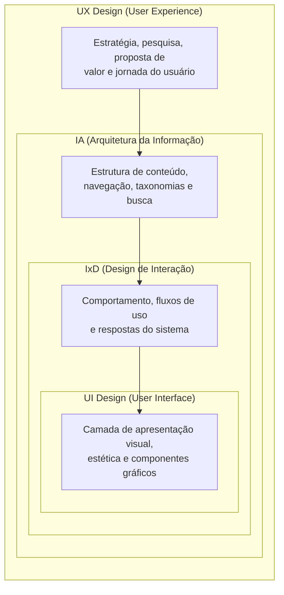

# Contexto de uso, interface, interação e papéis do design

## Introdução (intuição e analogia do cotidiano)

Pense na experiência de dirigir um **carro conversível de luxo**:
1. Se você estiver dirigindo em uma estrada litorânea ensolarada no fim de semana, a experiência será agradável, relaxante e gratificante.
2. Se você estiver preso no trânsito pesado sob uma tempestade torrencial com a capota quebrada, o mesmo carro causará estresse, frustração e irritação.

O veículo em si (a tecnologia e seus botões no painel) é rigorosamente o mesmo nos dois cenários. O que mudou drasticamente foi o **contexto de uso** (o ambiente, as condições climáticas e o estado do motorista).

Na tecnologia digital, ocorre o mesmo fenômeno. Um sistema não existe no vácuo. Para projetar produtos de sucesso, o design de interação precisa compreender quatro elementos fundamentais: o **objetivo do usuário**, o **contexto de uso**, a **interface** e a **interação**, bem como a atuação multidisciplinar dos papéis de design (**UX**, **UI**, **IA** e **IxD**) e o impacto direto da **cultura**.

---

## 1. Conceitos fundamentais da relação humano-computador

Para alinhar a tecnologia às necessidades humanas, a área de IHC conceitua com precisão quatro pilares:

### a. Objetivo do usuário (*user goal*)
É o estado final que a pessoa deseja alcançar ao realizar uma atividade. O objetivo não deve ser confundido com as etapas do software.
- **Exemplo de objetivo:** "quero me deslocar até o aeroporto a tempo de pegar meu voo".
- **Erro comum de design:** focar apenas nas operações do aplicativo (ex.: "preencher 5 campos de texto") em vez de ajudar a pessoa a atingir seu objetivo real com rapidez.

### b. Contexto de uso (*context of use*)
Conforme definido pela norma ISO 9241-11, o contexto de uso é a combinação de quatro fatores essenciais durante a realização de uma tarefa:
1. **Usuários:** quem são as pessoas (suas habilidades, nível de conhecimento, limitações visuais ou motoras).
2. **Tarefas:** quais atividades e passos são necessários para atingir o objetivo.
3. **Equipamentos:** quais dispositivos e infraestruturas tecnológicas estão sendo usados (hardware, tamanho de tela, estabilidade da conexão de internet).
4. **Ambiente:** o meio físico, social e **cultural** em que o uso ocorre (ex.: nível de ruído, iluminação do sol, interrupções frequentes, normas sociais e valores culturais).

### c. Interface do usuário (*user interface - UI*)
É a superfície de contato física, visual, auditiva ou tátil por meio da qual o usuário e o sistema trocam informações. A interface engloba as telas, botões, ícones, menus, tipografia, cores, comandos de voz e respostas háticas (vibração).

### d. Interação (*interaction*)
É o processo dinâmico e bidirecional de troca de ações e respostas entre o ser humano e o sistema ao longo do tempo. A interação ocorre quando o usuário realiza um gesto na interface e o sistema responde com uma mudança de estado ou feedback visual.

---

## 2. A influência da cultura no contexto de uso e no design de interação

A cultura é um componente determinante do ambiente no contexto de uso. Ela molda os modelos mentais, a interpretação de símbolos, os hábitos de leitura e os valores comportamentais dos usuários (*cross-cultural design*).

### Fatores culturais que impactam o projeto de interfaces

- **Direção de leitura e fluxo espacial:** em culturas ocidentais, a leitura e a varredura visual ocorrem da esquerda para a direita (LTR - *left-to-right*). Em culturas árabes ou hebraicas, a leitura ocorre da direita para a esquerda (RTL - *right-to-left*). Projetar para contextos RTL exige o espelhamento completo de layouts, menus, barras de progresso e ícones direcionais.
- **Simbologia e significado das cores:** a cor vermelha em mercados ocidentais frequentemente sinaliza perigo, erro ou parada. Na China e em países do leste asiático, o vermelho simboliza sorte, prosperidade e celebração (influenciando, por exemplo, gráficos de mercado financeiro, onde o vermelho indica alta e o verde indica queda).
- **Densidade de informação vs. minimalismo:** usuários ocidentais costumam valorizar interfaces minimalistas e com bastante espaço em branco. Em mercados asiáticos (como Japão e China - ex.: plataformas como Taobao e Yahoo! Japan), telas com altíssima densidade de informação, múltiplos banners e links visíveis simultaneamente são interpretadas como sinal de transparência e variedade de opções.
- **Metáforas visuais e linguagem:** ícones baseados em objetos ocidentais (como caixas de correio no estilo norte-americano) ou termos idiomáticos perdem o sentido quando aplicados em outras culturas, exigindo localização adequada.

### Internacionalização (i18n) vs. Localização (l10n)

- **Internacionalização (*i18n*):** processo técnico de arquitetura de software que prepara a aplicação para suportar múltiplos idiomas, moedas, fusos horários e formatos de data sem necessidade de reescrever o código base.
- **Localização (*l10n*):** processo de adaptação cultural da experiência do usuário, ajustando não apenas o idioma, mas os símbolos, cores, metáforas, tom de voz e regras de negócio para atender às expectativas de uma cultura específica.

---

## 3. A multidisciplinaridade e os pilares científicos do design

Nenhum profissional ou área do conhecimento é capaz de dominar isoladamente a complexidade da relação humano-tecnologia. Por isso, a Interação Humano-Computador fundamenta-se na **multidisciplinaridade**, combinando contribuições científicas de diversas disciplinas:

### As bases disciplinares em IHC

1. **Definição da interface e interação:**
   - **Ergonomia:** estuda a adaptação física, postural e cognitiva da tecnologia às limitações do corpo e da mente.
   - **Linguística:** analisa a estruturação de diálogos, vocabulários, microtextos e clareza de rótulos.
   - **Semiótica:** investiga os signos, metáforas visuais (como ícones de lixeira ou pasta) e os significados transmitidos pelas telas.

2. **Análise de comportamento e contexto de uso:**
   - **Psicologia:** estuda a cognição, memória, percepção, emoções e a tomada de decisão do indivíduo.
   - **Sociologia:** compreende as dinâmicas de grupo, normas sociais e a comunicação colaborativa mediada por sistemas.
   - **Antropologia:** investiga a cultura, os rituais, os hábitos e as práticas reais das pessoas em seus ecossistemas locais.

3. **O valor das equipes multidisciplinares de produto:**
   - **Diversidade de perspectivas:** reunir profissionais de design, engenharia, psicologia, ciências sociais e dados traz visões de mundo distintas, múltiplos modelos mentais e vocabulários complementares.
   - **Fomento à criatividade e inovação:** evita o viés de confirmação (a falsa crença de que *"o desenvolvedor pensa como o usuário final"*) e estimula a criação de soluções mais resilientes, inovadoras e empáticas.

---

## 4. Tabela comparativa e escopo dos papéis do design

Projetar uma experiência digital exige a atuação integrada de diferentes papéis especializados do design:

### Tabela comparativa dos papéis do design

| Papel / Disciplina | Foco de atuação principal | Pergunta central que responde |
| :--- | :--- | :--- |
| **Experiência do Usuário (UX)** | Percepção holística, emoções e jornada completa do usuário | *"Este produto resolve a dor real do usuário de forma satisfatória?"* |
| **Design de Interação (IxD)** | Comportamento do sistema, fluxos, estados e dinâmicas de uso | *"Como o sistema responde e comporta-se diante da ação do usuário?"* |
| **Arquitetura da Informação (IA)** | Organização, navegação, rotulagem e hierarquia de conteúdos | *"Como a informação está estruturada para ser encontrada com facilidade?"* |
| **Interface do Usuário (UI)** | Estética visual, componentes gráficos e guias de estilo | *"Como a tela se parece visualmente e como os elementos estão dispostos?"* |

### Detalhamento escopado dos papéis

- **Experiência do Usuário (UX Design):** engloba todos os aspectos do contato do usuário com a empresa. Entregáveis: personas, mapas de jornada, testes de usabilidade.
- **Design de Interação (IxD):** foca nas cinco dimensões da interação (palavras, representações visuais, espaço, tempo e comportamento). Entregáveis: fluxogramas, wireframes animados, microinterações.
- **Arquitetura da Informação (IA):** estrutura ecossistemas de informação. Entregáveis: sitemaps, taxonomias, resultados de *card sorting*.
- **Interface do Usuário (UI Design):** camada tátil e visual. Entregáveis: telas em alta fidelidade, *UI kits*, *design tokens*.

---

## 5. A convergência das disciplinas no design centrado no usuário

A presença de **UX**, **UI**, **IA** e **IxD** não representa quatro áreas isoladas ou concorrentes, mas sim o **modelo de convergência do Design Centrado no Usuário (UCD)**.

### Definição formal da convergência
A **convergência das áreas de design de experiência** é a integração sinérgica e contínua entre estratégia (UX), estrutura (IA), comportamento (IxD) e apresentação (UI) para criar um ecossistema digital coeso, funcional e humano.

### Analogia de convergência: a construção de uma residência

- **UX (Estratégia e Pesquisa):** o arquiteto investigando o estilo de vida da família para garantir que a casa atenda às suas necessidades diárias e proporcione bem-estar.
- **IA (Estrutura de Conteúdo):** a planta baixa organizando a localização de cada cômodo e como os corredores se conectam de forma fluida.
- **IxD (Comportamento e Dinâmica):** o projeto de engenharia definindo como as portas abrem, como a iluminação responde aos interruptores e como os fluxos funcionam.
- **UI (Apresentação Visual):** o design de interiores escolhendo as tintas, texturas, iluminação e acabamentos estéticos das superfícies.

---

## 6. Exemplo prático do mundo real: aplicativo de entrega em mercado global

Para visualizar como a **multidisciplinaridade**, a **cultura** e os **papéis do design** trabalham juntos em um aplicativo de alcance global:

- **Contexto de uso cultural (Antropologia/Sociologia):** lançamento do aplicativo no Oriente Médio (Arábia Saudita).
- **UX Design (Estratégia/Psicologia):** conduz pesquisas empíricas para compreender que a dinâmica de compras e entrega domiciliar possui particularidades sociais locais (ex.: janelas de entrega adaptadas aos horários de oração).
- **Arquitetura da Informação - IA (Linguística/Estrutura):** reestrutura a taxonomia de categorias para refletir a culinária regional e hábitos de consumo locais.
- **Design de Interação - IxD (Ergonomia/Comportamento):** adapta o fluxo de pagamento para aceitar métodos de pagamento regionais e ajusta o rastreamento em tempo real para navegação da direita para a esquerda (RTL).
- **UI Design (Semiótica/Apresentação):** aplica o espelhamento completo de interface (RTL), ajusta a tipografia para fontes árabes perfeitamente legíveis e adapta a paleta de cores para respeitar os significados culturais locais.

---

## Síntese e revisão

- O **objetivo do usuário** representa o que a pessoa quer atingir, enquanto o **contexto de uso** (usuário, tarefa, equipamento e ambiente físico/cultural) determina as condições reais da interação.
- A **multidisciplinaridade** de IHC combina **ergonomia, linguística e semiótica** (para definir interface/interação) com **psicologia, sociologia e antropologia** (para analisar o comportamento e contexto de uso).
- As **equipes multidisciplinares** integram visões de mundo e vocabulários distintos, estimulando a criatividade e prevenindo vícios de projeto.
- A **convergência das áreas de design (UX, UI, IA e IxD)** estabelece um ecossistema integrado onde a estratégia (UX), a estrutura (IA), o comportamento (IxD) e a apresentação (UI) trabalham em sinergia.

---

## Referências bibliográficas

- GARRETT, Jesse James. **The Elements of User Experience: User-Centered Design for the Web and Beyond**. 2. ed. Berkeley: New Riders, 2011.
- HOFSTEDE, Geert. **Culture's Consequences: Comparing Values, Behaviors, Institutions and Organizations Across Nations**. 2. ed. Thousand Oaks: Sage Publications, 2001.
- INTERNATIONAL ORGANIZATION FOR STANDARDIZATION. **ISO 9241-11: Ergonomics of human-system interaction — Part 11: Usability: Definitions and concepts**. Geneva: ISO, 2018.
- MORVILLE, Peter; ROSENFELD, Louis. **Information Architecture for the Web and Beyond**. 4. ed. Sebastopol: O'Reilly Media, 2015.
- NIELSEN NORMAN GROUP. [How to Grow a UX Career and Advance Your User-Experience Expertise](https://www.youtube.com/watch?v=TcMPfj-FENY). Entrevista sobre desenvolvimento de carreira em UX. Acesso em: ==19/06/2021==.
- NIELSEN NORMAN GROUP. [UX Lessons I Wished I Learned Early](https://www.youtube.com/watch?v=WrW148tqKXw). Vídeo sobre lições práticas de experiência profissional em UX. Acesso em: ==19/06/2021==.
- NORMAN, Donald A. **The Design of Everyday Things**. Revised and expanded ed. New York: Basic Books, 2013.
- PONCIANO, L.; BRASILEIRO, F.; ANDRADE, N.; SAMPAIO, L. [Considering human aspects on strategies for designing and managing distributed human computation](https://doi.org/10.1186/s13174-014-0010-4). **Journal of Internet Services and Applications**, v. 5, n. 1, p. 1-15, 2014. DOI: 10.1186/s13174-014-0010-4. Acesso em: ==21/06/2021==.
- PUCILLO, Francesco; CASCINI, Gaetano. [A framework for user experience, needs and affordances](https://doi.org/10.1016/j.destud.2013.10.001). **Design Studies**, v. 35, n. 2, p. 160-179, 2014. DOI: 10.1016/j.destud.2013.10.001. Acesso em: ==10/05/2021==.
- ROGERS, Yvonne; SHARP, Helen; PREECE, Jenny. **Interaction Design: beyond human-computer interaction**. 5. ed. Indianapolis: John Wiley & Sons, 2019.
- SAFFER, Dan. **Designing for Interaction: Creating Innovative Applications and Devices**. 2. ed. Berkeley: New Riders, 2010.

---

## Artigos relacionados e navegação

- **Artigo anterior:** [[05. Por que a perspectiva da interação importa]]
- **Próximo artigo:** [[07. Atributos de qualidade em sistemas interativos - usabilidade, comunicabilidade, acessibilidade e experiência de uso]]
- **Resumo da disciplina:** [[00. Design de Interacao - Resumo]]
- **Página inicial do vault:** [[index]]
