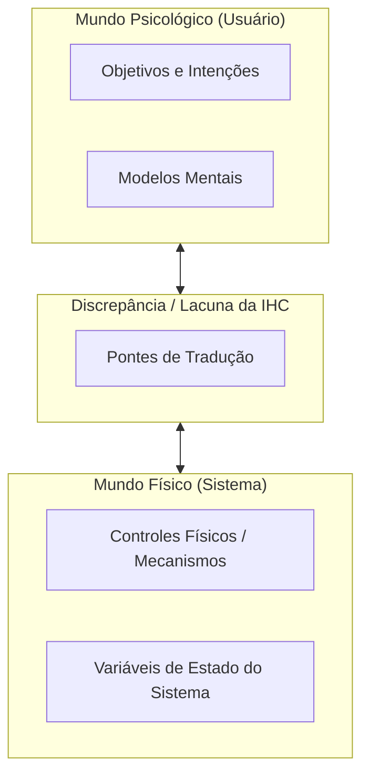

# Engenharia cognitiva e os problemas da interação usuário-sistema

## Introdução (intuição e analogia do cotidiano)

Pense na experiência de interagir com um **termostato digital de ar-condicionado de hotel**:
1. Você está com frio e deseja que o quarto aqueça rapidamente. No entanto, o controle possui oito botões com símbolos genéricos sem legenda. Você quer agir, mas não sabe qual botão pressionar para alcançar seu objetivo.
2. Após pressionar aleatoriamente um botão com o símbolo de um floco de neve, a tela do controle pisca um código alfanumérico ("E-04") sem indicar se a temperatura está subindo, descendo ou se o aparelho travou.

Nessa situação cotidiana, você vivenciou os dois problemas clássicos da interação humana com a tecnologia: a **dificuldade de agir** (não saber como traduzir seu desejo em comando) e a **dificuldade de entender o resultado** (não saber interpretar a resposta do aparelho).

Na Interação Humano-Computador, a **Engenharia Cognitiva**, teorizada por Donald Norman, é a lente teórica que estuda precisamente essa distância psicológica entre a mente humana e o funcionamento do sistema, formulando os conceitos dos **golfos de execução e avaliação**.

---

## 1. O que é a Engenharia Cognitiva

A **Engenharia Cognitiva** (*Cognitive Engineering*) é uma abordagem multidisciplinar de IHC que aplica os conhecimentos da psicologia cognitiva, da ciência da computação e da ergonomia para projetar sistemas interativos que se alinhem às capacidades de processamento da mente humana.

### A premissa central de Donald Norman
O sistema computacional opera com variáveis de estado físico e algoritmos abstratos, enquanto o ser humano opera com pensamentos, intenções, emoções e modelos mentais. O objetivo da Engenharia Cognitiva é **reduzir o esforço cognitivo** necessário para preencher a lacuna entre o modelo mental da pessoa e a mecânica da máquina.

---

## 2. Mundo psicológico versus mundo físico: a discrepância de variáveis

Na base da Engenharia Cognitiva está a identificação de uma **discrepância estrutural entre o mundo psicológico do usuário e o mundo físico do sistema**:

### a. Variáveis psicológicas (Mundo do Usuário)
Representam os construtos internos, cognitivos e intencionais da pessoa que interage com a tecnologia:
- **Objetivos (*goals*):** o estado final que a pessoa deseja alcançar no mundo real ou em sua mente (ex.: "quero estar preparado financeiramente para o fim do mês").
- **Intenções (*intentions*):** a decisão consciente de realizar uma ação específica para aproximar-se do objetivo (ex.: "vou registrar o gasto de 50 reais feito hoje com combustível").
- **Modelos mentais (*mental models*):** o conjunto de hipóteses, expectativas e conceitos intuitivos que o usuário constrói sobre o funcionamento do software.

### b. Variáveis físicas e controles físicos (Mundo do Sistema)
Representam a dimensão computacional, tangível e algorítmica da máquina:
- **Variáveis físicas / Estados do sistema (*system states*):** a configuração real dos dados, arquivos na memória, registros em banco de dados e processos de software (ex.: a variável `saldo_restante` atualizada para `R$ 450,00` no banco de dados).
- **Controles físicos / Mecanismos de interação (*physical controls / interaction mechanisms*):** os elementos operacionais de entrada e saída por meio dos quais o sistema pode ser manipulado ou percebido (ex.: botões na tela, caixas de texto, menus, gestos *touch*, atalhos de teclado e alertas visuais/sonoros).

### c. A discrepância central (O desafio da IHC)
A discrepância ocorre porque **o usuário pensa em termos de variáveis psicológicas** (desejos e metas), enquanto **o computador opera exclusivamente com variáveis e controles físicos**. A missão do design de interação é projetar pontes de tradução na interface que eliminem a interrogação entre os dois mundos.

---

## 3. Os dois grandes problemas da interação (Os dois golfos)

A partir da discrepância entre o mundo psicológico e o mundo físico, a Engenharia Cognitiva identifica dois obstáculos principais na experiência do usuário, conhecidos como **os dois golfos da interação** (*the two gulfs of interaction*):

### a. O Golfo de Execução (*Gulf of Execution*)
É a lacuna entre as **variáveis psicológicas (intenções)** do usuário e os **controles físicos** permitidos e visíveis na interface do sistema.

- **A pergunta central do usuário:** *"Como faço para o sistema realizar o que eu desejo?"*
- **A causa do golfo:** ocorre quando a interface não deixa claro quais controles físicos estão disponíveis ou como traduzir uma intenção mental em passos operacionais.
- **Como reduzir o golfo:** oferecendo affordances visíveis, significadores claros (*signifiers*), mapeamento natural e comandos intuitivos.

### b. O Golfo de Avaliação (*Gulf of Evaluation*)
É a lacuna entre as **variáveis físicas (estados do sistema)** e a **percepção e interpretação psicológica** que o usuário faz desse estado após executar uma ação.

- **A pergunta central do usuário:** *"O sistema executou o que eu queria? Qual é o estado atual do processo?"*
- **A causa do golfo:** ocorre quando o sistema não fornece feedback, apresenta mensagens de erro indecifráveis ou altera seu estado interno sem deixar pistas visuais claras.
- **Como reduzir o golfo:** fornecendo feedback imediato, visibilidade do estado do sistema e confirmações visuais compreensíveis.

---

## 4. As 7 etapas da ação de Donald Norman (*Norman's 7 Stages of Action*)

Para detalhar como os dois golfos se manifestam durante a atividade humana, Donald Norman dividiu a ação do usuário em **sete etapas sequenciais**, conectando as variáveis psicológicas às físicas:

### O ciclo de execução (superando o Golfo de Execução)
1. **Formar o objetivo (*goal*):** definir o estado final desejado no mundo psicológico (ex.: "quero salvar este documento").
2. **Formar a intenção de agir (*intention to act*):** decidir realizar a ação no sistema (ex.: "vou salvar a versão atual do texto").
3. **Especificar a sequência de ações (*action plan*):** determinar quais passos de interface são necessários (ex.: "devo mover o cursor até o menu Arquivo e clicar em Salvar").
4. **Executar as ações (*execution*):** realizar o movimento físico sobre os controles (ex.: clicar com o mouse ou pressionar `Ctrl + S`).

### O ciclo de avaliação (superando o Golfo de Avaliação)
5. **Perceber o estado do sistema (*perception*):** notar as mudanças visuais ou sonoras nos controles físicos (ex.: observar um ícone de disco piscando).
6. **Interpretar o estado do sistema (*interpretation*):** atribuir significado psicológico ao sinal percebido (ex.: entender que o ícone de disco significa que o arquivo foi gravado no banco de dados).
7. **Avaliar o resultado (*evaluation*):** comparar o estado interpretado com o objetivo inicial para decidir se a tarefa foi concluída com sucesso (ex.: "o documento está salvo, posso fechar a tela").

---

## 5. Princípios de design para transpor os golfos

Para ajudar designers e desenvolvedores a projetar interfaces que transponham os golfos de execução e avaliação, a Engenharia Cognitiva estabelece cinco princípios práticos:

| Princípio de design | Golfo que ajuda a transpor | Descrição prática |
| :--- | :--- | :--- |
| **Visibilidade (*visibility*)** | Execução e Avaliação | Manter as opções de ação e os estados do sistema visíveis na tela. |
| **Mapeamento natural (*natural mapping*)** | Execução | Criar uma correspondência direta entre a disposição dos controles na tela e os elementos do mundo real. |
| **Feedback imediato** | Avaliação | Enviar confirmações visuais, sonoras ou táteis em menos de 100ms após qualquer ação do usuário. |
| **Significadores (*signifiers*)** | Execução | Colocar pistas visuais explícitas (ex.: ícones, rótulos) que mostrem exatamente onde e como agir. |
| **Modelo conceitual claro** | Execução e Avaliação | Permitir que o usuário construa um modelo mental correto e previsível sobre o funcionamento do software. |

---

## 6. Exemplo prático do mundo real: upload de arquivos em nuvem

Para observar as variáveis e os dois golfos em ação em um produto digital moderno:

- **Cenário de falha (Discrepância alta e golfos abertos):**
  - **Variável Psicológica:** o usuário tem a intenção de enviar um documento para a equipe.
  - **Golfo de Execução:** a tela exibe uma caixa vazia sem nenhum botão explicativo, forçando o usuário a adivinhar como operar os controles físicos.
  - **Golfo de Avaliação:** após soltar o arquivo, a variável física do sistema muda para "em progresso", mas a tela não exibe nenhuma barra de carregamento, mantendo o usuário em dúvida.

- **Cenário de sucesso (Discrepância eliminada e golfos reduzidos):**
  - **Golfo de Execução reduzido:** a tela exibe a indicação em destaque *"Clique aqui para selecionar ou arraste seus arquivos"*, facilitando a tradução da intenção em ação física.
  - **Golfo de Avaliação reduzido:** assim que o arquivo é solto, a mudança da variável física é comunicada por uma barra de progresso em tempo real (0% a 100%) seguida de uma confirmação verde de sucesso.

---

## Síntese e revisão

- A **Engenharia Cognitiva** de Donald Norman estuda a discrepância fundamental entre o **Mundo Psicológico** (objetivos, intenções e modelos mentais do usuário) e o **Mundo Físico** (variáveis de estado e controles físicos do sistema).
- O **Golfo de Execução** refere-se à dificuldade do usuário em traduzir intenções psicológicas em ações nos controles físicos.
- O **Golfo de Avaliação** refere-se à dificuldade do usuário em perceber e interpretar a mudança das variáveis físicas de estado do sistema.
- O **ciclo das 7 etapas da ação** descreve a jornada completa que conecta a mente humana aos mecanismos da máquina.

---

## Referências bibliográficas

- NORMAN, Donald A. [Steps toward a cognitive engineering: Design rules based on analyses of human error](https://doi.org/10.1145/800049.801815). In: **Proceedings of the 1982 conference on Human factors in computing systems**. Gaithersburg: ACM, 1982. p. 378-382. DOI: 10.1145/800049.801815. Acesso em: ==15/05/2021==.
- NORMAN, Donald A. Cognitive engineering. In: NORMAN, Donald A.; DRAPER, Stephen W. (Ed.). **User Centered System Design: New Perspectives on Human-Computer Interaction**. Hillsdale: Lawrence Erlbaum Associates, 1986. p. 31-61.
- NORMAN, Donald A. **The Design of Everyday Things**. Revised and expanded ed. New York: Basic Books, 2013.
- ROGERS, Yvonne; SHARP, Helen; PREECE, Jenny. **Interaction Design: beyond human-computer interaction**. 5. ed. Indianapolis: John Wiley & Sons, 2019.

---

## Artigos relacionados e navegação

- **Artigo anterior:** [[07. Atributos de qualidade em sistemas interativos - usabilidade, comunicabilidade, acessibilidade e experiência de uso]]
- **Próximo artigo:** [[09. Engenharia semiótica - comunicação usuário-sistema e metacomunicação usuário-designer]]
- **Resumo da disciplina:** [[00. Design de Interacao - Resumo]]
- **Página inicial do vault:** [[index]]
