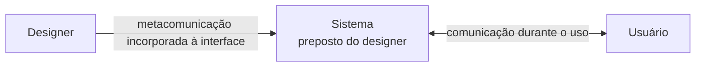
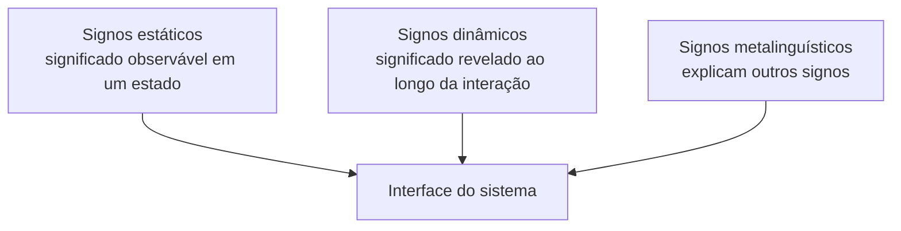
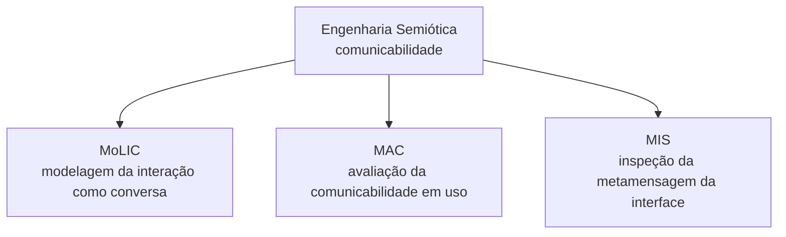

# Engenharia semiótica: comunicação usuário-sistema e metacomunicação usuário-designer

## Engenharia semiótica interpreta a interface como comunicação

Pense na experiência de jantar em um **restaurante de alta gastronomia**:
1. Quando o garçom lhe entrega o cardápio e explica a sequência dos pratos, você não está conversando diretamente com o chef de cozinha que criou o menu. No entanto, através do garçom, da louça e da apresentação do prato, você recebe a **visão do chef** sobre como aquela refeição deve ser apreciada.
2. O garçom atua como um **representante do chef** (um preposto). Se o garçom não souber explicar um ingrediente ou se o prato vier sem talheres adequados, a comunicação criada pelo chef sofre uma ruptura.

Na tecnologia digital, ocorre um fenômeno idêntico. A **Engenharia Semiótica**, formulada no Brasil pela professora Clarisse Sieckenius de Souza (PUC-Rio), interpreta os sistemas interativos não apenas como máquinas utilitárias ou processadores cognitivos, mas como **artefatos de comunicação**.

Em um sistema interativo, o software atua como o **preposto do designer**, transmitindo uma **metacomunicação** ao usuário final.

---

## Engenharia semiótica como teoria da comunicação em IHC

A **Engenharia Semiótica** é uma teoria de Interação Humano-Computador fundamentada na semiótica (a ciência dos signos e dos processos de significação). 

### A tese da metacomunicação
Diferente da Engenharia Cognitiva (que foca nos processos mentais individuais) ou da Ergonomia (que foca na adaptação física e operacional), a Engenharia Semiótica conceitua a IHC como um **processo de comunicação de segundo nível (metacomunicação)**.

- **O designer como emissor:** o criador do software possui uma visão sobre o problema, sobre o usuário e sobre como a solução deve ser usada.
- **O sistema como preposto (*designer's deputy*):** o software não tem intenções próprias; ele é o agente delegado pelo designer para interagir com o usuário em seu lugar.
- **O usuário como receptor e interlocutor:** o usuário interage com a interface buscando decodificar os signos criados pelo designer para atingir seus próprios objetivos.

---

## Comunicação durante o uso e metacomunicação do designer

A Engenharia Semiótica estabelece que toda interação computacional ocorre simultaneamente em dois níveis distintos de comunicação:

### Comunicação entre usuário e sistema durante a interação
É a interlocução operacional e em tempo real que ocorre na superfície da interface entre o usuário e o software.
- **Mecanismo:** o usuário envia comandos (cliques, digitação, gestos) e o sistema responde com reações imediatas (mensagens, alteração de telas, animações).
- **Exemplo:** clicar no botão "Imprimir" e o sistema exibir uma caixa de diálogo perguntando o número de cópias.

### Metacomunicação do designer para o usuário
É a mensagem global de alto nível enviada pelo designer ao usuário através de todo o projeto do sistema.

- **A metáfora central da metacomunicação:**
  > *"Eis a minha visão de quem você é, do que você precisa ou deseja fazer, de como você pode ou deve fazer, e por que essa é uma boa solução para o seu problema."*

- **O papel da metacomunicação:** explicar ao usuário a lógica conceitual do produto, quais são as regras de negócio, o que é permitido e o que é proibido no sistema.

---

## O sistema atua como preposto do designer

Como o designer não pode estar fisicamente presente ao lado de cada usuário para explicar o software, ele programa a interface para atuar como seu **preposto**.

### Como o preposto representa decisões de design
- **Previsibilidade e limites:** o preposto só consegue comunicar aquilo que o designer antecipou durante a fase de projeto.
- **Comportamento diante do inesperado:** quando o usuário realiza uma ação não prevista pelo designer, o preposto "engasga" ou emite mensagens genéricas (ex.: *"Erro desconhecido 0x800"*) porque a metacomunicação falhou naquele ponto.
- **Atributo de comunicabilidade:** mede o quão bem o preposto consegue transmitir as intenções do designer sem causar mal-entendidos ou dúvidas no usuário.

---

## Signos estáticos, dinâmicos e metalinguísticos

Para analisar a comunicabilidade e realizar inspeções semióticas da interface (como no Método de Inspeção Semiótica - MIS), a Engenharia Semiótica categoriza os elementos de interface em **três tipos universais de signos**:

### Signos estáticos
São aqueles que comunicam o seu significado integral em telas fixas ou imóveis do sistema. Não dependem de passagem de tempo ou de animações para serem compreendidos pelo usuário.
- **Definição formal:** *"Comunicam o seu significado integral em telas fixas (estáticas) do sistema."*
- **Exemplos na interface:** rótulos de texto, botões estáticos, ícones fixos (ex.: ícone de disquete ou impressora), paletas de cores de status, disposições de leiaute e tipografia.

### Signos dinâmicos
São aqueles cujo significado completo **não pode ser apreendido em uma única imagem estática**, exigindo uma sequência temporal de telas, animações ou mudanças de estado para que sua mensagem se revele de forma completa.
- **Definição formal:** *"Comunicam seu significado integral em sequência de telas ou com o tempo (dinamicamente), sendo que estaticamente não comunicam todo o seu significado."*
- **Exemplos na interface:** barras de progresso (0% a 100%), *spinners* de carregamento, transições de tela, gestos de arrastar e soltar (*drag and drop*), respostas ao passar o cursor (*hover effects*) e animações de estado.

### Signos metalinguísticos
São signos (estáticos ou dinâmicos) que têm como função primária **explicar, orientar ou ilustrar outros signos** da interface (a linguagem do sistema falando sobre a própria linguagem do sistema).
- **Definição formal:** *"São signos estáticos ou dinâmicos que explicam ou ilustram outros signos estáticos ou dinâmicos."*
- **Exemplos na interface:** balões explicativos (*tooltips* ao passar o mouse sobre um ícone), mensagens de ajuda contextual (*microcopy* em campos de formulário), tutoriais interativos de boas-vindas (*onboarding*), guias de validação de erros e documentações de ajuda (*Help/FAQ*).

---

## Métodos derivados da Engenharia Semiótica

A Engenharia Semiótica estabelece o **Design Centrado na Comunicabilidade**, desdobrando sua teoria em três ferramentas e linguagens práticas para a engenharia de software:

### MoLIC: interação modelada como conversa
- **O que é:** Linguagem de Modelagem da Interação como Conversa.
- **Conceito:** é uma notação gráfica criada para modelar o design de interação enxergando o uso do sistema como se fosse um diálogo fluído entre o usuário e o preposto do designer.
- **Foco de atuação:** mapeia a estrutura da conversa, a alternância de turnos de fala, os pontos de decisão do usuário e as estratégias de prevenção de quebras de diálogo.

### MAC: avaliação de comunicabilidade
- **O que é:** Avaliação da comunicabilidade pela emissão da metamensagem.
- **Conceito:** método empírico de avaliação onde usuários reais realizam tarefas em testes de usabilidade observacionais gravados. O avaliador identifica e categoriza expressões comunicativas do usuário durante os momentos de dúvida (ex.: *"Cadê?"*, *"E agora?"*, *"Ué!"*, *"Opa!"*).
- **Foco de atuação:** analisa o processo de **emissão da metamensagem** pelo sistema e a reação comportamental observada do usuário diante de rupturas comunicativas.

### MIS: inspeção semiótica
- **O que é:** Avaliação da comunicabilidade pela recepção da metamensagem.
- **Conceito:** método analítico de inspeção realizado por avaliadores especialistas em IHC (sem a presença direta de usuários finais). O especialista inspeciona sistematicamente os signos estáticos, dinâmicos e metalinguísticos da interface para reconstruir e avaliar a metamensagem enviada pelo designer.
- **Foco de atuação:** analisa a **recepção da metamensagem**, identificando se a intenção de design transmitida pela interface é coesa, clara e completa.

---

## Rupturas de comunicação revelam problemas de comunicabilidade

Na Engenharia Semiótica, os problemas de usabilidade são interpretados como **rupturas na comunicação** (*breakdowns* ou *stumbles*).

### Rupturas recorrentes durante a interação
1. **"Cadê?" (*Where is it?*):** o usuário procura um controle ou função que o designer colocou em um local não intuitivo (falha de signo estático).
2. **"E agora?" (*What now?*):** o usuário não sabe qual deve ser o seu próximo passo porque a interface não oferece pistas dinâmicas ou metalinguísticas claras.
3. **"Por que isso?" (*Why this?*):** o sistema executa uma alteração sem explicar o motivo, deixando o usuário confuso sobre a intenção do designer.

---

## Engenharia Semiótica em relação à semiótica e ao design

Para profissionais com bagagem em **Comunicação Social, Semiótica Clássica (Peirce, Umberto Eco, Barthes) e Design de Informação**, o modelo da Engenharia Semiótica em IHC pode parecer à primeira vista **instrumental, rígido ou simplificado**.

### Semiótica clássica e Engenharia Semiótica

- **Na Semiótica Clássica / Teoria da Comunicação:** a comunicação é vista como uma rede polifônica e aberta de significado (*semiose ilimitada*). Celebra-se a polissemia, a *obra aberta*, a subjetividade do leitor e a multiplicidade de interpretações possíveis de um signo cultural.
- **Na Engenharia Semiótica em IHC:** a abordagem foi intencionalmente simplificada para atender às necessidades da Engenharia de Software. Em um aplicativo bancário ou sistema de aviação, a polissemia é tratada como um **risco de usabilidade**. O objetivo não é abrir o signo para múltiplas interpretações artísticas, mas **conter a semiose**, fechando as ambiguidades para garantir que o usuário decodifique a mensagem com precisão operacional.

### Simplificação como estratégia de aplicação
O grande mérito científico do SERG (PUC-Rio) não foi criar uma nova teoria linguística geral, mas sim **traduzir conceitos semióticos complexos em ferramentas empíricas e pragmáticas** que cientistas da computação pudessem aplicar na avaliação de software — dando origem a métodos práticos como o **MoLIC**, o **MIS** e o **MAC**.

---

## Exemplo integrado: assistente de instalação de software

Para visualizar os três tipos de signos, os métodos e a metacomunicação em ação em uma interface digital:

- **Signo Metalinguístico:** o texto do assistente que diz *"Esta instalação rápida configurará os padrões ideais para o seu computador"*.
- **Signo Estático:** o botão azul com o texto em negrito *"Avançar"*.
- **Signo Dinâmico:** a barra azul de preenchimento que avança da esquerda para a direita indicando que os arquivos estão sendo copiados.

---

## Engenharia Cognitiva e Engenharia Semiótica explicam problemas diferentes

> [!IMPORTANT]
> **Diferença essencial de prova (síntese rápida):**
> - **Engenharia Cognitiva (Donald Norman):** pensa **ação, objetivo, execução e avaliação**. Foca no processamento psicológico individual e na eliminação dos golfos entre o modelo mental do usuário e a máquina.
> - **Engenharia Semiótica (Clarisse de Souza):** pensa **comunicação, signos, designer e usuário**. Foca no software como artefato de metacomunicação e preposto do designer.

### Comparação entre as duas abordagens

| Lente teórica | Autor / Origem | Foco de análise principal | Palavras-chave essenciais | Pergunta central de avaliação |
| :--- | :--- | :--- | :--- | :--- |
| **[[08. Engenharia cognitiva e os problemas da interação usuário-sistema\|Engenharia Cognitiva]]** | Donald Norman | Ação humana, objetivos mentais e processamento psicológico | Ação, objetivo, intenção, execução, avaliação, golfo de execução, golfo de avaliação | *"Como o usuário traduz seu objetivo mental em ação física e interpreta a resposta da máquina?"* |
| **[[09. Engenharia semiótica - comunicação usuário-sistema e metacomunicação usuário-designer\|Engenharia Semiótica]]** | Clarisse Sieckenius de Souza (PUC-Rio) | Comunicação, metacomunicação, signos e interlocução | Comunicação, metacomunicação, signos (estáticos/dinâmicos/metalinguísticos), designer, preposto, usuário | *"Como o designer transmite sua visão de projeto ao usuário por meio da interface como seu preposto?"* |

---

## A interface comunica possibilidades, intenções e consequências

- A **Engenharia Semiótica** de Clarisse Sieckenius de Souza conceitua a IHC como uma **metacomunicação** onde o designer envia uma mensagem ao usuário por meio do software (que atua como seu preposto).
- A interface é composta por três tipos de signos: **estáticos** (telas imóveis), **dinâmicos** (fluxo temporal) e **metalinguísticos** (signos que explicam outros signos).
- Suas contribuições metodológicas incluem o **MoLIC** (modelagem da conversa), o **MAC** (avaliação empírica da emissão da metamensagem) e o **MIS** (inspeção analítica da recepção da metamensagem).
- Para fins de avaliação acadêmica: **Cognitiva = Ação, Objetivo, Execução e Avaliação**; **Semiótica = Comunicação, Signos, Designer e Usuário**.

---

## Referências bibliográficas

- DE SOUZA, Clarisse Sieckenius. **The Semiotic Engineering of Human-Computer Interfaces**. Cambridge: MIT Press, 2005.
- DE SOUZA, Clarisse Sieckenius; LEITÃO, Carla Faria. **Semiotic Engineering Methods for Scientific Research in Human-Computer Interaction**. Synthesis Lectures on Human-Centered Informatics, Morgan & Claypool Publishers, 2009.
- ECO, Umberto. **A Estrutura Ausente**. São Paulo: Perspectiva, 2001.
- PEIRCE, Charles Sanders. **Semiótica**. São Paulo: Perspectiva, 2005.
- ROGERS, Yvonne; SHARP, Helen; PREECE, Jenny. **Interaction Design: beyond human-computer interaction**. 5. ed. Indianapolis: John Wiley & Sons, 2019.

---

## Artigos relacionados

- **Artigo anterior:** [[08. Engenharia cognitiva e os problemas da interação usuário-sistema]]
- **Próximo artigo:** [[10. Envolvimento do usuário no design - projetar de modo independente, centrado ou participativo]]
- **Resumo da disciplina:** [[00. Design de Interacao - Resumo]]
- **Página inicial do vault:** [[index]]
