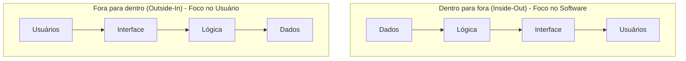
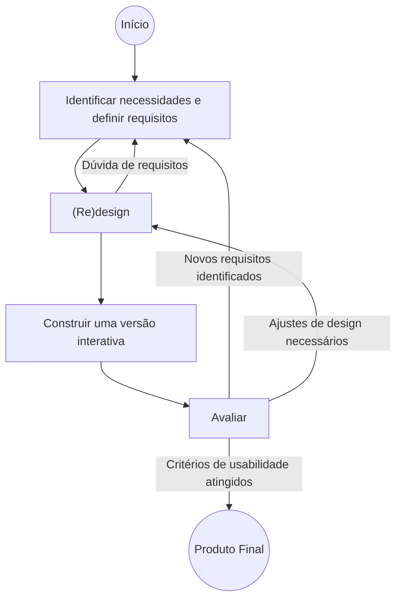

# Envolvimento do usuário no design: projetar de modo independente, centrado ou participativo

## Introdução (intuição e analogia do cotidiano)

Pense na confecção de um **traje de festa**:
1. **Projetar de modo independente (sem o usuário):** o estilista desenha e costura a roupa em seu ateliê com base apenas em suas preferências pessoais, sem tirar as medidas de quem vai vestir e sem saber a ocasião do evento.
2. **Projetar centrado no usuário (para o usuário):** o alfaiate tira as medidas precisas da pessoa, estuda sua postura, faz testes de caimento com tecidos provisórios e pede que a pessoa prove a roupa para ajustar as barras. As decisões técnicas de costura permanecem com o alfaiate.
3. **Projetar participativo (com o usuário):** o cliente senta-se à mesa de criação ao lado do estilista, escolhe os tecidos juntos, desenha os croquis em parceria e decide diretamente os cortes e detalhes da peça.

Na criação de produtos digitais e sistemas computacionais, a Interação Humano-Computador identifica exatamente esses três paradigmas de envolvimento: **projetar de modo independente do usuário**, **projetar centrado no usuário (*User-Centered Design*)** e **projetar com o usuário (*Design Participativo / Co-Design*)**.

---

## 1. Projetar de modo independente do usuário (*designing without users*)

Projetar de modo independente é a abordagem tradicional em que o desenvolvimento do software é guiado exclusivamente por restrições tecnológicas, interesses de negócios ou suposições pessoais da equipe de engenharia e design, **sem a participação ou investigação empírica com usuários reais**.

### Consequências operacionais para o usuário
Quando o usuário é completamente desconsiderado no processo de construção do software, a relação de uso torna-se autoritária e unilateral. O usuário é obrigado a:

1. **Aprender a usar o sistema da forma como ele é:** a pessoa deve esforçar-se cognitivamente para adaptar seus modelos mentais ao funcionamento arbitrário do software, arcando com todo o custo de aprendizagem.
2. **Aceitar o que o sistema permite e o que ele não permite:** a pessoa é forçada a aceitar passivamente as limitações impostas pela máquina, adaptando suas tarefas e rotinas de trabalho às rigidezes da aplicação.

### Riscos e prejuízos de projeto
- **Orientação à tecnologia (*technology-driven*):** a inovação é impulsionada pela disponibilidade de um novo recurso técnico e não por uma dor real.
- **Viés de confirmação do desenvolvedor:** assenta-se na falsa premissa de que *"quem constrói o sistema sabe intuitivamente o que o usuário precisa"*.
- **Custo elevado de retrabalho:** erros de concepção só vêm à tona após o lançamento oficial, resultando em insatisfação, estresse e refatorações dispendiosas de código.

---

## 2. As duas direções do processo de projeto: Inside-Out vs. Outside-In

A forma como o usuário é considerado no processo reflete a direção em que o fluxo de design e desenvolvimento é conduzido:

### a. Abordagem "Dentro para fora" (*Inside-Out*) — Foco no software
- **Direção do fluxo:** parte do centro (camadas internas da aplicação) em direção às bordas (usuários externos).
- **Caminho de projeto:** **Dados $\rightarrow$ Lógica $\rightarrow$ Interface $\rightarrow$ Usuários**.
- **Maior ênfase em:** algoritmos, arquitetura de dados, estrutura de software e tempo de execução de consultas.
- **Raciocínio subjacente:** *"Primeiro modelamos o banco de dados e as regras de negócio do servidor; por fim, colocamos uma tela de interface na frente para expor o sistema aos usuários"*.

### b. Abordagem "Fora para dentro" (*Outside-In*) — Foco no usuário
- **Direção do fluxo:** parte das bordas (características e necessidades humanas) em direção ao centro (infraestrutura computacional).
- **Caminho de projeto:** **Usuários $\rightarrow$ Interface $\rightarrow$ Lógica $\rightarrow$ Dados**.
- **Maior ênfase em:** como os usuários são, suas características cognitivas/físicas, seus hábitos e seu contexto de uso real.
- **Raciocínio subjacente:** *"Primeiro compreendemos quem são as pessoas e como elas precisam interagir; em seguida, desenhamos a interface e adequamos a lógica e os dados internos para suportar essa experiência"*.

---

## 3. Projetar centrado no usuário (*User-Centered Design - UCD*)

O **Design Centrado no Usuário** (também normatizado como Design Centrado no Ser Humano pela ISO 9241-210) adota rigorosamente a abordagem **Fora para Dentro (*Outside-In*)**, garantindo que as necessidades, limitações e o contexto de uso das pessoas influenciam ativamente cada etapa do desenvolvimento.

### O ciclo de vida do Design de Interação (Preece, Rogers & Sharp)

Na abordagem centrada no usuário, o processo de desenvolvimento é estruturado como um **ciclo iterativo de quatro atividades fundamentais**:

#### As quatro atividades básicas de IxD
1. **Identificar necessidades e definir requisitos:** investigar quem são os usuários, seu contexto de uso e quais objetivos eles precisam alcançar.
2. **(Re)design:** propor alternativas conceituais e visuais de solução para atender aos requisitos identificados.
3. **Construir uma versão interativa (Prototipação):** desenvolver representações testáveis (desde protótipos de papel até protótipos funcionais navegáveis).
4. **Avaliar:** testar as soluções interativas com usuários reais ou especialistas para medir o nível de usabilidade, comunicabilidade e satisfação.

### Princípios fundamentais da ISO 9241-210
1. O projeto é baseado na compreensão explícita dos usuários, tarefas e ambientes.
2. Os usuários são envolvidos ao longo de todo o desenvolvimento e avaliação.
3. O processo é impulsionado por avaliações centradas no usuário (testes de usabilidade iterativos).
4. O processo é intrinsecamente **iterativo** (ciclos repetidos de refinamento).
5. O projeto aborda a experiência do usuário como um todo (holístico).
6. A equipe de projeto possui competências multidisciplinares.

---

## 4. Projetar com o usuário (*Design Participativo / Co-Design*)

O **Design Participativo** (*Participatory Design*) ou **Co-Design** é a abordagem em que os usuários finais deixam de ser apenas sujeitos passivos de pesquisa e passam a atuar como **parceiros ativos e co-criadores** (*co-designers*) no processo de tomada de decisão do projeto.

### Origem histórica e valores éticos
O Design Participativo surgiu na **Escola Escandinava de Design** durante as décadas de 1970 e 1980 (projetos UTOPIA e DEMOS). Seu surgimento teve um forte caráter ético, político e social: garantir que os trabalhadores afetados pela introdução da informática nas fábricas e escritórios tivessem direito de voz e poder de decisão sobre as ferramentas que iriam utilizar.

### A filosofia do Co-Design: projetar COM o usuário
No Design Participativo, reconhece-se que **o usuário é o maior especialista na sua própria prática de trabalho e vida cotidiana**. A equipe de design atua como facilitadora, fornecendo ferramentas de expressão visual e conceitual para que o usuário crie, valide e decida as soluções em conjunto.

### O conceito de *Design by Doing* (aprender e projetar fazendo)
Uma das contribuições metodológicas mais marcantes do Design Participativo (introduzida no projeto UTOPIA por pesquisadores como Susanne Bødker, Morten Kyng e Pelle Ehn) é a abordagem ***Design by Doing*** (*projetar pela ação / fazendo*).

- **O desafio do conhecimento tácito (*tacit knowledge*):** grande parte da experiência prática dos trabalhadores é implícita. As pessoas "sabem como fazer" suas rotinas cotidianas, mas têm enorme dificuldade para descrever suas ações verbalmente ou em formulários teóricos de requisitos.
- **A ação prática como ferramenta de projeto:** no *Design by Doing*, os usuários não tentam explicar verbalmente o que querem; em vez disso, eles **simulam e executam as tarefas reais** utilizando maquetes físicas de papelão (*cardboard mockups*), protótipos de papel e simulações de fluxo (*roleplaying*).
- **Emergência do design na ação:** ao agir e manipular os artefatos de teste (*doing*), o conhecimento prático tácito emerge naturally, permitindo que usuários e designers descubram juntos soluções que nunca surgiriam em reuniões tradicionais de especificação.

### Técnicas características de Design Participativo
- **Workshops de co-criação:** sessões estruturadas de trabalho em grupo com cartões, papéis, maquetes e dinâmicas criativas.
- **Prototipação participativa de papel (*cardboard & paper prototyping*):** criação conjunta de maquetes físicas e interfaces de papel onde os usuários desenham e colam componentes.
- **Jogos de design (*design games*):** atividades lúdicas e simulações para explicitar requisitos implícitos e resolver conflitos de interesse.
- **Dramatização de cenários (*roleplaying*):** encenação de cenários de uso reais para testar a dinâmica de fluxos e papéis.

---

## 5. Tabela comparativa dos três paradigmas de envolvimento

| Critério de comparação | Projetar de modo independente (Inside-Out) | Projetar centrado no usuário (UCD - Outside-In) | Projetar participativo (Co-Design) |
| :--- | :--- | :--- | :--- |
| **Direção de projeto** | Dentro para fora (*Inside-Out*) | Fora para dentro (*Outside-In*) | Fora para dentro colaborativo |
| **Relação com o usuário** | Sem o usuário (*without users*) | Para o usuário (*for users*) | Com o usuário (*with users*) |
| **Papel do usuário** | Ausente; forçado a aprender e aceitar a máquina | Objeto de estudo, pesquisa e teste | Co-criador e parceiro de tomada de decisão |
| **Foco principal** | Algoritmos, dados e arquitetura | Características humanas, usabilidade e contexto | Democratização, empoderamento e co-criação (*Design by Doing*) |
| **Tomada de decisão** | Exclusiva dos desenvolvedores/gestores | Dos especialistas de design com base em dados | Compartilhada entre designers e usuários |
| **Técnicas típicas** | Especificações técnicas, reuniões de engenharia | Personas, entrevistas, testes de usabilidade | Workshops de co-criação, jogos de design, maquetes de papelão |
| **Vantagens** | Desenvolvimento inicial rápido e de baixo custo inicial | Alta usabilidade, baixo risco de rejeição e foco no contexto | Altíssimo engajamento, revelação de conhecimento tácito e valor ético |
| **Limitações** | Altíssimo risco de falha de uso e refatoração dispendiosa | Exige tempo e orçamento para pesquisas e testes iterativos | Exige mediação de conflitos, tempo e engajamento contínuo dos participantes |

---

## 6. Exemplo prático do mundo real: sistema de prontuário eletrônico para postos de saúde

Para visualizar como as três abordagens se comportam no desenvolvimento de um software de saúde pública:

- **1. Abordagem Independente (Inside-Out):** uma empresa desenvolve um sistema focado na estrutura de banco de dados e o instala no posto. Médicos e enfermeiros são forçados a aprender e aceitar um fluxo de 15 cliques por consulta que não atende ao ritmo real de atendimento.
- **2. Abordagem Centrada no Usuário (UCD / Outside-In):** designers de IHC passam semanas observando a rotina dos postos de saúde (Fora para dentro), identificam necessidades, constroem versões interativas e realizam avaliações iterativas conforme o ciclo de vida de IxD até otimizarem o atendimento.
- **3. Abordagem Participativa (Co-Design & Design by Doing):** médicos, enfermeiros e agentes comunitários participam de *workshops* de co-criação. Eles utilizam maquetes de papelão e cartões para simular consultas reais (*Design by Doing*), desenhando juntos a disposição dos campos de triagem e definindo em conjunto com a engenharia a prioridade das telas.

---

## Síntese e revisão

- **Projetar de modo independente (Inside-Out):** foco no software (Dados $\rightarrow$ Lógica $\rightarrow$ Interface $\rightarrow$ Usuários), forçando o usuário a *"aprender a usar o sistema como ele é"* e *"aceitar suas limitações"*.
- **Projetar centrado no usuário (UCD / Outside-In):** foco no usuário (Usuários $\rightarrow$ Interface $\rightarrow$ Lógica $\rightarrow$ Dados), seguindo o **ciclo de vida iterativo de IxD** (requisitos $\rightarrow$ redesign $\rightarrow$ versão interativa $\rightarrow$ avaliar).
- **Projetar participativo (Co-Design / Escola Escandinava):** constrói a solução **com o usuário**, promovendo empoderamento ético e aplicação do conceito de ***Design by Doing*** (aprender e projetar através da ação prática e revelação de conhecimento tácito).

---

## Referências bibliográficas

- BØDKER, Susanne; EHN, Pelle; KYNSS, Morten; TULLBERG, Sjögren. **The UTOPIA Project: Designing for Democracy and Work**. Aarhus University Press, 1987.
- BØDKER, Susanne; KENSING, Finn; SIMONSEN, Jesper. **Participatory Design in Practice**. Cambridge: MIT Press, 2004.
- INTERNATIONAL ORGANIZATION FOR STANDARDIZATION. **ISO 9241-210: Ergonomics of human-system interaction — Part 210: Human-centred design for interactive systems**. Geneva: ISO, 2019.
- KUHN, Sara; WINOGRAD, Terry. [Participatory Design](https://hci.stanford.edu/publications/bds/). In: **Bringing Design to Software**. New York: Addison-Wesley, 1996. Acesso em: ==01/07/2021==.
- NIELSEN NORMAN GROUP. [What Is Design Thinking, Really? (What Practitioners Say)](https://www.nngroup.com/articles/design-thinking-practitioners-say/). Acesso em: ==01/07/2021==.
- NORMAN, Donald A. **The Design of Everyday Things**. Revised and expanded ed. New York: Basic Books, 2013.
- PONCIANO, Lesandro. [HCI Support Card: Creating and Using a Support Card for Education in Human-Computer Interaction](https://doi.org/10.5753/ihc.2019.8409). In: **Workshop sobre Educação em IHC. Simpósio Brasileiro de Fatores Humanos em Sistemas Computacionais (IHC '19)**. Porto Alegre: Sociedade Brasileira de Computação, 2019. p. 106-111. DOI: 10.5753/ihc.2019.8409. Acesso em: ==01/07/2021==.
- ROGERS, Yvonne; SHARP, Helen; PREECE, Jenny. **Interaction Design: beyond human-computer interaction**. 5. ed. Indianapolis: John Wiley & Sons, 2019.
- SANDERS, Elizabeth B.-N.; STAPPERS, Pieter Jan. Co-creation and the new landscapes of design. **CoDesign**, v. 4, n. 1, p. 5-18, 2008.

---

## Artigos relacionados e navegação

- **Artigo anterior:** [[09. Engenharia semiótica - comunicação usuário-sistema e metacomunicação usuário-designer]]
- **Resumo da disciplina:** [[11. Design de Interacao - Resumo]]
- **Página inicial do vault:** [[index]]
