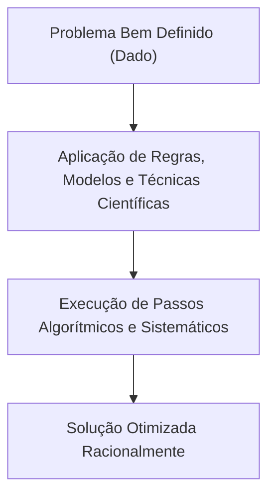
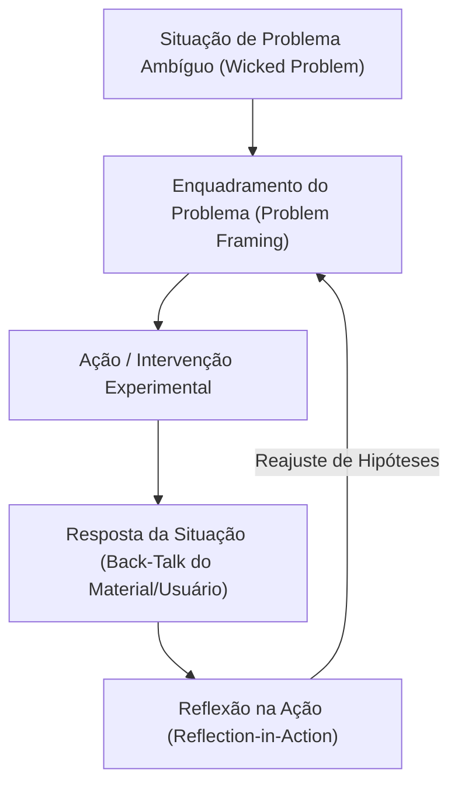
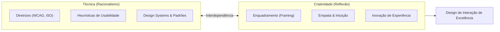

# Racionalismo técnico e reflexão em ação: o papel da técnica e da criatividade no design

## Introdução (intuição e analogia do cotidiano)

Pense na diferença entre dois profissionais construindo uma ponte:
1. **O engenheiro tradicional (Racionalismo Técnico):** calcula rigorosamente a resistência dos materiais, aplica equações matemáticas testadas, segue normas técnicas padronizadas e executa o plano passo a passo para otimizar a estrutura de forma previsível.
2. **O arquiteto urbanista (Reflexão em Ação):** ao chegar no terreno rochoso com ventos imprevisíveis, percebe que a ponte não deve ser apenas uma passagem de carros, mas um espaço de convivência comunitária. Ele rascunha uma forma inicial, observa como a luz do sol incide na maquete, escuta a reação dos moradores locais e refaz o conceito durante o próprio processo de criação.

Na Interação Humano-Computador, o processo de design levanta um questionamento epistemológico equivalente: **a tarefa de projetar consiste em empregar a técnica ou exercer a criatividade?**

Para responder a essa questão, a teoria de IHC analisa duas grandes visões do processo de design: o **Racionalismo Técnico** (*Technical Rationality*) e a **Reflexão em Ação** (*Reflection-in-Action*).

---

## 1. O paradigma do Racionalismo Técnico (*Technical Rationality*)

O **Racionalismo Técnico** é a visão herdeira da tradição positivista e das ciências da computação tradicionais (influenciada fortemente pelos trabalhos do cientista cognitivo Herbert Simon, autor de *The Sciences of the Artificial*, 1969).

### Premissas centrais do Racionalismo Técnico
- **Design como resolução de problemas (*problem solving*):** o processo de design é interpretado como uma atividade de otimização onde se busca a solução ideal para um problema previamente delimitado e bem definido.
- **Predominância da técnica e da regra:** a decisão de design deve ser guiada por teorias científicas comprovadas, heurísticas formais de usabilidade, padrões reutilizáveis de interface e métricas quantitativas de desempenho.
- **Previsibilidade e controle:** o processo é sistemático, linear e reprodutível. Se a técnica correta for applied aos dados de entrada corretos, a interface resultante será necessariamente eficaz.

### Contribuições e limitações
- **Contribuições:** garante rigor técnico, padronização, reprodutibilidade, conformidade com diretrizes de acessibilidade e redução de erros de implementação.
- **Limitações:** falha ao lidar com problemas ambíguos do mundo real. Presume que os problemas chegam prontos e bem definidos para a equipe, ignorando os aspectos humanos incertos, subjetivos e mutáveis.

---

## 2. O paradigma da Reflexão em Ação (*Reflection-in-Action*)

A **Reflexão em Ação** foi formulada pelo filósofo e educador Donald Schön em sua obra clássica *The Reflective Practitioner* (1983) como uma crítica direta ao Racionalismo Técnico.

### Premissas centrais da Reflexão em Ação
- **Design como conversa reflexiva (*reflective conversation with the situation*):** o design não é uma aplicação mecânica de regras, mas um diálogo contínuo e experimental entre o designer e os materiais do seu trabalho (rascunhos, interfaces, protótipos e reações de usuários).
- **Enquadramento do problema (*problem framing*):** no mundo real, os problemas de IHC são complexos, instáveis e mal definidos (*wicked problems*). A tarefa principal do designer não é apenas *resolver* o problema dado, mas sim **descobrir e definir qual é o verdadeiro problema**.
- **O ciclo reflexivo em tempo real:**
  1. **Ação (*Action*):** o designer realiza uma proposta de interface baseada em uma hipótese inicial.
  2. **Resposta da situação (*Back-talk*):** o material de design ou o teste com o usuário "fala de volta", revelando consequências não antecipadas ou falhas de compreensão.
  3. **Reflexão na ação (*Reflection-in-action*):** o designer reflete no próprio momento da execução, reestruturando suas hipóteses e adaptando a solução na hora.

### Contribuições e limitações
- **Contribuições:** altamente adaptável à complexidade de produtos modernos, estimula a inovação, a empatia e a capacidade de lidar com incertezas.
- **Limitações:** depende fortemente da maturidade, intuição e repertório prático do profissional, correndo o risco de faltar padronização se não houver disciplina técnica.

---

## 3. O papel da técnica e da criatividade no design de interação

A resposta da Interação Humano-Computador contemporânea para o dilema entre técnica e criatividade é que **elas não são forças opostas, mas dimensões complementares e interdependentes**.

### A complementaridade prática
- **A técnica fornece o repertório e os limites:** a técnica assegura que a interface seja acessível, performática, segura, estruturada em *design systems* e em conformidade com os princípios da ergonomia cognitiva e usabilidade. A técnica evita que a equipe "reinvente a roda" de forma desastrosa.
- **A criatividade fornece a visão e a adaptação:** a criatividade permite enquadrar os problemas de formas inéditas, propor metáforas de interação originais, desenhar microinterações encantadoras e responder com agilidade às imprevisibilidades do comportamento humano.

> *Sem técnica, a criatividade gera interfaces bonitas, mas inoperáveis e inacessíveis. Sem criatividade, a técnica gera interfaces corretas, mas burocráticas, genéricas e sem apelo de engajamento.*

---

## 4. Tabela comparativa dos dois paradigmas epistemológicos

| Critério de comparação | Racionalismo técnico (Herbert Simon) | Reflexão em ação (Donald Schön) |
| :--- | :--- | :--- |
| **Origem epistemológica** | Positivismo lógico e Engenharia Tradicional | Pragmatismo e Prática Reflexiva do Design |
| **Natureza do design** | Solução de problemas (*problem solving*) | Conversa reflexiva e enquadramento (*problem framing*) |
| **Natureza dos problemas** | Bem definidos, estáveis e dados previamente | Ambíguos, incertos e mal estruturados (*wicked problems*) |
| **Papel da técnica** | Guiar rigidamente a tomada de decisão via regras e modelos | Fornecer um repertório flexível de ferramentas para a ação |
| **Mecanismo de ajuste** | Otimização e validação quantitativa ao final | Escuta da resposta da situação (*back-talk*) e reflexão contínua |
| **Papel da criatividade** | Restrito à escolha da técnica de solução mais eficiente | Central na reconceituação do problema e na invenção visual/funcional |
| **Vantagens** | Reprodutibilidade, rigor, consistência e fácil normatização | Alta inovação, adaptabilidade ao contexto real e sensibilidade empática |

---

## 5. Exemplo prático do mundo real: redesign de um aplicativo de mobilidade urbana

Para visualizar a atuação conjunta dos dois paradigmas na criação de um aplicativo de transporte:

- **Abordagem pelo Racionalismo Técnico:** a equipe aplica as 10 heurísticas de Nielsen, segue o guia de acessibilidade WCAG 2.1, adota os componentes visuais do Material Design e otimiza o algoritmo para reduzir a latência de resposta em milissegundos.
- **Abordagem pela Reflexão em Ação:** ao observar usuários idosos tentando pedir uma corrida sob chuva forte, a equipe percebe que o problema real não é a velocidade do botão (*problem framing*), mas o pânico de não saber a localização exata do motorista. Através da reflexão em ação, a equipe reestrutura a tela para exibir um mapa em tempo real com instruções por voz em linguagem natural.

---

## Síntese e revisão

- A tarefa de projetar em IHC não é uma escolha excludente entre técnica e criatividade.
- O **Racionalismo Técnico** fundamenta a aplicação rigorosa de técnicas, diretrizes, heurísticas e padrões para a solução de problemas bem estruturados.
- A **Reflexão em Ação** fundamenta o processo criativo e dialético de enquadramento de problemas ambíguos (*problem framing*) por meio da escuta da resposta da situação (*back-talk*).
- O design de interação de alto nível exige a **técnica para garantir usabilidade e estrutura** e a **criatividade reflexiva para garantir inovação e sentido humano**.

---

## Referências bibliográficas

- NORMAN, Donald A. **The Design of Everyday Things**. Revised and expanded ed. New York: Basic Books, 2013.
- PONCIANO, Lesandro. [Debate Estruturado: Uma Estratégia Pedagógica para Ensino e Aprendizagem de Valores Humanos em Interação Humano-Computador](https://doi.org/10.5753/ihc.2018.4209). In: **Workshop sobre Educação em IHC. Simpósio Brasileiro de Fatores Humanos em Sistemas Computacionais (IHC '18)**. Belém. Porto Alegre: Sociedade Brasileira de Computação, 2018. DOI: 10.5753/ihc.2018.4209. Acesso em: ==01/07/2021==.
- PONCIANO, Lesandro; ANDRADE, Nazareno. [Perspectivas em Computação Social](https://lsd.ufcg.edu.br/~lesandrop/papers/Ponciano-2018-PerspectivasEmComputa%C3%A7%C3%A3oSocial.pdf). **Computação Brasil**, v. 36, p. 30-33, 2018. Acesso em: ==01/07/2021==.
- ROGERS, Yvonne; SHARP, Helen; PREECE, Jenny. **Interaction Design: beyond human-computer interaction**. 5. ed. Indianapolis: John Wiley & Sons, 2019.
- SCHÖN, Donald A. **The Reflective Practitioner: How Professionals Think in Action**. New York: Basic Books, 1983.
- SIMON, Herbert A. **The Sciences of the Artificial**. 3. ed. Cambridge: MIT Press, 1996.

---

## Artigos relacionados e navegação

- **Artigo anterior:** [[10. Envolvimento do usuário no design - projetar de modo independente, centrado ou participativo]]
- **Resumo da disciplina:** [[00. Design de Interacao - Resumo]]
- **Página inicial do vault:** [[index]]
