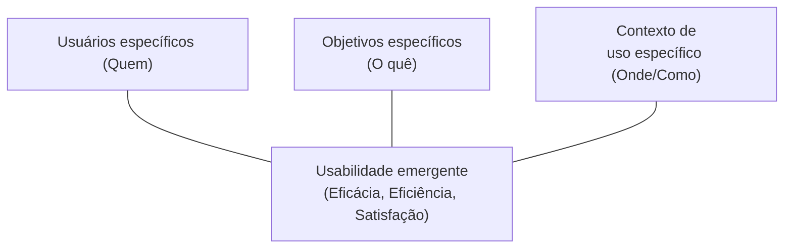
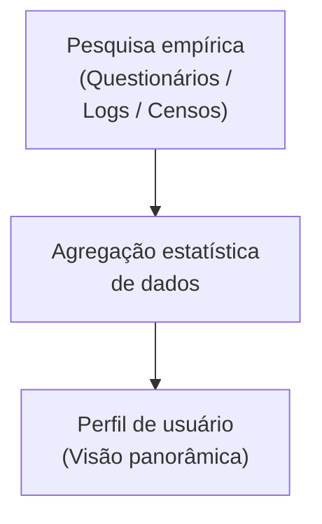
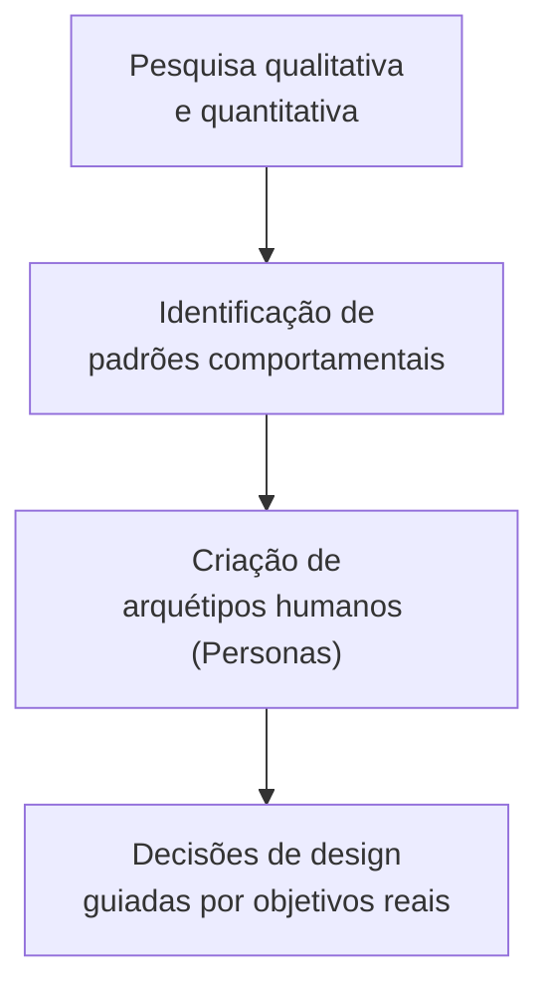
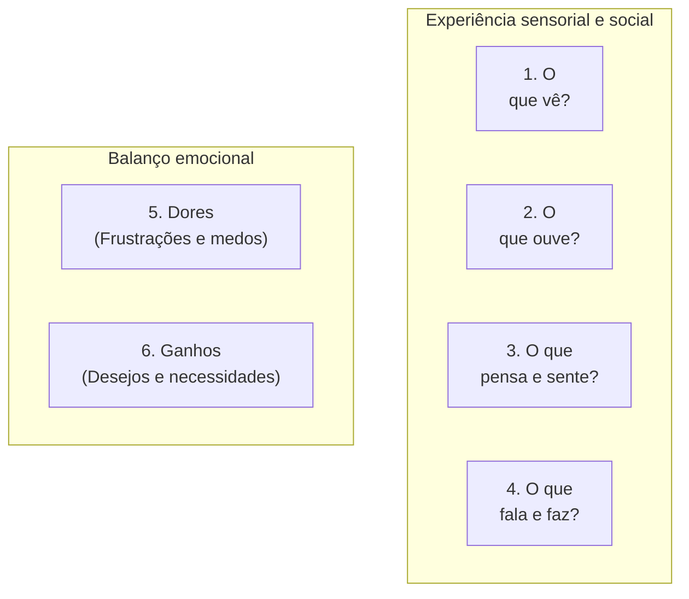

# Modelagem de usuário: perfil, persona e mapa de empatia

## Introdução (intuição e analogia do cotidiano)

Pense na diferença entre prescrever um **medicamento genérico** e confeccionar um **tratamento médico personalizado**:
1. **O remédio genérico de prateleira:** assume uma pessoa estatística média teórica. Funciona para a maioria de forma razoável, mas pode não ter dosagem suficiente para uns ou causar reações adversas em outros devido a particularidades de saúde não consideradas.
2. **O plano de saúde personalizado:** o médico examina o histórico específico do paciente, sua rotina de trabalho, restrições alimentares, rotinas de sono e medos pessoais antes de desenhar a intervenção.

Na Interação Humano-Computador (IHC), tentar projetar um sistema para um "usuário genérico" ou "todo mundo" resulta em softwares frustrantes, confusos e ineficientes. Para construir interfaces com alta usabilidade, o designer precisa responder rigorosamente a duas perguntas: **quem é a pessoa que vai interagir com este sistema?** e **como representá-la de forma útil para a equipe de desenvolvimento?**

Para solucionar essa questão, a IHC utiliza as técnicas de **modelagem de usuário**, destacando-se o **Perfil de Usuário**, a **Persona** e o **Mapa de Empatia**.

---

## 1. Identificação e descrição do usuário em IHC

### O conceito de usuários específicos na ISO 9241-11

A norma **ISO 9241-11 (2018)** conceitua a **usabilidade** como:

> *"O grau em que um produto é usado por usuários específicos para atingir objetivos específicos com eficácia, eficiência e satisfação em um contexto de uso específico."*

Essa definição explicita que a usabilidade **não é uma propriedade intrínseca e abstrata do software**, mas sim um resultado emergente do encontro entre:
- **Usuários específicos:** pessoas com características cognitivas, motoras, culturais e de repertório próprias.
- **Objetivos específicos:** as tarefas e intenções que as pessoas buscam realizar.
- **Contexto de uso específico:** o ambiente físico, técnico, social e organizacional onde a interação ocorre.

### O perigo da "pessoa elástica" (*elastic user*)

Quando a equipe de design e desenvolvimento não possui um modelo claro e formal de quem é o usuário, surge o fenômeno que **Alan Cooper** denominou de **"usuário elástico"** (*elastic user*):

- Durante a fase de requisitos, a equipe assume que o usuário é **altamente especialista** para justificar interfaces complexas e cheias de atalhos técnicos.
- Quando surge a necessidade de simplificar um fluxo difícil de codificar, a equipe muda arbitrariamente a premissa, argumentando que o usuário é **iniciante e leigo** e não vai se importar com a falta do recurso.

O usuário "estica" e "encolhe" de acordo com a conveniência dos desenvolvedores ou prazos de entrega. A **modelagem de usuário** serve precisamente para "congelar" a definição do público-alvo, dando à equipe uma referência concreta e estável.

---

## 2. Perfil de usuário

O **perfil de usuário** é uma descrição **estatística, agregada e resumida** das características gerais da população de usuários que utilizará o sistema.

### Atributos levantados no perfil
Um perfil de usuário tipicamente inclui variáveis quantitativas e qualitativas organizadas nas seguintes categorias:

1. **Dados demográficos e socioeconômicos:** faixa etária, gênero, nível de escolaridade, ocupação profissional, região geográfica e renda.
2. **Experiência e conhecimento de domínio:** nível de conhecimento sobre o assunto do sistema (ex.: contabilidade, medicina, navegação de bordo).
3. **Experiência com tecnologia (alfabetização digital):** familiaridade com sistemas operacionais, frequência de uso de computadores ou smartphones, preferência por dispositivos.
4. **Características físicas e cognitivas:** limitações visuais, motoras ou auditivas, nível de atenção e exigência de acessibilidade.
5. **Frequência de uso prevista:** usuário habitual (diário), eventual ou esporádico.

### Exemplo de perfil de usuário
- **Categoria:** operadores de caixa de supermercado.
- **Faixa etária:** 18 a 35 anos.
- **Escolaridade:** ensino médio completo.
- **Experiência tecnológica:** alta familiaridade com smartphones, mas baixa experiência com atalhos de teclado de sistemas desktop tradicionais.
- **Frequência de uso:** uso diário intensivo (8 horas por dia), sob alta pressão de tempo e estresse por filas.

### Limitações do perfil de usuário
Embora essencial para definir requisitos de acessibilidade e parametrização geral, o perfil de usuário é **abstrato e impessoal**. Ele fornece números e percentuais (ex.: *"65% dos usuários têm mais de 40 anos"*), mas não ajuda os projetistas a tomarem decisões de design detalhadas sobre fluxos de interação, empatia e tomada de decisão no dia a dia.

---

## 3. Persona

A **persona** é uma representação **arquetípica e fictícia**, porém **fundamentada em dados empíricos reais**, de um usuário do sistema. A técnica foi introduzida por **Alan Cooper** em seu livro *The Inmates Are Running the Asylum* (1999).

Diferente do perfil estatístico, a persona ganha um **nome, uma face visual, uma história de vida, motivações, objetivos e dores específicas**.

### Componentes essenciais de uma persona

Uma persona completa é documentada em uma ficha de síntese contendo:

1. **Identificação e elemento visual:** nome fictício, foto representativa (evitando celebridades), idade, profissão e localização.
2. **Frase marcante (*quote*):** uma citação sintética que resume a mentalidade ou a maior dor da persona.
3. **História de fundo (*bio*):** um parágrafo que contextualiza a rotina diária e a realidade da pessoa.
4. **Objetivos e necessidades (*goals*):** o que a persona deseja alcançar ao utilizar o produto (objetivos de vida, de trabalho e de experiência).
5. **Dores e frustrações (*pain points*):** os obstáculos, receios e problemas atuais que a impedem de atingir seus objetivos com facilidade.
6. **Comportamentos e atitudes:** hábitos de uso de tecnologia, canais de preferência e ambiente em que interage com a interface.

### Exemplo prático de persona

- **Nome:** Maria Clara, 42 anos.
- **Cargo:** gerente de compras de pequeno varejo.
- **Frase:** *"Preciso aprovar os pedidos de estoque rapidamente entre uma reunião e outra, sem ter que ficar procurando botões escondidos no sistema."*
- **Objetivo principal:** emitir e aprovar ordens de compra em menos de 2 minutos pelo celular.
- **Maior frustração:** sistemas com telas poluídas, letras pequenas e confirmações duplas desnecessárias que travam sua rotina móvel.

### Tipos de personas em um projeto

Um projeto de IHC pode ter múltiplas personas, organizadas por hierarquia:

1. **Persona primária:** representa o alvo principal do produto. A interface do sistema deve ser desenhada **prioritariamente para satisfazer as necessidades da persona primária** sem concessões.
2. **Persona secundária:** cujas necessidades são em grande parte cobertas pela persona primária, mas que possui algumas poucas exigências adicionais que podem ser atendidas sem prejudicar a persona primária.
3. **Antipersona (ou persona negativa):** representação de quem **não** é o público do sistema, ajudando a equipe a explicitar o que o produto não fará e para quem não está projetando.

---

## 4. Mapa de empatia

O **mapa de empatia** é uma ferramenta visual de síntese colaborativa (originalmente desenvolvida pela consultoria XPLANE) que busca aprofundar a compreensão sobre o **estado emocional, sensorial e comportamental** do usuário em seu contexto de uso.

Enquanto a persona descreve *quem é* o usuário e *quais são seus objetivos*, o mapa de empatia investiga *o que o usuário vivencia no seu dia a dia*.

### Estrutura dos seis quadrantes

O mapa de empatia organiza-se em seis áreas de análise em torno da figura do usuário:

1. **O que o usuário vê?**
   - Como é o ambiente físico e visual onde ele está inserido?
   - Quem são os amigos, colegas de trabalho e concorrentes ao seu redor?
   - Quais produtos, telas ou ofertas ele observa no cotidiano?

2. **O que o usuário ouve?**
   - O que os colegas de trabalho, chefes, clientes ou familiares dizem a ele?
   - Quem são os influenciadores de opinião que impactam suas decisões?
   - Quais ruídos ou interrupções sonoras existem em seu ambiente de uso?

3. **O que o usuário pensa e sente?**
   - Quais são suas preocupações centrais, medos não declarados e aspirações?
   - O que é realmente importante para ele, mesmo que não fale abertamente?
   - Qual é seu estado emocional ao tentar resolver o problema atual?

4. **O que o usuário fala e faz?**
   - Qual é sua atitude pública e comportamento visível perante os outros?
   - Como ele se expressa? Existe contradição entre o que ele *diz* que faz e o que ele *realmente faz* na prática?

5. **Quais são suas dores? (*Pains*)**
   - Quais são as maiores frustrações, obstáculos, riscos e estresses que ele enfrenta durante a tarefa?

6. **Quais são seus ganhos? (*Gains*)**
   - O que representa o sucesso para ele? Quais são seus desejos, métricas de satisfação e benefícios esperados?

---

## 5. Comparativo técnico entre perfil, persona e mapa de empatia

As três técnicas não são mutuamente exclusivas; elas se complementam e alimentam umas às outras durante o processo de **Design Centrado no Usuário (UCD / ISO 9241-210)**:

| Dimensão de análise | Perfil de usuário | Persona | Mapa de empatia |
| :--- | :--- | :--- | :--- |
| **Natureza dos dados** | Quantitativa, estatística e agregada | Qualitativa, arquetípica e narrativa | Emocional, sensorial e comportamental |
| **Foco principal** | Atributos demográficos e níveis de experiência | Objetivos, motivações e padrões de uso | Percepções, ambiente e sentimentos |
| **Formato visual** | Relatórios, gráficos e tabelas de dados | Ficha sintética com nome, foto e história | Painel visual dividido em 6 quadrantes |
| **Principal benefício** | Visão geral da população de usuários | Evita o "usuário elástico" e guia decisões de UI | Estimula a empatia da equipe com o contexto real |
| **Momento no projeto** | Início da pesquisa de campo (etapa inicial) | Síntese da pesquisa para a fase de ideação | Workshops de alinhamento e concepção inicial |

---

## Conclusão e integração no fluxo de design

Modelar o usuário é o passo fundamental para garantir a **abordagem Fora para Dentro (*Outside-In*)** em Interação Humano-Computador. 

Ao combinar o **Perfil de Usuário** (que responde *quantos e quais grupos existem*), a **Persona** (que responde *quem é o indivíduo arquetípico e o que ele quer*) e o **Mapa de Empatia** (que responde *como ele se sente e percebe seu ambiente*), a equipe de design e engenharia estabelece uma base sólida para criar interfaces que atendam aos critérios de **eficácia, eficiência e satisfação** definidos pela norma ISO 9241-11.

---

## Material complementar

- LOUZADA, Henrique; CHAVES, Gabriel; PONCIANO, Lesandro. [Exploring user profiles based on their explainability requirements in interactive systems](https://dl.acm.org/doi/10.1145/3424953.3426545). In: **Proceedings of the 19th Brazilian Symposium on Human Factors in Computing Systems (IHC '20)**. 2020. p. 1-6. DOI: 10.1145/3424953.3426545. Acesso em: ==01/07/2021==.
- PONCIANO, Lesandro; BRASILEIRO, Francisco. [Finding Volunteers' Engagement Profiles in Human Computation for Citizen Science Projects](https://doi.org/10.15346/hc.v1i2.12). **Human Computation**, v. 1, n. 2, 2014. DOI: 10.15346/hc.v1i2.12. Acesso em: ==01/07/2021==.

---

## Artigos relacionados e navegação

- **Artigo anterior:** [[11. Racionalismo técnico e reflexão em ação - o papel da técnica e da criatividade no design]]
- **Próximo artigo:** [[13. Prototipagem de sistemas interativos - fidelidade, dimensão, wireframe, mockup e storyboard]]
- **Resumo da disciplina:** [[00. Design de Interacao - Resumo]]
- **Página inicial do vault:** [[index]]
