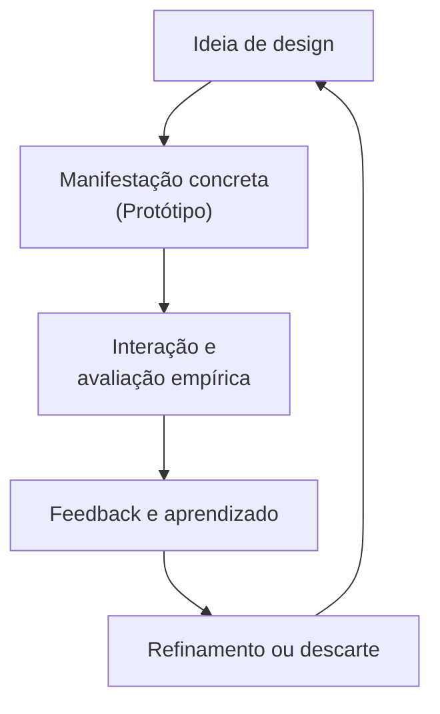
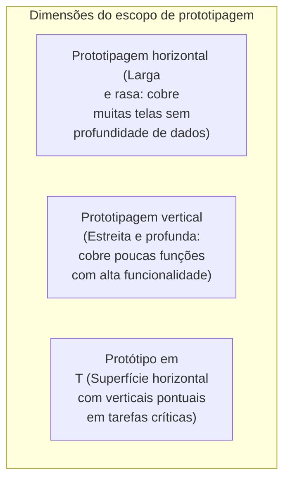
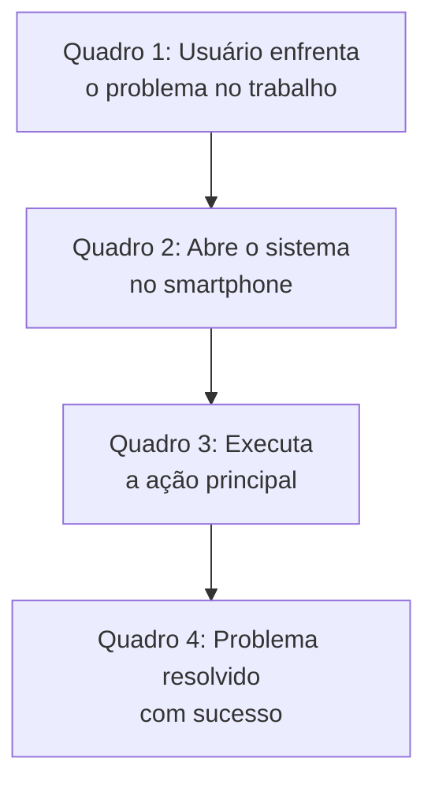

# Prototipagem de sistemas interativos: fidelidade, dimensão, wireframe, mockup e storyboard

## Introdução (intuição e analogia do cotidiano)

Pense no processo de produção de um **filme de grande orçamento**:
1. Antes de construir cenários caros ou contratar atores renomados, o diretor e a equipe desenham um **storyboard**, ou seja, uma sequência de quadros desenhados à mão que mostra o ângulo de cada cena, a iluminação e as reações dos personagens.
2. Em seguida, os arquitetos de cena constroem uma **maquete em escala reduzida** de papelão para testar o posicionamento de câmeras e luzes.
3. Apenas após validar o roteiro e os enquadramentos com o storyboard e a maquete é que a equipe constrói os **cenários reais em tamanho definitivo** e grava as cenas.

Na Interação Humano-Computador (IHC), construir software diretamente em código-fonte sem validar a interface e a experiência antes equivale a filmar sem storyboard: qualquer erro de concepção exige refazer dias de trabalho de programação dispendiosa.

A **prototipagem** é o conjunto de técnicas que permite aos designers representarem concretamente a interface e a interação para obter *feedback* empírico de usuários, clientes e colegas de equipe o mais cedo possível no ciclo de desenvolvimento.

---

## 1. O papel da prototipagem em Interação Humano-Computador

Um **protótipo** em IHC é uma manifestação concreta de uma ideia de design que permite aos projetistas e aos usuários interagirem com ela para explorar sua adequação, viabilidade e usabilidade.

### Objetivos fundamentais da prototipagem

1. **Testar ideias de forma rápida e barata:** permitir que hipóteses de navegação, rotulagem e fluxo de tarefas sejam testadas antes da escrita de código-fonte.
2. **Estimular a reflexão em ação (*Reflection-in-Action*):** conforme proposto por Donald Schön, o protótipo atua como um material com o qual o designer "conversa", revelando problemas não previstos na fase conceitual.
3. **Facilitar a comunicação entre stakeholders:** preencher o golfo de comunicação entre clientes (que pensam em regras de negócio), desenvolvedores (que pensam em arquitetura de código) e usuários (que pensam na execução de suas tarefas diárias).
4. **Resolver conflitos de design:** comparar empiricamente duas ou mais alternativas de interface (testes A/B ou avaliações formativas) com base na reação do usuário real.

---

## 2. Dimensões de fidelidade na prototipagem

A **fidelidade** refere-se ao grau em que o protótipo se aproxima do produto final em termos de aparência visual, comportamento interativo, riqueza de conteúdo e resposta tecnológica.

### a. Protótipos de baixa fidelidade (*low-fidelity / low-fi*)

Os protótipos de baixa fidelidade são representações simplificadas, abstratas e intencionalmente rústicas do sistema. São construídos utilizando materiais muito distantes do meio digital final, tais como papel, cartolina, post-its ou rascunhos rápidos (*sketches*).

#### Principais técnicas de baixa fidelidade
- **Prototipagem em papel (*paper prototyping*):** desenho das telas em folhas de papel onde um facilitador ("o computador humano") troca as folhas ou cola pequenos pedaços de papel simulando menus suspensos, caixas de diálogo e mensagens de erro conforme o usuário toca no papel.
- **Rascunhos visuais (*sketches*):** desenhos rápidos à mão livre para explorar múltiplos conceitos visuais sem preocupação com alinhamento rigoroso.

#### Vantagens da baixa fidelidade
- **Baixíssimo custo e rapidez de produção:** podem ser criados em minutos durante uma reunião.
- **Encoraja críticas sinceras dos usuários:** como o protótipo parece rústico e inacabado, os usuários não hesitam em apontar falhas ou propor mudanças radicais.
- **Descarte sem apego emocional:** a equipe não sofre com o viés de custo afundado (*sunk cost fallacy*) se precisar jogar o papel no lixo e recomeçar.

#### Limitações da baixa fidelidade
- **Navegação não autônoma:** exige a presença constante de um facilitador para simular a reação do sistema.
- **Incapacidade de testar tempo de resposta e micro-interações:** não permite avaliar animações, tempos de carregamento ou precisão motora detalhada.

---

### b. Protótipos de alta fidelidade (*high-fidelity / hi-fi*)

Os protótipos de alta fidelidade assemelham-se fortemente ao produto final em aparência visual, tipografia, paleta de cores e comportamento de resposta interativa. São construídos em ferramentas especializadas de design de interface (ex.: Figma, Axure) ou com código sintético (HTML/CSS/JavaScript).

#### Vantagens da alta fidelidade
- **Aparência e comportamento realistas:** permite testes de usabilidade autônomos e altamente fiéis à realidade de uso.
- **Validação visual detalhada:** ideal para testar contraste, hierarquia tipográfica, identidade de marca e transições entre telas.
- **Excelente para demonstrações executivas:** facilita a aprovação de orçamento com clientes e diretoria.

#### Limitações da alta fidelidade
- **Custo elevado e alto tempo de desenvolvimento:** exige horas ou dias de trabalho especializado.
- **Inibição de feedback conceitual:** como a interface parece "pronta", os usuários tendem a se concentrar em detalhes superficiais (como a cor de um botão) em vez de questionar a lógica do fluxo de tarefas.
- **Resistência a mudanças:** a equipe tende a defender o protótipo devido ao tempo investido em sua criação.

---

### Tabela comparativa de fidelidade

| Característica | Baixa fidelidade (*low-fi*) | Alta fidelidade (*hi-fi*) |
| :--- | :--- | :--- |
| **Materiais típicos** | Papel, lápis, post-its, cartolina | Figma, Axure, HTML/CSS/JS, ferramentas de prototipagem |
| **Tempo de criação** | Minutos a poucas horas | Dias a semanas |
| **Custo de alteração** | Mínimo | Elevado |
| **Foco da avaliação** | Lógica do fluxo, navegação e conceitos | Detalhes visuais, affordances e micro-interações |
| **Atitude do usuário** | Foco na funcionalidade e facilidade de criticar | Foco nos detalhes estéticos e apreensão em criticar |
| **Fase ideal de uso** | Concepção inicial e elicitação de ideias | Validação formativa final e entrega para desenvolvimento |

---

## 3. Dimensões do escopo do protótipo: horizontal vs. vertical

Além da fidelidade visual, a prototipagem difere na **amplitude de cobertura das funcionalidades do sistema**, dividindo-se nas abordagens **horizontal** e **vertical**.

### a. Prototipagem horizontal (*horizontal prototyping*)

A **prototipagem horizontal** fornece uma visão ampla e rasa do sistema. Ela cobre uma grande quantidade de telas e rotas de navegação, mas **sem implementar a funcionalidade interna ou o processamento de dados subjacente**.

- **Características:** o usuário pode clicar em vários menus e navegar por quase todas as seções da interface, mas ao tentar realizar uma ação profunda (ex.: salvar um cadastro ou processar um pagamento), o sistema exibe dados genéricos de demonstração (*dummy data*).
- **Principal objetivo:** testar a arquitetura da informação, a consistência dos menus e a visão geral da jornada do usuário.

### b. Prototipagem vertical (*vertical prototyping*)

A **prototipagem vertical** fornece uma visão estreita e detalhada de uma funcionalidade específica do sistema. Ela escolhe um único fluxo de tarefa crítico e o implementa com alta profundidade operacional.

- **Características:** todas as telas secundárias e menus irrelevantes para aquela tarefa são desativados. No entanto, no fluxo selecionado, o usuário consegue inserir dados reais, experimentar validações complexas e ver a resposta exata da máquina.
- **Principal objetivo:** testar a viabilidade técnica e a usabilidade de um algoritmo ou tarefa de alto risco (ex.: um simulador financeiro ou o fluxo de checkout principal).

### c. O protótipo em T (*T-prototype*)

Na prática profissional de IHC, combina-se o melhor das duas abordagens no chamado **protótipo em T** (*T-prototype*):
- A barra horizontal do "T" fornece uma cobertura superficial de toda a interface para dar contexto global ao usuário.
- As hastes verticais do "T" aprofundam-se apenas nas duas ou três tarefas mais críticas e frequentes do sistema.

---

## 4. Técnicas e artefatos de representação

Dependendo do objetivo do teste e do momento do projeto, o designer utiliza artefatos de representação distintos:

### a. Storyboard (cenário em sequência de quadros)

O **storyboard** é uma técnica adaptada do cinema que ilustra visualmente o usuário interagindo com o sistema **inserido em seu contexto de uso real**.

- **Foco do storyboard:** não é mostrar botões ou pixels da tela, mas sim a história humana, as emoções, as motivações e os fatores ambientais (ex.: barulho, pressa, luz solar) que envolvem o momento de uso.
- **Quando utilizar:** na fase inicial de ideação e alinhamento de proposta de valor com partes interessadas.

### b. Wireframe (esqueleto estrutural)

O **wireframe** é um desenho de baixa ou média fidelidade que estabelece a estrutura espacial, a hierarquia de conteúdo e o arranjo dos componentes de uma tela sem utilizar elementos visuais definitivos.

- **Características visuais:** feito em tons de cinza, utilizando caixas com um "X" para indicar imagens, linhas para representar textos e retângulos simples para indicar botões.
- **Foco do wireframe:** validar o posicionamento dos elementos, a legibilidade da estrutura e a hierarquia visual.
- **O que não deve conter:** cores finais de marca, fotografias reais, fontes tipográficas estilizadas ou elementos decorativos.

### c. Mockup (modelo estático de alta fidelidade)

O **mockup** é a evolução visual do wireframe. É um modelo estático de alta fidelidade visual que exibe com precisão matemática (*pixel-perfect*) como a interface final se parecerá.

- **Características visuais:** inclui a paleta de cores final, fotografias reais, tipografia oficial, ícones vetorizados e identidade corporativa.
- **Foco do mockup:** validar o apelo estético, a comunicação visual, o contraste e a conformidade com o sistema de design (*design system*).
- **Diferença para o protótipo interativo:** o mockup é estático (uma imagem fixa); ele não reage aos cliques do usuário nem possui transições de tela ativas.

---

## 5. Matriz comparativa das técnicas de representação

| Artefato | Meio / Formato | Nível de fidelidade | Foco principal da representação | Interatividade |
| :--- | :--- | :--- | :--- | :--- |
| **Storyboard** | Ilustração em quadros | Baixa (narrativa) | Contexto humano, ambiente e proposta de valor | Nenhuma (narrativa estática) |
| **Wireframe** | Esquema espacial (cinza) | Baixa a média | Estrutura de conteúdo, arranjo espacial e layout | Nenhuma ou navegação básica |
| **Mockup** | Imagem digital final | Alta visual | Estética, cores, tipografia e identidade visual | Nenhuma (imagem fixa) |
| **Protótipo Interativo** | Ferramenta digital / Código | Média a alta | Comportamento, transições de tela e fluxo de tarefa | Alta (clique e resposta em tempo real) |

---

## 6. Conexão interdisciplinar: Wireframes e Prototipagem no Projeto Integrador

A prototipagem é o elo direto entre a concepção visual em Design de Interação e a entrega do software no Eixo 2:

1. **Entregável Obrigatório da Etapa 02:**
   * No cronograma do Projeto Integrador ([[06. Projeto - Aplicacao Interativa/03. Cronograma semanal e entregas de etapas.md|Cronograma Semanal do Projeto]]), a equipe deve entregar os **Wireframes Interativos e o Diagrama de Fluxo de Telas (User Flow)** antes de iniciar a codificação das views no ASP.NET Core MVC.
2. **Validação Antecipada com Stakeholders:**
   * A utilização de wireframes interativos (no Figma, MarvelApp ou Marvel) permite validar as jornadas de usuário definidas nas Histórias de Usuário da Etapa 01 com a orientadora e usuários reais antes de gastar tempo de desenvolvimento em código HTML/CSS/C#.

---

## Conclusão e boas práticas no fluxo de design

A prototipagem não é uma etapa isolada, mas sim o **motor do ciclo iterativo do Design Centrado no Usuário**. 

A boa prática em IHC recomenda iniciar o projeto com **storyboards e wireframes de baixa fidelidade em papel** para explorar alternativas conceituais com rapidez e baixíssimo custo. À medida que as incertezas sobre o fluxo de uso diminuem, a equipe evolui gradualmente para **mockups estáticos e protótipos de alta fidelidade (horizontais ou em T)** para realizar testes formais de usabilidade e orientar a implementação final da engenharia de software.

---

## Referências bibliográficas

- BENYON, David. **Interação Humano-Computador**. 2. ed. São Paulo: Pearson, 2011.
- BUXTON, Bill. **Sketching User Experiences: getting the design right and the right design**. San Francisco: Morgan Kaufmann, 2007.
- NIELSEN NORMAN GROUP. [Paper Prototyping: Getting User Data Before You Code](https://www.nngroup.com/articles/paper-prototyping/). Acesso em: ==01/07/2021==.
- RETTIG, Marc. Prototyping for tiny budgets. **Communications of the ACM**, v. 37, n. 4, p. 21-27, 1994.
- ROGERS, Yvonne; SHARP, Helen; PREECE, Jenny. **Interaction Design: beyond human-computer interaction**. 5. ed. Indianapolis: John Wiley & Sons, 2019.

---

## Material complementar

- SISTEMA LUMEN. [Exemplo de protótipo em vídeo para sistema de Internet das Coisas: Sistema Lumen](https://www.youtube.com/watch?v=pI7LEZ3AsOg). Vídeo demonstrativo de prototipagem em vídeo para IoT. Acesso em: ==01/07/2021==.
- SISTEMA PULSO. [Exemplo de protótipo em vídeo para sistema de Internet das Coisas: Sistema Pulso](https://www.youtube.com/watch?v=TWXc-a3uPIk). Vídeo demonstrativo de prototipagem em vídeo para IoT. Acesso em: ==01/07/2021==.

---

## Artigos relacionados e navegação

- **Artigo anterior:** [[12. Modelagem de usuário - perfil, persona e mapa de empatia]]
- **Próximo artigo:** [[14. Estética em sistemas interativos - harmonização de cores, fontes e usabilidade]]
- **Resumo da disciplina:** [[00. Design de Interacao - Resumo]]
- **Página inicial do vault:** [[index]]
