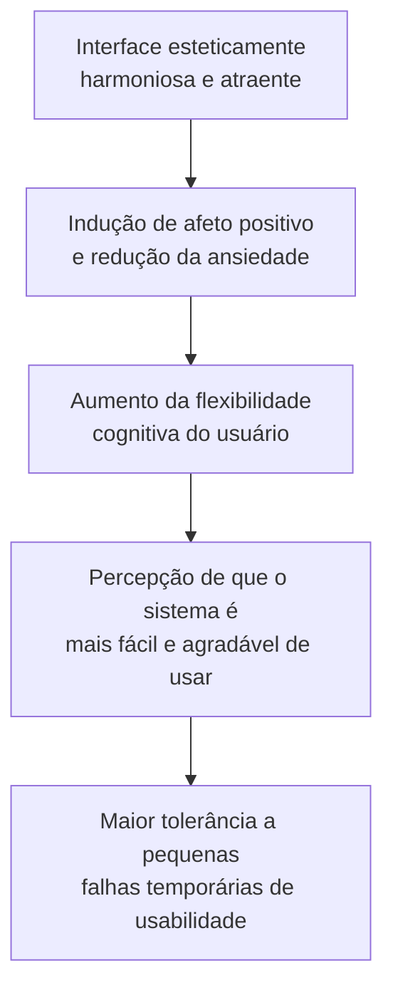
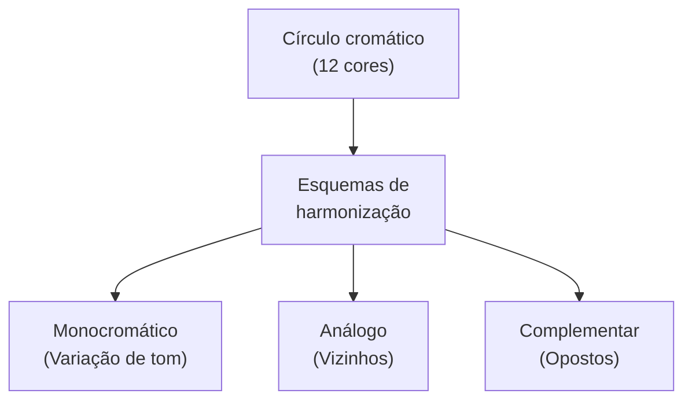
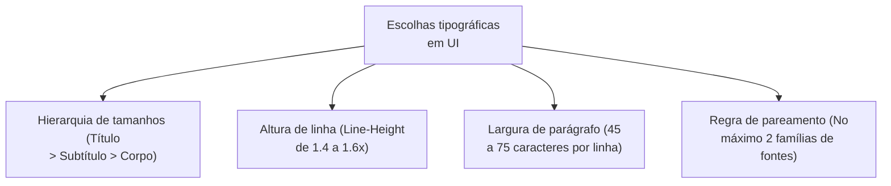

# Estética em sistemas interativos: harmonização de cores, fontes e usabilidade

## Introdução (intuição e analogia do cotidiano)

Pense na sinalização visual de um **aeroporto internacional**:
1. Se as placas usarem cores conflitantes sem contraste, tipografias rebuscadas com recortes decorativos e tamanhos desproporcionais, os passageiros se sentem desorientados, ansiosos e correm o risco de perder seus voos.
2. Se o aeroporto adotar uma paleta de cores harmoniosa, com sinalização em cores padronizadas (ex.: amarelo para atenção, verde para portões abertos) e tipografia clara e legível à distância, os passageiros transitam com calma, rapidez e confiança.

Em Interação Humano-Computador (IHC), a **estética da interface** não é mero adorno visual ou ornamentação superficial (*visual polishing*). A escolha das cores, a harmonização cromática e a estruturação tipográfica desempenham um papel funcional direto no processamento cognitivo do usuário, influenciando diretamente a **usabilidade, a legibilidade, a acessibilidade e a resposta emocional** ao interagir com o software.

---

## 1. O papel da estética no projeto de sistemas interativos

### A estética na norma ISO/IEC 25010:2011

A norma de qualidade de produto de software **ISO/IEC 25010:2011** inclui explicitamente a **estética da interface de usuário** (*user interface aesthetics*) como uma das subcaracterísticas essenciais do modelo de qualidade de usabilidade, definindo-a como:

> *"O grau em que a interface de usuário proporciona uma interação agradável e satisfatória para o usuário através de um arranjo visual harmonioso, coerente e atraente."*

### O efeito estética-usabilidade (*Aesthetic-Usability Effect*)

Demonstrado inicialmente pelos pesquisadores japoneses **Masaaki Kurosu e Kaori Kashimura** (1995) e popularizado por **Don Norman** em sua obra *Emotional Design* (2004), o **efeito estética-usabilidade** descreve um fenômeno psicológico fundamental em IHC:

- **Impacto psicológico:** usuários tendem a perceber interfaces esteticamente atraentes como **mais fáceis de usar** do que interfaces poluídas ou desarmônicas, mesmo quando ambas possuem exatamente as mesmas funcionalidades e tempos de resposta.
- **Tolerância a erros:** quando a interface transmite cuidado visual e harmonia, o usuário tende a culpar a si mesmo por uma falha e persistir na tarefa com paciência, enquanto em interfaces feias e desorganizadas a frustração surge no primeiro obstáculo.

---

## 2. Teoria e harmonização de cores em IHC

A cor é um dos elementos visuais mais poderosos na interface. Além de comunicar a identidade de marca, a cor atua como um **signo funcional** para organizar a informação e direcionar a atenção visual do usuário.

### Esquemas fundamentais de harmonização cromática

1. **Harmonia monocromática:** utiliza variações de saturação e brilho de uma única matriz de cor.
   - *Aplicação em UI:* cria interfaces elegantes, limpas e com baixo ruído visual. Ideal para painéis de dados operacionais (*dashboards*) e ferramentas de leitura.
2. **Harmonia análoga:** combina cores que estão lado a lado no círculo cromático (ex.: azul, azul-esverdeado e verde).
   - *Aplicação em UI:* transmite sensação de calma, continuidade e serenidade.
3. **Harmonia complementar:** utiliza cores diametralmente opostas no círculo cromático (ex.: azul e laranja, ou roxo e amarelo).
   - *Aplicação em UI:* gera altíssimo contraste visual. Excelente para destacar o botão de ação principal (*Call to Action - CTA*) ou elementos de alerta em relação ao fundo.

### A regra 60-30-10 de distribuição cromática em telas

Para evitar o excesso de estimulação visual, adota-se a regra de proporção visual **60-30-10**:

- **60% - Cor dominante (fundo/espaço negativo):** cor neutra (branco, cinza claro ou escuro no modo noturno) que estabelece o ambiente sem competir por atenção.
- **30% - Cor secundária (elementos estruturais):** utilizada em cartões (*cards*), barras laterais, menus e divisores para agrupar conteúdos relacionados.
- **10% - Cor de acento ou destaque (*accent color*):** cor vibrante reservada exclusivamente para botões de ação primária, seleções ativas, chamadas importantes e links.

### Código semântico das cores de estado (*status colors*)

Em IHC, certas cores possuem convenções semânticas consolidadas que não devem ser violadas arbitrariamente:

- **Vermelho (erro/destrutivo):** indica falhas, exclusão irreversível, ações de alto risco ou parada obrigatória.
- **Verde (sucesso/confirmação):** indica conclusão bem-sucedida, sistema ativo ou permissão concedida.
- **Amarelo / Laranja (aviso/atenção):** sinaliza alertas, pendências não bloqueantes ou necessidade de cautela.
- **Azul (informação/interação):** indica links selecionáveis, balões informativos ou navegação padrão.

### Acessibilidade cromática (norma WCAG 2.1)

De acordo com as diretrizes da **WCAG 2.1 (Web Content Accessibility Guidelines)**:

1. **Contraste mínimo de luminância:** o texto normal deve ter uma razão de contraste de pelo menos **4.5:1** em relação ao fundo (e **3:1** para textos grandes ou em negrito).
2. **Independência da cor:** **nunca confie exclusivamente na cor** para transmitir uma informação crítica (ex.: indicar campos com erro apenas mudando a borda para vermelho). Deve-se sempre associar a cor a um ícone explicativo, texto ou textura visual para atender pessoas com daltonismo.

---

## 3. Tipografia e hierarquia visual de fontes

A tipografia é a arte de organizar letras e textos de forma a tornar a linguagem escrita clara, legível e visualmente atraente para a leitura em telas digitais.

### Legibilidade (*legibility*) vs. Leiturabilidade (*readability*)

- **Legibilidade (*legibility*):** capacidade de o olho humano **distinguir individualmente cada caractere ou letra** (depende da anatomia da fonte, abertura das letras e contraste).
- **Leiturabilidade (*readability*):** facilidade com que o cérebro consegue **ler e compreender blocos contínuos de texto** (depende do tamanho da fonte, altura da linha e largura dos parágrafos).

### Classificação de fontes e uso em telas

1. **Fontes sem serifa (*Sans-Serif* - ex.: Inter, Roboto, Helvetica, Arial):**
   - Não possuem os pequenos traços ornamentais nas extremidades das letras.
   - *Uso ideal:* são a escolha padrão para interfaces digitais e telas de qualquer resolução, garantindo máxima clareza em tamanhos pequenos.
2. **Fontes serifadas (*Serif* - ex.: Georgia, Merriweather, Times New Roman):**
   - Possuem remates e traços estruturais nas pontas.
   - *Uso ideal:* adequadas para textos longos e editoriais (como livros digitais ou artigos acadêmicos), transmitindo tradição e elegância.
3. **Fontes monoespaçadas (*Monospace* - ex.: Fira Code, Consolas):**
   - Todas as letras ocupam exatamente a mesma largura horizontal.
   - *Uso ideal:* editores de código-fonte, tabelas de valores financeiros e alinhamento de colunas numéricas.

### Regras práticas de hierarquia e pareamento tipográfico

- **Pareamento limitado (*font pairing*):** utilize no máximo **duas famílias tipográficas diferentes** na mesma aplicação (ex.: uma fonte marcante para títulos e uma fonte altamente legível para o corpo de texto).
- **Altura de linha (*line-height*):** para textos de corpo em telas, mantenha a altura de linha entre **1.4 e 1.6 vezes** o tamanho da fonte (140% a 160%), evitando que as linhas se sobreponham visualmente.
- **Comprimento da linha de texto (*line length*):** limite a largura dos blocos de texto a um intervalo de **45 a 75 caracteres por linha**. Linhas muito longas cansam a musculatura ocular na transição de volta ao início da próxima linha.

---

## 4. Matriz comparativa: elemento estético vs. impacto na usabilidade

| Elemento estético | Boa prática de design | Erro comum de design | Impacto direto na usabilidade |
| :--- | :--- | :--- | :--- |
| **Contraste de cor** | Razão $\ge 4.5:1$ (WCAG 2.1) | Texto cinza claro sobre fundo cinza | Reduz fadiga visual e garante acessibilidade |
| **Paleta de cores** | Regra 60-30-10 com acento pontual | Múltiplas cores vibrantes disputando atenção | Direciona o foco do usuário para o fluxo principal |
| **Família tipográfica** | Uso de fontes Sans-Serif em telas | Uso de fontes decorativas ou manuscritas em UI | Aumenta a velocidade de leitura e reconhecimento |
| **Tamanho de fonte** | Escala proporcional (mínimo de 16px para texto) | Letras minúsculas sem opção de ajuste | Evita erros de digitação e leitura incorreta |
| **Espaçamento branco** | Espaço negativo generoso entre blocos | Telas poluídas e densas sem respiro visual | Reduz a carga cognitiva e agrupa conteúdos por afinidade |

---

## Conclusão e integração prática

A estética em Interação Humano-Computador não é um fim em si mesma, mas um meio para alcançar a excelência operacional. 

Quando a **harmonização cromática** (atração, semântica e contraste) é combinada com uma **arquitetura tipográfica rigorosa** (legibilidade, hierarquia e espaçamento), a interface atinge um equilíbrio em que a beleza visual trabalha a favor da redução da carga cognitiva, proporcionando uma experiência de uso rápida, acessível, segura e gratificante.

---

## Referências bibliográficas

- GAUGHTON, Jon. **Laws of UX: using psychology to design better products and services**. Sebastopol: O'Reilly Media, 2020.
- INTERNATIONAL ORGANIZATION FOR STANDARDIZATION / INTERNATIONAL ELECTROTECHNICAL COMMISSION. **ISO/IEC 25010:2011: Systems and software engineering — SQuaRE — System and software quality models**. Geneva: ISO/IEC, 2011.
- KUROSU, Masaaki; KASHIMURA, Kaori. [Apparent usability vs. inherent usability](https://doi.org/10.1145/223355.223680). In: **CHI '95 Conference Companion on Human Factors in Computing Systems**. Denver. New York: ACM, 1995. p. 292-293. DOI: 10.1145/223355.223680. Acesso em: ==01/07/2021==.
- NIELSEN NORMAN GROUP. [The Aesthetic-Usability Effect](https://www.nngroup.com/articles/aesthetic-usability-effect/). Acesso em: ==01/07/2021==.
- NORMAN, Donald A. **Emotional Design: why we love (or hate) everyday things**. New York: Basic Books, 2004.
- WORLD WIDE WEB CONSORTIUM (W3C). **Web Content Accessibility Guidelines (WCAG) 2.1**. W3C Recommendation, 2018.

---

## Material complementar

- ADOBE COLOR. [Sistema online de manipulação de cores Adobe Color](https://color.adobe.com/pt/create). Ferramenta online de paletas e harmonização cromática. Acesso em: ==01/07/2021==.
- DE MACÊDO MORAIS, L. A.; ANDRADE, N.; DE SOUSA, D. M. C.; PONCIANO, L. [Defamiliarization, representation granularity, and user experience: A qualitative study with two situated visualizations](https://doi.org/10.1109/PacificVis.2019.00019). In: **2019 IEEE Pacific Visualization Symposium (PacificVis)**. IEEE, 2019. p. 92-101. DOI: 10.1109/PacificVis.2019.00019. Acesso em: ==05/07/2021==.
- GOOGLE FONTS. [Sistema Google Fonts](https://fonts.google.com/). Biblioteca e repositório de tipografias e fontes para web e interfaces. Acesso em: ==01/07/2021==.
- USERTESTING. [How color impacts conversion rates and UX](https://www.usertesting.com/blog/color-ux-conversion-rates). Artigo sobre impacto das cores na conversão e experiência de uso. Acesso em: ==01/07/2021==.

---

## Artigos relacionados e navegação

- **Artigo anterior:** [[13. Prototipagem de sistemas interativos - fidelidade, dimensão, wireframe, mockup e storyboard]]
- **Próximo artigo:** [[15. Componentes e recomendações ergonômicas em sistemas interativos]]
- **Resumo da disciplina:** [[00. Design de Interacao - Resumo]]
- **Página inicial do vault:** [[index]]
