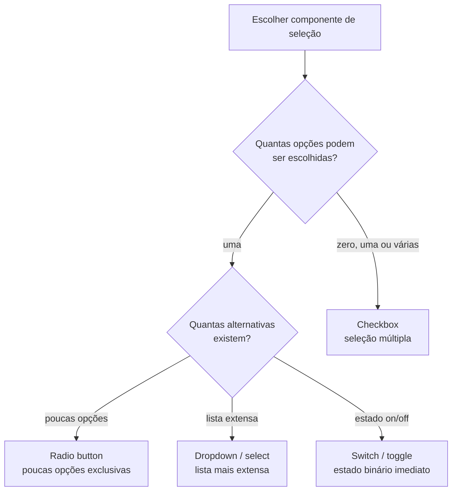
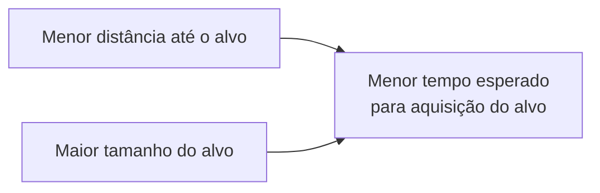

# Componentes e recomendações ergonômicas em sistemas interativos

## Ergonomia orienta componentes compatíveis com capacidades humanas

Pense no painel de controle de um **automóvel moderno**:
1. Se o botão para ligar os faróis de milha for fisicamente idêntico, tiver a mesma cor e estiver posicionado lado a lado com o botão que aciona o pisca-alerta ou o limpador de para-brisa, o motorista em uma situação de emergência correndo o risco de cometer um deslize grave por confusão táctil e visual.
2. Se os botões possuírem formas distintas (botões giratórios para luzes, alavancas para limpadores, botões em relevo vermelho para o pisca-alerta), o motorista consegue operar os comandos por memória muscular e tato, sem precisar tirar os olhos da estrada.

Em Interação Humano-Computador (IHC), a **ergonomia de software** busca adaptar o design dos componentes gráficos às características cognitivas, motoras e perceptivas dos seres humanos. A escolha correta dos componentes de interface e o cumprimento das recomendações ergonômicas evitam deslizes operacionais, reduzem a carga de memória e garantem a **usabilidade e operabilidade** do sistema.

---

## Critérios de Scapin e Bastien para ergonomia de interfaces

A ergonomia aplicada ao design de interfaces estuda as diretrizes para tornar a interação entre o ser humano e o computador eficiente, segura e confortável.

Uma das estruturas teóricas mais influentes em IHC para avaliação ergonômica são os **8 critérios ergonômicos de Scapin e Bastien** (desenvolvidos no INRIA em 1993):

| Critério de Scapin e Bastien | Foco |
| :--- | :--- |
| Condução | Orientação, feedback e legibilidade |
| Carga de trabalho | Redução de esforço perceptivo e cognitivo |
| Controle explícito | Ações iniciadas e controladas pelo usuário |
| Adaptabilidade | Flexibilidade e adequação a diferentes usuários |
| Gestão de erros | Prevenção, diagnóstico e recuperação |
| Consistência | Padrões estáveis de apresentação e comportamento |
| Significado dos códigos | Rótulos, abreviações e símbolos compreensíveis |
| Compatibilidade | Coerência com tarefas, expectativas e contexto |

### Oito critérios ergonômicos

1. **Condução (*Guidance*):** conjunto de meios utilizados para aconselhar, orientar e informar o usuário sobre o estado do sistema e as ações possíveis (subdividido em *incitamento*, *agrupamento*, *feedback imediato* e *legibilidade*).
2. **Carga cognitiva (*Cognitive Load / Workload*):** conjunto de elementos que visam reduzir a exigência de memória de trabalho e o esforço de leitura (subdividido em *brevidade* e *densidade de informação*).
3. **Controle explícito (*Explicit Control*):** garantia de que o sistema processe apenas ações explicitamente solicitadas pelo usuário e permita interrupção ou reversão (subdividido em *ações explícitas* e *reversibilidade/desfazer*).
4. **Adaptabilidade (*Adaptability*):** capacidade da interface de se ajustar à experiência, preferências e hábitos de diferentes perfis de usuários (subdividido em *flexibilidade* e *experiência do usuário*).
5. **Gestão de erros (*Error Management*):** mecanismos de proteção contra deslizes operacionais, mensagens de erro explicativas e facilidade de recuperação.
6. **Consistência (*Consistency*):** manutenção dos mesmos padrões visuais, nomenclaturas, layouts e comportamentos em todas as telas da aplicação.
7. **Significado dos códigos e denominadores (*Significance of Codes*):** uso de termos, ícones e metáforas que possuem relação direta com o domínio e o mundo real do usuário.
8. **Compatibilidade (*Compatibility*):** grau de adequação do fluxo do sistema com a rotina e o modo como o usuário realiza a tarefa no mundo real.

---

## Componentes de UI comunicam possibilidades de ação

A norma **ISO 9241-161 (2016)** padroniza os elementos visuais de interface de usuário. Cada componente gráfico possui uma "gramática visual" implícita que comunica mentalmente ao usuário como ele deve operar aquele controle.

### Componentes para seleção única e múltipla

1. **Botões de opção (*Radio Buttons* - seleção única visível):**
   - *Gramática visual:* círculos com preenchimento central.
   - *Regra ergonômica:* utilizados quando o usuário deve escolher **uma e apenas uma opção entre 2 e 5 alternativas**. Todas as opções ficam visíveis simultaneamente, permitindo comparação direta sem cliques adicionais.
2. **Caixas de seleção (*Checkboxes* - seleção múltipla):**
   - *Gramática visual:* quadrados com marcação em "X" ou sinal de visto.
   - *Regra ergonômica:* utilizadas quando o usuário pode selecionar **zero, uma ou múltiplas opções independentes**. Cada caixa atua de forma autônoma.
3. **Listas suspensas (*Dropdowns / Selects* - seleção única oculta):**
   - *Gramática visual:* caixa de texto com seta para baixo.
   - *Regra ergonômica:* recomendadas quando existem **mais de 5 a 6 alternativas mutuamente exclusivas** (ex.: lista de estados ou países). Economizam espaço em tela, mas escondem as opções sob um clique adicional.
4. **Interruptores (*Switches / Toggles* - alteração imediata de estado):**
   - *Gramática visual:* chave deslizante (ligado/desligado).
   - *Regra ergonômica:* devem ser utilizados para **ações binárias com efeito imediato no sistema** (ex.: "Ativar Wi-Fi" ou "Modo Noturno"), sem necessidade de o usuário clicar em um botão "Salvar" ou "Confirmar".

---

### Entrada de texto e ações

1. **Campos de entrada de texto (*Input Fields*):**
   - *Recomendação ergonômica:* os rótulos (*labels*) devem estar posicionados **acima ou à esquerda** do campo e permanecerem visíveis mesmo durante a digitação. Nunca utilize apenas o texto de exemplo (*placeholder*) como rótulo, pois ele desaparece quando o usuário começa a digitar, sobrecarregando a memória de curto prazo.
2. **Botões de ação (*Buttons* - hierarquia visual):**
   - *Botão primário (preenchido):* representa a ação principal e desejada na tela (ex.: "Salvar", "Continuar"). Deve haver **apenas um botão primário por bloco visual**.
   - *Botão secundário (contornado/outline):* representa ações alternativas (ex.: "Voltar", "Cancelar").
   - *Botão terciário ou destrutivo:* ações puramente informativas ou de alto risco em vermelho (ex.: "Excluir conta").

---

### Navegação e feedback do sistema

1. **Migas de pão (*Breadcrumbs*):**
   - *Recomendação ergonômica:* fornecem apoio de navegação hierárquica em sistemas com mais de 3 níveis de profundidade, permitindo que o usuário saiba onde está e retorne a níveis superiores com um único clique (critério de *Condução* e *Carga cognitiva*).
2. **Caixas de diálogo modais (*Modals*) vs. Notificações não intrusivas (*Toasts*):**
   - *Modais (bloqueantes):* interrompem o fluxo de trabalho e exigem uma ação obrigatória do usuário. Devem ser reservadas estritamente para confirmações críticas de ações irreversíveis (critério de *Gestão de erros*).
   - *Toasts / Banners (não bloqueantes):* fornecem feedback visual temporário sobre o sucesso de uma ação (ex.: "Rascunho salvo") e desaparecem automaticamente em poucos segundos sem bloquear a tela.

---

## Ergonomia física e cognitiva aplicada à interface

### Lei de Fitts e aquisição de alvos

Formulada por Paul Fitts em 1954 e adaptada para IHC por Stuart Card, Thomas Moran e Allen Newell, a **Lei de Fitts** prevê o tempo necessário para mover o apontador até um determinado alvo visual:

$$T = a + b \log_2 \left(1 + \frac{D}{W}\right)$$

Onde $T$ é o tempo de movimento, $D$ é a distância até o alvo e $W$ é a largura (tamanho) do alvo.

- **Recomendação ergonômica:**
  - **Tamanho dos alvos:** botões e zonas de clique devem ser suficientemente grandes. Em telas sensíveis ao toque (smartphones), a área mínima recomendada para toque é de **$44 \times 44$ pixels (ou $9 \times 9$ mm)** para acomodar o diâmetro do polegar humano.
  - **Posicionamento estratégico:** os cantos e as bordas da tela são alvos de acesso extremamente rápido em sistemas desktop, pois o cursor física e virtualmente "para" na borda da tela ($D$ é minimizado e $W$ torna-se infinito na borda).

### *Affordances* e significadores

Conceituados por Donald Norman em *The Design of Everyday Things*:

- **Affordance:** a relação entre as propriedades físicas de um objeto e as capacidades do agente que determinam como o objeto pode ser utilizado (ex.: uma maçaneta permite ser girada).
- **Significador (*Signifier*):** qualquer sinal visual, sonoro ou tátil que sinaliza ao usuário **onde e como a ação deve ser realizada** (ex.: um sombreamento sutil ou relevo em um retângulo de tela sinaliza que ele é um botão clicável).

---

## Recomendações ergonômicas por componente

| Componente | Gramática visual | Contexto recomendado | Erro grave de usabilidade a evitar | Critério de Scapin & Bastien |
| :--- | :--- | :--- | :--- | :--- |
| **Radio Button** | Círculo marcado | Seleção única exclusiva (2 a 5 opções) | Permitir desmarcar a opção clicando nela | Consistência e Gestão de Erros |
| **Checkbox** | Quadrado marcado | Seleção múltipla ou binária independente | Usar para ações que alteram o sistema imediatamente | Condução e Controle Explícito |
| **Dropdown** | Caixa com seta | Seleção única com mais de 5 opções | Usar para opções binárias (Sim/Não) | Carga Cognitiva |
| **Toggle / Switch** | Chave deslizante | Ativação imediata de estado (On/Off) | Exigir clicar em "Salvar" após alterar a chave | Condução e Compatibilidade |
| **Modal** | Janela sobreposta | Confirmação de ação irreversível / críctica | Usar para avisos informativos não urgentes | Gestão de Erros e Controle Explícito |
| **Label em Input** | Texto sobre o campo | Identificação permanente de campos de formulário | Usar apenas *placeholder* como rótulo | Condução e Carga Cognitiva |

---

## Componentes eficazes combinam convenção, feedback e compatibilidade

As recomendações ergonômicas e o uso correto dos componentes gráficos de UI estabelecem a **ponte entre o modelo mental do usuário e a arquitetura do sistema**.

Ao respeitar os **critérios de Scapin e Bastien**, aplicar a **gramática visual padronizada da ISO 9241-161** e dimensionar os componentes conforme a **Lei de Fitts**, o designer reduz o esforço perceptivo e motor do usuário, fechando os golfos de execução e avaliação e garantindo uma experiência de uso intuitiva, segura e eficiente.

---

## Referências bibliográficas

- BASTIEN, J. M. Christian; SCAPIN, Dominique L. Ergonomic criteria for the evaluation of human-computer interfaces. **Computers in Human Behavior**, v. 9, n. 2-3, p. 205-222, 1993.
- CYBIS, Walter; BETIOL, Adriana Holtz; FAUST, Richard. **Ergonomia e Usabilidade: conhecimentos para o design de interface**. 3. ed. São Paulo: Novatec, 2015.
- INTERNATIONAL ORGANIZATION FOR STANDARDIZATION. **ISO 9241-161: Ergonomics of human-system interaction — Part 161: Guidance on visual user interface elements**. Geneva: ISO, 2016.
- NIELSEN NORMAN GROUP. [Radio Buttons vs. Checkboxes](https://www.nngroup.com/articles/radio-buttons-vs-checkboxes/). Acesso em: ==01/07/2021==.
- NORMAN, Donald A. **The Design of Everyday Things**. Revised and expanded ed. New York: Basic Books, 2013.

---

## Artigos relacionados

- **Artigo anterior:** [[14. Estética em sistemas interativos - harmonização de cores, fontes e usabilidade]]
- **Próximo artigo:** [[16. Interfaces gráficas - paradigma wimp, manipulação direta e reconhecer em vez de recordar]]
- **Resumo da disciplina:** [[00. Design de Interacao - Resumo]]
- **Página inicial do vault:** [[index]]
