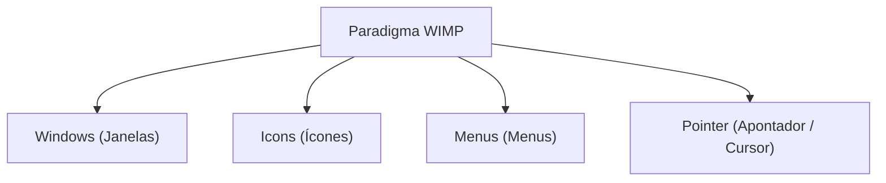
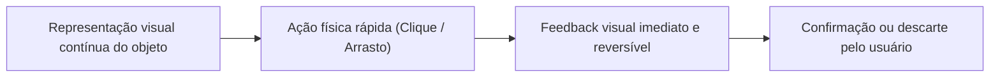
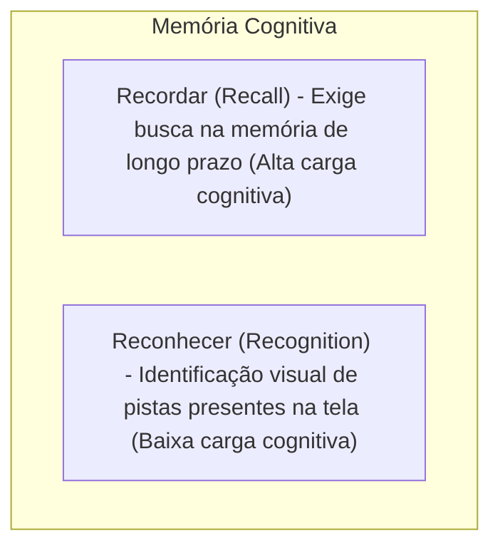

# Interfaces gráficas: paradigma WIMP, manipulação direta e reconhecer em vez de recordar

## Introdução (intuição e analogia do cotidiano)

Pense na diferença entre **conduzir um automóvel** e **enviar ordens escritas a um motorista por carta**:
1. **Interação por comandos (Carta/Linha de comando):** você precisa lembrar o nome exato de todas as ruas, o formato da sintaxe de instrução e escrever uma mensagem de texto sem erros (ex.: *"vire_a_direita na rua_x velocidade=50kmh"*). Se você esquecer o nome da rua ou errar a digitação de uma vírgula, a instrução falha silenciosamente.
2. **Interação direta (Dirigir o carro):** você enxerga a estrada no painel dianteiro, segura o volante com as mãos e reage em tempo real. Se quiser virar à direita, você gira o volante para a direita e observa imediatamente o carro mudar de direção. Se virar demais, você corrige a trajetória no mesmo instante.

Na história da computação, a transição das **Interfaces de Linha de Comando (CLI - *Command Line Interface*)** para as **Interfaces Gráficas de Usuário (GUI - *Graphical User Interface*)** representou uma mudança de paradigma revolucionária. As GUIs permitiram que os seres humanos interagissem com os sistemas através de elementos visuais intuitivos e do conceito de **manipulação direta**, reduzindo drasticamente a necessidade de memorizar instruções e priorizando o **reconhecimento visual sobre a recordação de memória**.

---

## 1. O paradigma WIMP (Windows, Icons, Menus, Pointer)

Surgido nos laboratórios da **Xerox PARC** no final da década de 1970 e popularizado comercialmente pelo **Apple Macintosh** (1984) e pelo **Microsoft Windows**, o paradigma **WIMP** tornou-se a arquitetura padrão das interfaces gráficas de usuário nos computadores de mesa e notebooks.

WIMP é um acrônimo para os quatro componentes visuais e operacionais fundamentais da interface:

### Os quatro pilares do WIMP

1. **Janelas (*Windows*):** áreas retangulares isoladas na tela que delimitam uma aplicação, documento ou tarefa ativa. As janelas permitem a execução de **multitarefa**, podendo ser movidas, redimensionadas, minimizadas, maximizadas ou sobrepostas umas às outras.
2. **Ícones (*Icons*):** pequenas representações pictóricas e metáforas visuais que simbolizam objetos do mundo real (ex.: uma pasta de arquivos, um documento de texto, uma lixeira ou uma impressora) ou comandos do sistema.
3. **Menus (*Menus*):** listas suspensas ou desdobráveis que agrupam comandos executáveis organizados por categorias lógicas (ex.: *Arquivo*, *Editar*, *Exibir*, *Ajuda*). Os menus permitem ao usuário selecionar comandos com o apontador sem precisar memorizar seus nomes sintáticos.
4. **Apontador (*Pointer / Cursor*):** um símbolo gráfico na tela (geralmente uma seta ou mão) controlado por um dispositivo físico de entrada (mouse, trackpad ou digitalizador). O apontador permite ao usuário sinalizar a posição exata da tela onde a ação deve ser realizada.

---

## 2. O conceito de manipulação direta (*Direct Manipulation*)

Formulado por **Ben Shneiderman** em 1983, o conceito de **manipulação direta** descreve um estilo de interação no qual o usuário atua diretamente sobre representações visuais permanentes dos objetos de interesse, em vez de digitar comandos abstratos.

### Os três princípios fundamentais da manipulação direta

1. **Representação contínua dos objetos de interesse:** os arquivos, pastas, textos e controles ficam visíveis o tempo todo na tela sob a forma de metáforas visuais claras.
2. **Ações físicas e rápidas em vez de sintaxes complexas:** em vez de digitar um comando como `delete arquivo.txt`, o usuário clica sobre o ícone do arquivo e o arrasta fisicamente para a lixeira, ou pressiona o botão de exclusão.
3. **Operações reversíveis e feedback imediato:** cada ação física produz um efeito visual perceptível no mesmo instante (feedback imediato), e a ação pode ser desfeita (*Undo / Ctrl+Z*) caso o usuário perceba que cometeu um erro.

### Exemplos clássicos de manipulação direta
- **Gerenciador de arquivos:** arrastar um documento de uma pasta para outra com o mouse.
- **Editor de imagens:** clicar nas alças de uma foto e puxá-las para redimensionar o tamanho em tempo real.
- **Controles de mídia:** arrastar o ponteiro de um controle deslizante (*slider*) para aumentar ou diminuir o volume do áudio.

### Vantagens e limitações da manipulação direta

- **Vantagens:** fácil aprendizado por usuários iniciantes, retenção de conhecimento a longo prazo, redução do medo de errar (devido à reversibilidade) e alta satisfação de uso.
- **Limitações:** ineficiência para automação em lote (*batch processing* - onde comandos de texto em linha de comando continuam sendo mais rápidos para especialistas) e exigência de espaço físico significativo em tela.

---

## 3. O princípio cognitivo: reconhecer em vez de recordar (*Recognition vs. Recall*)

Consagrado como a **6ª heurística de usabilidade de Jakob Nielsen**, o princípio de **reconhecer em vez de recordar** baseia-se nas capacidades e limitações da psicologia cognitiva humana.

### A diferença psicológica entre recordar e reconhecer

- **Recordar (*Recall*):** exige que a mente humana recupere ativamente uma informação da memória de longo prazo sem a ajuda de pistas externas.
  - *Exemplo em sistemas:* lembrar de cabeça o comando de terminal `tar -czvf arquivo.tar.gz pasta/` ou o nome exato de um parâmetro de sistema. A taxa de erro e a carga cognitiva são altíssimas.
- **Reconhecer (*Recognition*):** exige apenas que a mente perceba uma pista visual presente no ambiente e a associe a um conceito já conhecido.
  - *Exemplo em sistemas:* ver a palavra "Salvar" acompanhada do ícone de disquete em um menu e entender imediatamente a sua função. O cérebro realiza uma simples operação de pareamento visual de baixo esforço.

### Como as interfaces gráficas promovem o reconhecimento

1. **Menus e barras de ferramentas visíveis:** em vez de exigir que o usuário decore os comandos do sistema, a GUI apresenta todos os comandos disponíveis organizados em menus desdobráveis.
2. **Ícones com dicas de ferramenta (*tooltips*):** ao posicionar o apontador sobre um ícone abstrato, a interface exibe um pequeno rótulo de texto explicando a função do botão antes do clique.
3. **Listas de sugestões e autocompletar:** em campos de busca ou formulários, o sistema sugere opções recentes ou compatíveis conforme o usuário digita, transformando uma tarefa de recordação em uma escolha de reconhecimento.
4. **Atalhos de teclado visíveis nos menus:** a interface exibe o atalho de teclado ao lado da opção do menu (ex.: *Salvar [Ctrl+S]*), permitindo que o usuário utilize o **reconhecimento** no início e gradualmente transicione para a **recordação por memória muscular** conforme ganha experiência.

---

## 4. Tabela comparativa: Linha de Comando (CLI) vs. Interface Gráfica (GUI / WIMP)

| Característica de IHC | Interface de Linha de Comando (CLI) | Interface Gráfica de Usuário (GUI / WIMP) |
| :--- | :--- | :--- |
| **Estilo de interação** | Linguagem de comandos sintáticos digitados | Manipulação direta com apontador e ícones |
| **Processo cognitivo** | **Recordar (*Recall*)** de sintaxes e comandos | **Reconhecer (*Recognition*)** de pistas visuais |
| **Carga de memória** | Altíssima (exige memorizar parâmetros) | Mínima (comandos visíveis em menus) |
| **Curva de aprendizado** | Longa e íngreme (exige treinamento) | Curta e intuitiva (aprendizado por exploração) |
| **Tratamento de erros** | Mensagens de erro em texto; difícil reversão | Feedback visual imediato e ações reversíveis (*Undo*) |
| **Público-alvo ideal** | Programadores e administradores de sistemas | Usuários em geral e especialistas de domínio |

---

## Conclusão e evolução das interfaces gráficas

O paradigma WIMP, a manipulação direta e o princípio de reconhecer em vez de recordar transformaram a relação humano-computador, tornando a tecnologia uma extensão intuitiva da atividade humana.

Nas últimas décadas, as interfaces evoluíram do WIMP tradicional em computadores desktop para **interfaces pós-WIMP** (em smartphones, tablets e dispositivos vestíveis). Contudo, mesmo em telas sensíveis ao toque ou ambientes de realidade virtual, os princípios fundamentais da **manipulação direta** (toque direto no objeto) e do **reconhecimento visual** continuam sendo os pilares centrais da usabilidade e do design de interação moderno.

---

## Referências bibliográficas

- NIELSEN, Jakob. **Usability Engineering**. San Diego: Academic Press, 1994.
- NIELSEN NORMAN GROUP. [Recognition vs. Recall in User Interfaces](https://www.nngroup.com/articles/recognition-vs-recall/). Acesso em: ==01/07/2021==.
- SHNEIDERMAN, Ben. [Direct manipulation: A step beyond programming languages](https://doi.org/10.1109/MC.1983.1654471). **IEEE Computer**, v. 16, n. 8, p. 57-69, 1983. DOI: 10.1109/MC.1983.1654471. Acesso em: ==01/07/2021==.
- SHNEIDERMAN, Ben; PLAISANT, Catherine. **Designing the User Interface: strategies for effective human-computer interaction**. 5. ed. Boston: Addison-Wesley, 2010.

---

## Artigos relacionados e navegação

- **Artigo anterior:** [[15. Componentes e recomendações ergonômicas em sistemas interativos]]
- **Resumo da disciplina:** [[00. Design de Interacao - Resumo]]
- **Página inicial do vault:** [[index]]
