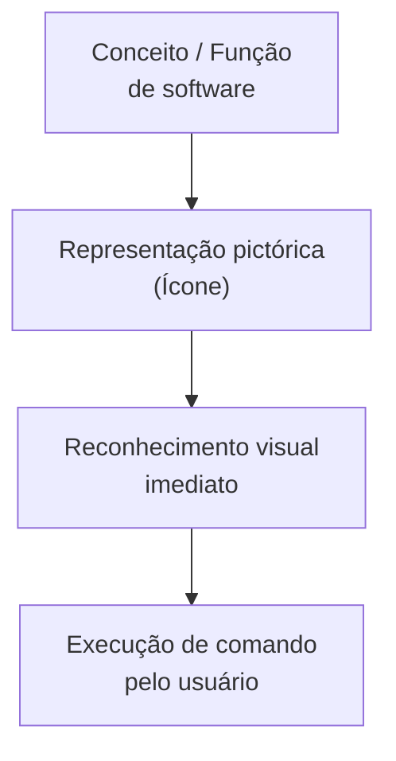
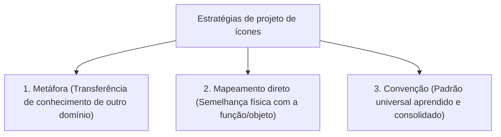
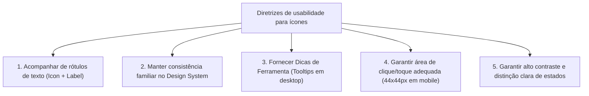

# Projeto de ícones em interfaces interativas: metáfora, mapeamento direto e convenção

## Introdução (intuição e analogia do cotidiano)

Pense na sinalização visual de um **estabelecimento comercial moderno**:
1. Ao procurar o banheiro, você busca por um pequeno **pictograma estilizado** indicando figuras humanas na porta.
2. Na saída de emergência, você reconhece imediatamente o desenho da **figura correndo em direção à porta**, sem precisar parar para ler frases longas.
3. No salão de beleza, o símbolo de uma **tesoura** gravado na placa comunica a atividade exercida no local antes mesmo de qualquer leitura de texto.

Em Interação Humano-Computador (IHC), os **ícones gráficos** atuam exatamente como essa sinalização visual. Eles são pictogramas concebidos para representar objetos, ações, funções e estados da aplicação em um espaço reduzido da interface, acelando o reconhecimento e facilitando a navegação do usuário.

---

## 1. O papel dos ícones no design de interação

Um **ícone** em IHC é um signo gráfico que visa substituir ou complementar o texto escrito para identificar componentes de interface, ferramentas ou rotas de navegação.

### Principais benefícios do uso de ícones
- **Economia de espaço visual:** comprimem conceitos complexos em áreas compactas da tela, sendo fundamentais em dispositivos móveis.
- **Aceleração da velocidade de reconhecimento:** o cérebro humano processa imagens visuais familiares muito mais rápido do que a leitura de blocos de texto.
- **Universalidade transcultural:** pictogramas consolidados transcendem barreiras de idioma e alfabetização técnica.

### O risco da "navegação por adivinhação" (*Mystery Meat Navigation*)
Quando o designer cria ícones excessivamente abstratos, ornamentados ou sem convenção clara, surge o problema de usabilidade conhecido como **"navegação por adivinhação"**: o usuário é forçado a passar o cursor sobre cada ícone ou clicar por tentativa e erro para descobrir o que a função faz, aumentando drasticamente a carga cognitiva.

---

## 2. Estratégias fundamentais no projeto de ícones

De acordo com a teoria de design de interfaces, existem **três estratégias principais** para conceber a representação gráfica de um ícone: a **metáfora**, o **mapeamento direto** e a **convenção**.

### a. Metáfora (*Metaphor*)

A **metáfora** consiste em transferir o conhecimento e o comportamento de um domínio físico conhecido do mundo real para um novo domínio computacional abstrato.

- **Mecanismo:** o ícone utiliza uma analogia visual com um objeto familiar para explicar como a função digital opera.
- **Exemplos clássicos:**
  - **Tesoura:** representa a ação de *cortar* (remover texto ou arquivo da posição atual).
  - **Pasta de arquivos:** representa a estrutura de *diretório* para organizar arquivos.
  - **Lixeira:** representa a área de *descarte temporário e exclusão* de arquivos.
  - **Prancheta com papel:** representa a ação de *colar* o conteúdo armazenado na área de transferência.
- **Desafio ergonômico:** metáforas físicas podem se tornar ultrapassadas com o tempo (fenômeno do esqueuomorfismo), criando um fosso cultural para gerações mais jovens.

---

### b. Mapeamento direto (*Direct Mapping / Literal Representation*)

O **mapeamento direto** (ou representação literal/pictórica) consiste em criar uma imagem visivelmente parecida com a coisa ou ação exata que o ícone pretende representar ou acionar.

- **Mecanismo:** existe uma relação de semelhança física ou espelhada entre o desenho do ícone e o dispositivo/resultado final.
- **Exemplos clássicos:**
  - **Impressora:** representa a ação de *imprimir um documento* em uma impressora física.
  - **Câmera fotográfica:** representa a ação de *tirar uma foto* ou abrir o aplicativo de câmera.
  - **Alto-falante:** representa o *controle de volume sonoro*.
  - **Lupa:** representa a ação de *buscar* ou *ampliar* um conteúdo visual.

---

### c. Convenção (*Convention / Standard*)

A **convenção** consiste na adoção de um símbolo visual que se tornou um padrão amplamente reconhecido e aceito pela indústria e pelos usuários, mantendo-se consistente entre diferentes aplicações e sistemas operacionais.

- **Mecanismo:** o significado do ícone não depende mais de uma semelhança física atual, mas sim de um **acordo social e cultural consolidado pelo hábito de uso**.
- **Exemplos clássicos:**
  - **Disquete:** representa a ação de *salvar* dados, mantido universalmente mesmo décadas após a extinção dos disquetes físicos.
  - **Engrenagem:** representa o menu de *configurações* ou parâmetros do sistema.
  - **Menu hambúrguer (três linhas horizontais):** representa a abertura de um *menu principal* em interfaces móveis.
  - **Símbolo de Wi-Fi / Bluetooth:** representam tecnologias de conectividade sem fio.

---

## 3. A dimensão semiótica dos ícones (Peirce e Engenharia Semiótica)

Na perspectiva da **Engenharia Semiótica** (Clarisse de Souza) e da teoria geral dos signos de **Charles Sanders Peirce**, os ícones gráficos de UI podem ser classificados em três categorias semióticas:

1. **Signo Icônico (Ícone propriamente dito):** possui uma relação de **semelhança direta** com o objeto representado (ex.: o desenho de uma impressora representando uma impressora). Corresponde ao *mapeamento direto*.
2. **Signo Indicial (Índice):** possui uma relação de **causa, efeito ou evidência física** com o objeto (ex.: um ícone de raio indicando *bateria carregando*, ou chamas indicando *conteúdo em alta/trending*).
3. **Signo Simbólico (Símbolo):** possui uma relação **arbitrária ou de convenção social** com o objeto, exigindo aprendizado prévio pelo usuário (ex.: o símbolo de arroba `@` em e-mails, o símbolo de *USB* ou o disquete para *salvar*).

---

## 4. Diretrizes e boas práticas de usabilidade no projeto de ícones

Para garantir que os ícones funcionem como facilitadores e não como barreiras de usabilidade, o designer deve seguir cinco diretrizes fundamentais:

1. **Utilizar ícones acompanhados de rótulos de texto (*Icon + Label*):**
   - Testes empíricos do Nielsen Norman Group comprovam que a combinação de **ícone + texto descritivo** obtém as maiores taxas de sucesso e menor tempo de execução, pois une a rapidez do reconhecimento visual com a precisão do texto escrito.
2. **Manter consistência dentro da família de ícones (*Design System*):**
   - Todos os ícones da mesma aplicação devem compartilhar a mesma espessura de traço (*stroke*), preenchimento (*fill vs. outline*), estilo de cantos e nível de abstração visual.
3. **Fornecer dicas de ferramenta (*Tooltips*):**
   - Em interfaces desktop, posicionar o cursor sobre um ícone sem texto deve exibir imediatamente um pequeno balão explicativo com o nome da função e o atalho de teclado associado.
4. **Dimensionar a área de toque ergonômica (*Target Size*):**
   - Respeitar a Lei de Fitts e as diretrizes de acessibilidade, garantindo área mínima de toque de **$44 \times 44$ pixels** em dispositivos móveis.
5. **Garantir estados visuais distintos:**
   - O ícone deve alterar sua aparência gráfica de forma clara para comunicar seus estados operacionais: *normal*, *hover* (foco), *ativo/selecionado* e *desabilitado/inativo* (com menor contraste).

---

## 5. Matriz comparativa das estratégias de projeto de ícones

| Estratégia | Conceito base | Exemplo típico | Principal vantagem | Risco de usabilidade |
| :--- | :--- | :--- | :--- | :--- |
| **Metáfora** | Transferência de conhecimento de outro domínio | Tesoura (Cortar), Lixeira (Deletar), Pasta (Diretório) | Facilita a compreensão inicial por analogia com o mundo real | A metáfora física pode se tornar obsoleta ou culturalmente distante |
| **Mapeamento direto** | Imagem parecida com o objeto/resultado | Impressora (Imprimir), Câmera (Foto), Alto-falante (Som) | Altíssima intuitividade e reconhecimento instantâneo | Difícil de aplicar para funções abstratas (ex.: "Compilar" ou "Sincronizar") |
| **Convenção** | Padrão universal aceito e padronizado | Disquete (Salvar), Engrenagem (Ajustes), Hambúrguer (Menu) | Elimina ambiguidades entre diferentes sistemas e aplicativos | Exige aprendizado inicial prévio para novos símbolos sem texto |

---

## Conclusão e integração prática

O projeto de ícones em Interação Humano-Computador exige um equilíbrio refinado entre **clareza semiótica, harmonia estética e rigor ergonômico**. 

Ao combinar o uso inteligente de **metáforas intuitivas**, **mapeamentos diretos precisos** e **convenções universais consolidadas** — sempre reforçadas por rótulos de texto e estados visuais claros —, o designer transforma a interface em um ambiente comunicável e acessível, em que o usuário navega com confiança, rapidez e mínimo esforço cognitivo.

---

## Referências bibliográficas

- HORTON, William. **The Icon Book: creating icons for the financial, medical, and industrial interfaces**. New York: John Wiley & Sons, 1994.
- NIELSEN NORMAN GROUP. [Icon Usability: The Ultimate Guide](https://www.nngroup.com/articles/icon-usability/). Acesso em: ==01/07/2021==.
- ROGERS, Yvonne; SHARP, Helen; PREECE, Jenny. **Interaction Design: beyond human-computer interaction**. 5. ed. Indianapolis: John Wiley & Sons, 2019.
- SHNEIDERMAN, Ben; PLAISANT, Catherine. **Designing the User Interface: strategies for effective human-computer interaction**. 5. ed. Boston: Addison-Wesley, 2010.

---

## Artigos relacionados e navegação

- **Artigo anterior:** [[16. Interfaces gráficas - paradigma wimp, manipulação direta e reconhecer em vez de recordar]]
- **Resumo da disciplina:** [[00. Design de Interacao - Resumo]]
- **Página inicial do vault:** [[index]]
