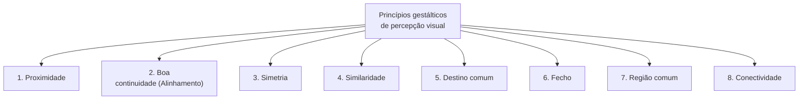
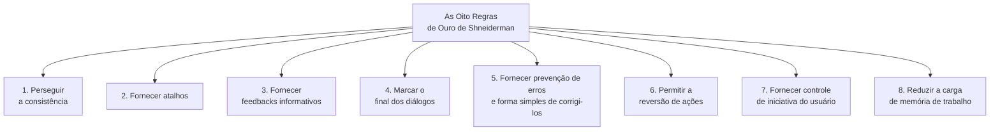

# Princípios e regras de design: psicologia da Gestalt e regras de ouro em IHC

## Introdução (intuição e analogia do cotidiano)

Pense na experiência de ler a **primeira página de um jornal impresso**:
1. O seu cérebro não lê as letras isoladas de forma caótica. Instantaneamente, você percebe que a manchete no topo em letras garrafais pertence ao artigo logo abaixo, que os artigos de notícias locais estão agrupados em uma coluna separada e que os anúncios publicitários estão isolados por linhas em caixas na borda inferior.
2. Essa capacidade imediata de organizar o caos visual em blocos de informação com sentido não ocorre por acaso: ela decorre do modo como o cérebro humano processa padrões perceptivos.

Em Interação Humano-Computador (IHC), o desenvolvimento de interfaces de qualidade baseia-se em **princípios e regras de design**. Esses princípios unem a **psicologia da percepção visual (Leis da Gestalt)** com **diretrizes operacionais e comportamentais de usabilidade (as Regras de Ouro de Shneiderman)** para garantir que o software seja compreensível, previsível e seguro.

---

## 1. Princípios da psicologia da Gestalt na percepção visual de UI

A **psicologia da Gestalt** (origem na palavra alemã para "forma" ou "configuração") é uma escola de psicologia experimental fundada no início do século XX por Max Wertheimer, Wolfgang Köhler e Kurt Koffka. Seu axioma fundamental estabelece que:

> *"O todo perceptivo é diferente da soma de suas partes individuais."*

O cérebro humano possui uma tendência inata de agrupar elementos visuais soltos em estruturas organizadas e unificadas. Em IHC, entender as leis da Gestalt permite ao designer estruturar layouts nos quais o usuário entende a hierarquia e as relações do sistema de forma instantânea e involuntária.

### Detalhamento dos 8 princípios gestálticos

1. **Proximidade:**
   - *Definição:* as entidades visuais que estão próximas umas das outras são percebidas como um grupo ou unidade.
   - *Aplicação em UI:* o rótulo de um campo (*label*) deve estar espacialmente mais próximo da sua caixa de entrada do que do campo vizinho; botões de um mesmo cartão (*card*) são posicionados próximos para indicar agrupamento funcional.

2. **Boa continuidade (alinhamento):**
   - *Definição:* traços contínuos são percebidos mais prontamente do que contornos que mudem de direção rapidamente.
   - *Aplicação em UI:* elementos de formulários e listas alinhados em uma mesma linha vertical facilitam a varredura visual contínua do olho sem saltos desordenados.

3. **Simetria:**
   - *Definição:* objetos simétricos são mais prontamente percebidos do que objetos assimétricos.
   - *Aplicação em UI:* layouts estruturados em grades simétricas transmitem sensação de estabilidade, ordem e menor ruído visual.

4. **Similaridade:**
   - *Definição:* objetos semelhantes (em cor, forma, tamanho ou estilo) são percebidos como um grupo.
   - *Aplicação em UI:* todos os botões de ação primária de um sistema compartilham a mesma cor preenchida; todos os links navegáveis possuem o mesmo estilo visual.

5. **Destino comum:**
   - *Definição:* objetos com a mesma direção de movimento são percebidos como um grupo.
   - *Aplicação em UI:* em menus desdobráveis ou animações de transição, elementos que deslizam juntos na mesma direção e velocidade são interpretados como uma unidade funcional ligada.

6. **Fecho:**
   - *Definição:* a mente tende a fechar contornos para completar figuras regulares, "completando as falhas" e aumentando a regularidade.
   - *Aplicação em UI:* em carrosséis móveis, deixar o último cartão parcialmente recortado na borda da tela faz com que a mente complete a figura e entenda que a lista continua no deslize (*swipe*).

7. **Região comum:**
   - *Definição:* objetos dentro de uma região especial confinada são percebidos como um grupo.
   - *Aplicação em UI:* o uso de cartões (*cards*), caixas com bordas ou planos de fundo sombreados para agrupar elementos relacionados.

8. **Conectividade:**
   - *Definição:* objetos conectados por traços contínuos são percebidos como um relacionamento.
   - *Aplicação em UI:* indicadores de etapas numeradas (*steppers*) ou diagramas unidos por linhas conectoras que explicitam dependência e sequência.

---

## 2. As Oito Regras de Ouro de Ben Shneiderman

Desenvolvidas por **Ben Shneiderman** e publicadas em seu livro clássico *Designing the User Interface*, as **Oito Regras de Ouro** constituem os princípios operacionais e comportamentais mais consagrados em IHC.

### Detalhamento das oito regras de ouro

1. **Perseguir a consistência:**
   - Padronização de ações, terminologias, cores, layouts e fontes em todas as telas. Sequências parecidas de comandos devem ser exigidas em situações similares.

2. **Fornecer atalhos:**
   - Permitir que usuários frequentes ou experientes aumentem sua eficiência operacional por meio de atalhos de teclado (*hotkeys*), teclas de acesso rápido e macros de automação.

3. **Fornecer feedbacks informativos:**
   - Para toda ação do usuário, o sistema deve responder com um sinal perceptível proporcional à relevância da ação (mensagens visuais, sonoras ou táteis).

4. **Marcar o final dos diálogos:**
   - As sequências de ações devem ser organizadas com início, meio e fim claros. O encerramento de um grupo de tarefas deve apresentar uma mensagem de conclusão satisfatória, sinalizando que a mente pode avançar para o próximo bloco de trabalho.

5. **Fornecer prevenção de erros e forma simples de corrigi-los:**
   - A interface deve ser projetada para impedir que o usuário cometa deslizes graves (ex.: desabilitar botões inválidos). Quando um erro ocorrer, o sistema deve oferecer instruções claras, simples e diretas para a sua correção.

6. **Permitir a reversão de ações:**
   - As ações do sistema devem ser reversíveis (recurso de *Desfazer / Undo*). Isso alivia a ansiedade do usuário, encoraja a exploração confiante do software e reduz o medo de causar danos irreversíveis.

7. **Fornecer controle de iniciativa do usuário:**
   - O usuário deve sentir que está no comando do sistema e que o software responde de forma previsível às suas iniciativas, em vez de agir de forma autoritária ou tomar decisões inesperadas sem autorização.

8. **Reduzir a carga de memória de trabalho:**
   - Respeitar os limites da memória de curto prazo do ser humano (Regra de Miller: $7 \pm 2$ elementos), apresentando telas limpas, reduzindo a necessidade de memorizar dados entre páginas e priorizando o reconhecimento visual.

---

## 3. Síntese comparativa: princípios gestálticos vs. regras de ouro

| Dimensão de análise | Princípios gestálticos | As oito regras de ouro |
| :--- | :--- | :--- |
| **Foco principal** | Percepção visual e organização de layout | Comportamento operacional e fluxo interativo |
| **Origem teórica** | Psicologia experimental (Wertheimer, Koffka, Köhler) | Engenharia de software e IHC (Ben Shneiderman) |
| **Ponto central** | Como os olhos e o cérebro agrupam formas visuais | Como o usuário opera o sistema e conduz tarefas |
| **Mecanismo mental** | Processamento visual involuntário | Tomada de decisão e controle cognitivo consciente |
| **Resultado de usabilidade** | Interfaces organizadas, claras e sem poluição | Prevenção de erros, previsibilidade e eficiência operacional |

---

## Conclusão e integração prática

Os princípios de design não são regras rígidas ou dogmas invioláveis, mas sim **ferramentas conceituais e ergonômicas de alto nível**.

Quando o designer combina os **8 princípios gestálticos** (garantindo organização visual por proximidade, similaridade, fecho e alinhamento) com as **8 Regras de Ouro de Shneiderman** (garantindo consistência, atalhos, feedback, reversibilidade e controle), o produto final atinge um nível de usabilidade superior, onde a tecnologia torna-se transparente e a interação ocorre sem atritos.

---

## Referências bibliográficas

- KOFFKA, Kurt. **Principles of Gestalt Psychology**. New York: Harcourt, Brace & World, 1935.
- NIELSEN NORMAN GROUP. [Gestalt Principles for UX Design](https://www.nngroup.com/articles/gestalt-principles-ux/). Acesso em: ==01/07/2021==.
- SHNEIDERMAN, Ben; PLAISANT, Catherine. **Designing the User Interface: strategies for effective human-computer interaction**. 5. ed. Boston: Addison-Wesley, 2010.
- WERTHEIMER, Max. Laws of organization in perceptual forms. In: **A Source Book of Gestalt Psychology**. London: Routledge & Kegan Paul, 1938. p. 71-88.

---

## Material complementar

- SHNEIDERMAN, Ben. [The Eight Golden Rules of Interface Design](https://www.cs.umd.edu/users/ben/goldenrules.html). University of Maryland, Human-Computer Interaction Lab. Acesso em: ==01/07/2021==.

---

## Artigos relacionados e navegação

- **Artigo anterior:** [[17. Projeto de ícones em interfaces interativas - metáfora, mapeamento direto e convenção]]
- **Próximo artigo:** [[19. Avaliação de sistemas interativos - por que, quando e quem participa]]
- **Resumo da disciplina:** [[00. Design de Interacao - Resumo]]
- **Página inicial do vault:** [[index]]
