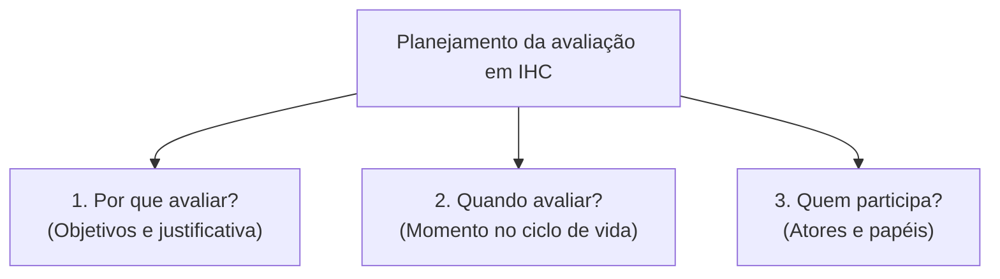
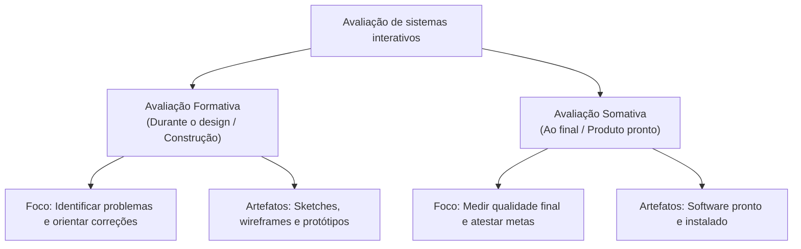
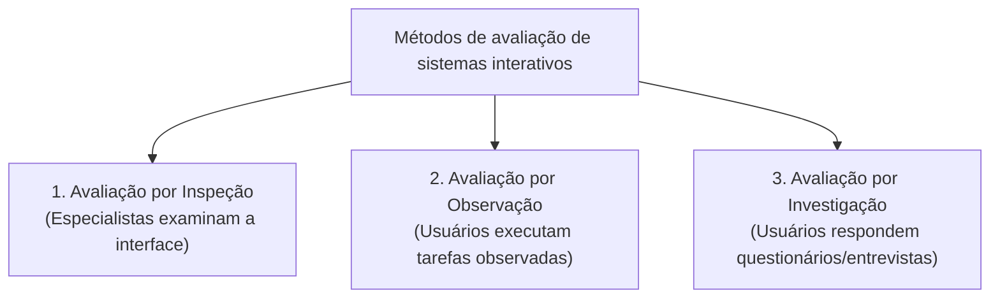
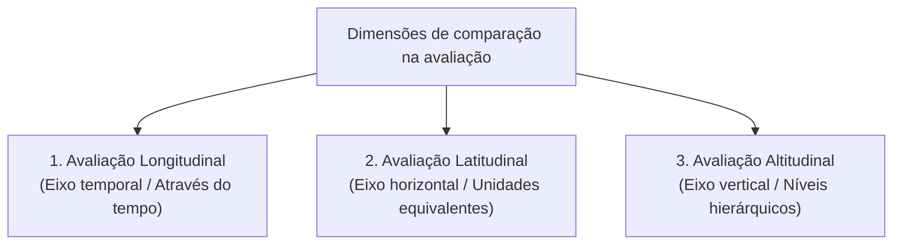

# Avaliação de sistemas interativos: por que, quando e quem participa

## Introdução (intuição e analogia do cotidiano)

Pense no processo de criação de uma **nova receita gastronômica em um restaurante**:
1. **Durante o preparo (fase inicial):** o chefe de cozinha experimenta o molho ainda na panela, ajusta o tempero e altera os ingredientes antes que o prato saia da cozinha. Trata-se de uma **avaliação formativa**, feita por um especialista com o objetivo de corrigir falhas enquanto a receita está sendo construída.
2. **Na mesa do cliente (fase final):** após o lançamento do prato, o restaurante observa a reação dos clientes reais, contabiliza os pratos devolvidos e aplica pesquisas de satisfação. Trata-se de uma **avaliação somativa**, feita com o consumidor final para atestar a qualidade e o sucesso do produto pronto.

Em Interação Humano-Computador (IHC), a **avaliação de sistemas interativos** é a atividade sistemática de analisar a qualidade da solução (usabilidade, comunicabilidade, acessibilidade e experiência do usuário) para identificar problemas de design, verificar se as necessidades dos usuários foram atendidas e orientar o refinamento contínuo do software.

---

## 1. As três perguntas fundamentais da avaliação

Para planejar qualquer processo de avaliação em IHC, a equipe de desenvolvimento deve responder a três perguntas estruturantes:

### a. Por que avaliar? (Objetivos)
- **Identificar problemas de usabilidade:** descobrir falhas de navegação, ambiguidades em rótulos, botões ineficientes e áreas de confusão cognitiva.
- **Validar requisitos de qualidade:** verificar se o sistema atinge as metas pré-estabelecidas de tempo de execução, taxa de sucesso e satisfação.
- **Comparar alternativas de design:** avaliar duas ou mais propostas de interface (testes A/B) para decidir qual entrega a melhor experiência de uso.
- **Prevenir custos e retrabalho:** corrigir falhas nas fases de prototipagem é drasticamente mais barato do que alterar código em produção.

### b. Quando avaliar? (Momento)
A avaliação pode ocorrer em **qualquer fase do ciclo de vida** do software:
- Nas fases iniciais, utilizando rascunhos, *sketches* e protótipos de baixa fidelidade.
- Nas fases intermediárias, utilizando protótipos interativos de média/alta fidelidade.
- Nas fases finais, utilizando o sistema compilado ou já implantado em ambiente real de produção.

### c. Quem participa? (Atores)
Os participantes da avaliação dependem da técnica escolhida:
- **Especialistas em IHC / Usabilidade:** atuam como avaliadores críticos em métodos analíticos (inspeção).
- **Usuários reais ou representativos:** atuam como sujeitos centrais na execução de tarefas em métodos empíricos (observação e investigação).
- **Designers e desenvolvedores:** atuam como planejadores, facilitadores e registradores dos dados observados.

---

## 2. Tipos de avaliação quanto ao momento e objetivo: Formativa vs. Somativa

A literatura de IHC divide o processo de avaliação em duas grandes categorias temporais e funcionais:

### a. Avaliação formativa (*Formative evaluation*)
- **Objetivo:** orientar o processo de design e ajudar a "formar" a interface enquanto ela está sendo concebida.
- **Quando ocorre:** durante o desenvolvimento (fases iniciais e intermediárias).
- **Foco dos dados:** qualitativo (descobrir "o que" está errado, "por que" o usuário errou e "como" melhorar a solução).
- **Artefatos avaliados:** papel, wireframes, mockups e protótipos interativos.

### b. Avaliação somativa (*Summative evaluation*)
- **Objetivo:** medir e julgar o nível de qualidade atingido pelo produto final em relação a métricas consolidadas.
- **Quando ocorre:** ao final do desenvolvimento ou após a implantação do sistema.
- **Foco dos dados:** quantitativo (taxa de sucesso em %, tempo médio de tarefa em segundos, número absoluto de erros, notas em escalas).
- **Artefatos avaliados:** produto final compilado ou versão comercial em uso.

---

## 3. As três grandes famílias de métodos de avaliação

Os métodos de avaliação de IHC são classificados em três famílias principais, variando conforme a forma de participação do usuário e a técnica de coleta de dados:

---

### a. Avaliação por inspeção (*Inspection methods*)

A **avaliação por inspeção** é um método analítico no qual **especialistas em IHC** examinam a interface procurando problemas de usabilidade com base em princípios, heurísticas ou rotas de tarefas.

- **Quem participa:** apenas especialistas e avaliadores de IHC (não envolve usuários reais diretamente no momento da inspeção).
- **Principais técnicas:**
  - **Avaliação Heurística (Jakob Nielsen):** especialistas inspecionam a interface comparando seus elementos contra as 10 Heurísticas de Nielsen.
  - **Percurso Cognitivo (*Cognitive Walkthrough*):** especialistas simulam passo a passo o raciocínio de um usuário iniciante tentando realizar uma tarefa específica.
- **Vantagens:** rápida execução, baixo custo e capaz de encontrar falhas grosseiras antes que a interface chegue aos usuários.
- **Limitações:** dependente da experiência dos avaliadores; pode gerar "falsos alarmes" (apontar problemas que usuários reais não considerariam graves).

---

### b. Avaliação por observação (*Observational methods*)

A **avaliação por observação** é um método empírico no qual **usuários reais** são observados diretamente enquanto realizam um conjunto de tarefas predefinidas na interface.

- **Quem participa:** usuários reais (ou representativos do perfil de usuário) + pesquisadores/observadores.
- **Principais técnicas:**
  - **Teste de Usabilidade em Laboratório:** o usuário executa tarefas em um ambiente controlado enquanto suas ações, tempo e tela são gravados.
  - **Protocolo de Pense em Voz Alta (*Think-Aloud Protocol*):** o usuário narra verbalmente seus pensamentos, intenções e dúvidas em tempo real enquanto navega no sistema.
  - **Observação de Campo:** o pesquisador observa o usuário interagindo com o sistema em seu ambiente de trabalho ou vida cotidiana real.
- **Vantagens:** revela o comportamento real do usuário e identifica pontos exatos de frustração e bloqueio.
- **Limitações:** exige planejamento rigoroso, recrutamento de participantes e ambiente adequado.

---

### c. Avaliação por investigação (*Query / Survey methods*)

A **avaliação por investigação** busca coletar opiniões, percepções, sentimentos, preferências e relatos atitudinais dos usuários sobre a interface.

- **Quem participa:** usuários reais (em amostras pequenas a grandes) + pesquisadores.
- **Principais técnicas:**
  - **Questionários de Usabilidade:** aplicação de formulários padronizados e validados (ex.: SUS - *System Usability Scale*, CSUQ) para quantificar a satisfação subjetiva.
  - **Entrevistas (Estruturadas ou Semiestruturadas):** conversas diretas para aprofundar as motivações e opiniões do usuário após o uso.
  - **Grupos Focais (*Focus Groups*):** discussões em grupo mediadas por um moderador para explorar ideias e reações gerais sobre o sistema.
- **Vantagens:** permite coletar dados atitudinais e subjetivos de uma quantidade expressiva de usuários.
- **Limitações:** baseia-se no relato verbal do usuário (o que o usuário diz que faz nem sempre corresponde ao que ele realmente faz ao usar o sistema).

---

## 4. Matriz comparativa das famílias de métodos de avaliação

| Família de método | Quem participa | Momento ideal no ciclo | Tipo de dados produzidos | Custo e tempo | Principal benefício |
| :--- | :--- | :--- | :--- | :--- | :--- |
| **Inspeção** | Especialistas em IHC | Inicial e formativo (protótipos) | Qualitativo (lista de violações heurísticas) | Baixo e rápido | Encontra falhas rapidamente sem necessidade de recrutar usuários |
| **Observação** | Usuários reais + Observadores | Intermediário e somativo (protótipos/sistema) | Quali-quantitativo (erros, tempos e comportamentos) | Médio a alto | Mostra o comportamento real de uso e os bloqueios práticos |
| **Investigação** | Usuários reais + Entrevistadores | Final e somativo (sistema pronto) | Atitudinal e quantitativo (notas, opiniões e escalas) | Baixo a médio | Mede a satisfação subjetiva e a percepção geral de utilidade |

---

## 5. Perspectivas dimensionais da avaliação: longitudinal, latitudinal e altitudinal

Além da classificação clássica quanto ao momento (*formativa vs. somativa*) e aos métodos (*inspeção, observação e investigação*), a avaliação de sistemas e processos pode ser analisada sob três **eixos dimensionais de comparação**:

### a. Avaliação longitudinal (Eixo temporal)
- **Conceito:** acompanha um mesmo objeto, usuário ou sistema **ao longo do tempo**, realizando medições repetidas em múltiplos momentos (ex.: avaliar o desempenho de uso em janeiro, junho e dezembro).
- **Objetivo:** observar a curva de aprendizado, a evolução da proficiência, a retenção de conhecimento a longo prazo ou eventuais regressões após atualizações do software.
- **Status metodológico:** conceito estatístico e científico amplamente consolidado e padronizado na literatura de IHC e pesquisas empíricas.

### b. Avaliação latitudinal / transversal (Eixo horizontal)
- **Conceito:** compara **elementos equivalentes localizados no mesmo nível** ou situação, analisados dentro de um mesmo intervalo de tempo (estudo transversal).
- **Objetivo:** comparar a usabilidade e a taxa de adoção do sistema entre diferentes setores de uma empresa, diferentes perfis de usuário (iniciantes vs. veteranos) ou entre sistemas concorrentes no mercado no mesmo período.

### c. Avaliação altitudinal (Eixo vertical / hierárquico)
- **Conceito:** analisa a ferramenta ou processo **através de diferentes níveis hierárquicos** de uma organização (eixo vertical de cima para baixo e de baixo para cima).
- **Objetivo:** capturar como a interface impacta diferentes estratos organizacionais — por exemplo, subordinados/operadores avaliando a facilidade de inserção de dados, gestores intermediários avaliando relatórios e diretores avaliando os painéis executivos (*dashboards*).
- **Nota metodológica:** enquanto o termo "longitudinal" é um padrão universal das ciências, os termos "latitudinal" e "altitudinal" são abordagens dimensionais metafóricas utilizadas na gestão e avaliação institucional para explicitar a comparação horizontal (entre pares) e vertical (entre níveis de autoridade).

---

## Conclusão e integração prática

Responder às perguntas **por que, quando e quem participa** da avaliação é o passo fundamental para garantir a qualidade de um sistema interativo.

Na prática de IHC, a estratégia mais recomendada é a **triangulação de métodos**: iniciar o desenvolvimento com **avaliações formativas por inspeção** (com especialistas eliminando problemas grosseiros em protótipos de baixa fidelidade) e avançar para **avaliações por observação e investigação** (com usuários reais realizando tarefas e avaliando a satisfação no sistema refinado).

---

## Referências bibliográficas

- BENYON, David. **Interação Humano-Computador**. 2. ed. São Paulo: Pearson, 2011.
- NIELSEN, Jakob. **Usability Engineering**. San Diego: Academic Press, 1994.
- ROGERS, Yvonne; SHARP, Helen; PREECE, Jenny. **Interaction Design: beyond human-computer interaction**. 5. ed. Indianapolis: John Wiley & Sons, 2019.
- RUBIN, Jeffrey; CHISNELL, Dana. **Handbook of Usability Testing: how to plan, design, and conduct effective tests**. 2. ed. Indianapolis: Wiley, 2008.

---

## Material complementar

- PONCIANO, Lesandro; BRASILEIRO, Francisco. [Agreement-based credibility assessment and task replication in human computation systems](https://doi.org/10.1016/j.future.2018.05.028). **Future Generation Computer Systems**, v. 87, p. 159-170, 2018. DOI: 10.1016/j.future.2018.05.028. Acesso em: ==15/07/2021==.
- PRATES, Raquel Oliveira; BARBOSA, Simone Diniz Junqueira. [Avaliação de interfaces de usuário — conceitos e métodos](http://www.inf.puc-rio.br/~inf1403/docs/JAI2003_PratesBarbosa_avaliacao.pdf). In: **Jornada de Atualização em Informática do Congresso da Sociedade Brasileira de Computação (JAI/SBC)**. 2003. p. 28. Acesso em: ==15/07/2021==.

---

## Artigos relacionados e navegação

- **Artigo anterior:** [[18. Princípios e regras de design - psicologia da gestalt e regras de ouro]]
- **Resumo da disciplina:** [[00. Design de Interacao - Resumo]]
- **Página inicial do vault:** [[index]]
