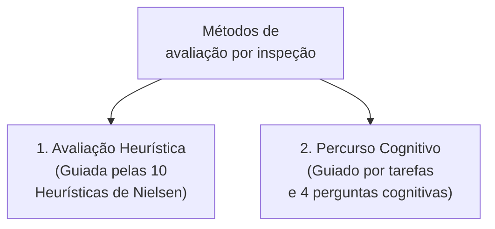
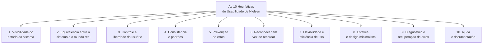
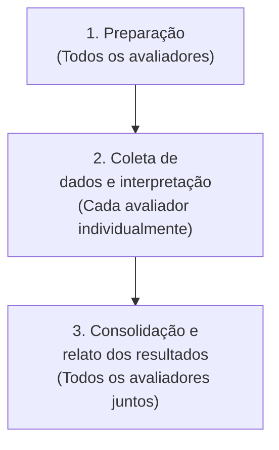
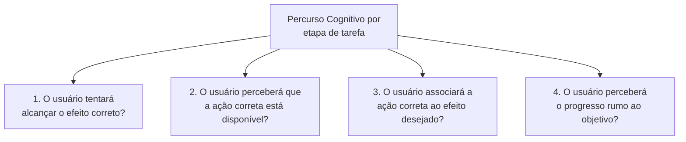

# Avaliação por inspeção: avaliação heurística e percurso cognitivo

## Introdução (intuição e analogia do cotidiano)

Pense na **vistoria técnica de segurança realizada por um piloto de avião** antes da decolagem:
1. O piloto não coloca passageiros dentro da aeronave e decola para "descobrir durante o voo" se os instrumentos funcionam.
2. Em vez disso, ele percorre a cabine de comando acompanhado de uma lista de checagem padronizada (*checklist*), inspecionando cada botão, indicador e sistema de comunicação para encontrar qualquer anomalia técnica com antecedência.

Na Interação Humano-Computador (IHC), a **avaliação por inspeção** atua exatamente como essa vistoria técnica. Trata-se de um conjunto de métodos analíticos em que **especialistas em usabilidade** inspecionam a interface para identificar problemas de design antes que o software seja entregue aos usuários finais. Dois dos métodos mais consagrados e utilizados na indústria são a **Avaliação Heurística** e o **Percurso Cognitivo**.

---

## 1. O que é a avaliação por inspeção?

A **avaliação por inspeção** reúne técnicas nas quais avaliadores treinados examinam aspectos da interface (telas, fluxos, protótipos ou código pronto) para julgar a sua conformidade com princípios ergonômicos e teorias de usabilidade.

### Principais vantagens dos métodos de inspeção
- **Rapidez e economia:** podem ser realizados em questão de dias, sem exigência de laboratórios ou recrutamento prévio de usuários.
- **Prevenção precoce:** aplicáveis em protótipos de papel, wireframes ou rascunhos iniciais.
- **Detecção de falhas estruturais:** especialistas identificam facilmente violações a padrões da indústria e ambiguidades na arquitetura de informação.

---

## 2. Método 1: Avaliação Heurística (Jakob Nielsen)

Formulada por **Jakob Nielsen e Rolf Molich** em 1990 e refinada em 1994, a **Avaliação Heurística** é um método no qual avaliadores inspecionam a interface passo a passo e verificam se cada elemento visual e fluxo respeita um conjunto de dez diretrizes genéricas de usabilidade, conhecidas como as **10 Heurísticas de Nielsen**.

### Detalhamento das 10 Heurísticas de Nielsen

1. **Visibilidade do estado do sistema:** o sistema deve manter os usuários informados sobre o que está acontecendo através de feedback apropriado em tempo razoável.
2. **Equivalência entre o sistema e o mundo real:** a interface deve falar a linguagem do usuário (palavras, frases e conceitos familiares), em vez de termos orientados a código ou sistema.
3. **Controle e liberdade do usuário:** os usuários frequentemente cometem enganos e precisam de uma "saída de emergência" claramente marcada para deixar o estado indesejado sem longos diálogos (suporte a *Desfazer* e *Refazer*).
4. **Consistência e padrões:** os usuários não devem ter que adivinhar se palavras, situações ou ações diferentes significam a mesma coisa. Seguir as convenções da plataforma.
5. **Prevenção de erros:** melhor do que uma boa mensagem de erro é um design cuidadoso que previne a ocorrência de problemas.
6. **Reconhecer em vez de recordar:** minimizar a carga de memória do usuário tornando objetos, ações e opções visíveis. O usuário não deve ter que lembrar de informações de uma parte da interface para outra.
7. **Flexibilidade e eficiência de uso:** atalhos e aceleradores de uso — invisíveis para o usuário iniciante — podem acelerar a interação para o usuário experiente.
8. **Estética e design minimalista:** os diálogos não devem conter informações irrelevantes ou raramente necessárias, pois cada unidade extra de informação compete com as unidades essenciais.
9. **Ajudar os usuários a reconhecer, diagnosticar e recuperar-se de erros:** as mensagens de erro devem ser expressas em linguagem clara (sem códigos de erro internos), indicar o problema e sugerir uma solução construtiva.
10. **Ajuda e documentação:** embora seja melhor que o sistema possa ser usado sem documentação, pode ser necessário fornecer ajuda. Ela deve ser fácil de buscar e focada na tarefa do usuário.

### Escala de severidade dos problemas (Nielsen)

Ao identificar um problema de usabilidade durante a inspeção, o especialista atribui uma nota de severidade para priorizar a correção:

| Nível de severidade | Classificação | Descrição |
| :--- | :--- | :--- |
| **0** | Não é um problema | Não é considerado um problema de usabilidade |
| **1** | Cosmético | Problema estético menor; corrigir apenas se houver tempo livre |
| **2** | Menor | Problema de baixa prioridade; causa pequeno desconforto |
| **3** | Maior | Problema importante; frustra os usuários e exige alta prioridade de correção |
| **4** | Catástrofe | Imperativo corrigir; impede a conclusão da tarefa e paralisa o uso |

### Protocolo da avaliação heurística (etapas e tarefas)

A execução da Avaliação Heurística segue um protocolo padronizado que organiza a atuação dos avaliadores em três fases principais:

| Atividade | Tarefa e atuação dos avaliadores |
| :--- | :--- |
| **Preparação** | **Todos os avaliadores:** - Aprendem sobre a situação atual (perfis de usuários, domínio da aplicação etc.). - Selecionam as partes e fluxos da interface que devem ser avaliadas. |
| **Coleta de dados e interpretação** | **Cada avaliador, individualmente:** - Inspeciona a interface para identificar violações das heurísticas. - Lista os problemas encontrados pela inspeção, indicando local, gravidade, justificativa e recomendações de solução. |
| **Consolidação e relato dos resultados** | **Todos os avaliadores:** - Revisam os problemas encontrados, julgando sua relevância, gravidade, justificativa e recomendações de solução. - Geram um relatório consolidado de usabilidade. |

---

## 3. Método 2: Avaliação do Percurso Cognitivo (*Cognitive Walkthrough*)

Desenvolvido por **Cathleen Wharton, Clayton Lewis, John Rieman e Peter Polson** em 1994, o **Percurso Cognitivo** é um método de inspeção focado em avaliar a **facilidade de aprendizado da interface por exploração** (*learnability*).

O método simula o processo mental de um **usuário iniciante** realizando uma tarefa pela primeira vez, sem ter recebido treinamento prévio.

### As 4 perguntas fundamentais do Percurso Cognitivo

Para **cada passo de ação** necessário para concluir uma tarefa (ex.: criar uma conta ou emitir um boleto), os avaliadores examinam a tela e respondem rigorosamente a quatro perguntas cognitivas:

1. **O usuário tentará alcançar o efeito correto?**
   - *Análise:* o usuário sabe o que precisa fazer no próximo passo, ou o objetivo mental dele é diferente do que o sistema exige?
2. **O usuário perceberá que a ação correta está disponível?**
   - *Análise:* o controle, botão ou link necessário para avançar está visível na tela, ou está escondido sob submenus complexos?
3. **O usuário associará a ação correta ao efeito desejado?**
   - *Análise:* o rótulo do botão ou o ícone deixa claro o que acontecerá após o clique, ou o termo é ambíguo?
4. **Se a ação correta for executada, o usuário perceberá que está progredindo rumo ao objetivo?**
   - *Análise:* o sistema fornece um feedback visual imediato e compreensível confirmando que a etapa foi concluída com sucesso?

Se a resposta a qualquer uma das perguntas for **"Não"**, os avaliadores registram um problema de usabilidade, explicando o motivo pelo qual o usuário se perderia naquela etapa.

---

## 4. Matriz comparativa: Avaliação Heurística vs. Percurso Cognitivo

| Dimensão de análise | Avaliação Heurística | Percurso Cognitivo |
| :--- | :--- | :--- |
| **Foco principal** | Conformidade geral da interface com diretrizes de usabilidade | Facilidade de aprendizado inicial por exploração |
| **Guia de análise** | As 10 Heurísticas de Usabilidade de Nielsen | Sequência rígida de tarefas + 4 Perguntas Cognitivas |
| **Abordagem** | Inspeção ampla da tela e dos elementos visuais | Inspeção profunda de um fluxo sequencial de tarefas |
| **Perfil dos avaliadores** | 3 a 5 especialistas em IHC trabalhando isoladamente | Grupo de especialistas simulando a mente do iniciante |
| **Resultado final** | Lista de problemas classificados por severidade (0 a 4) | Relatório detalhado com os pontos de quebra no fluxo de tarefas |

---

## Conclusão e integração prática

A **Avaliação Heurística** e o **Percurso Cognitivo** são métodos complementares de inspeção. 

Enquanto a Avaliação Heurística oferece uma visão panorâmica sobre a consistência e a ergonomia de toda a aplicação, o Percurso Cognitivo investiga detalhadamente os fluxos críticos de tarefas para garantir que um novo usuário consiga utilizar o sistema de primeira sem ajuda externa.

---

## Referências bibliográficas

- NIELSEN, Jakob. **Usability Engineering**. San Diego: Academic Press, 1994.
- NIELSEN, Jakob; MACK, Robert L. (Ed.). **Usability Inspection Methods**. New York: John Wiley & Sons, 1994.
- WHARTON, Cathleen et al. The cognitive walkthrough method: A practitioner's guide. In: **Usability Inspection Methods**. New York: John Wiley & Sons, 1994. p. 105-140.

---

## Material complementar

- NIELSEN NORMAN GROUP. [10 Usability Heuristics for User Interface Design](https://www.nngroup.com/articles/ten-usability-heuristics/). Guia oficial com exemplos práticos das 10 Heurísticas de Usabilidade. Acesso em: ==15/07/2021==.
- NIELSEN NORMAN GROUP. [Heuristic Evaluation of User Interfaces](https://www.youtube.com/watch?v=6Bw0n6Jvwxk). Vídeo explicativo sobre a aplicação da avaliação heurística em interfaces de usuário. Acesso em: ==15/07/2021==.

---

## Artigos relacionados e navegação

- **Artigo anterior:** [[19. Avaliação de sistemas interativos - por que, quando e quem participa]]
- **Próximo artigo:** [[21. Avaliação da comunicabilidade - método de inspeção semiótica mis e método de avaliação da comunicabilidade mac]]
- **Resumo da disciplina:** [[00. Design de Interacao - Resumo]]
- **Página inicial do vault:** [[index]]
