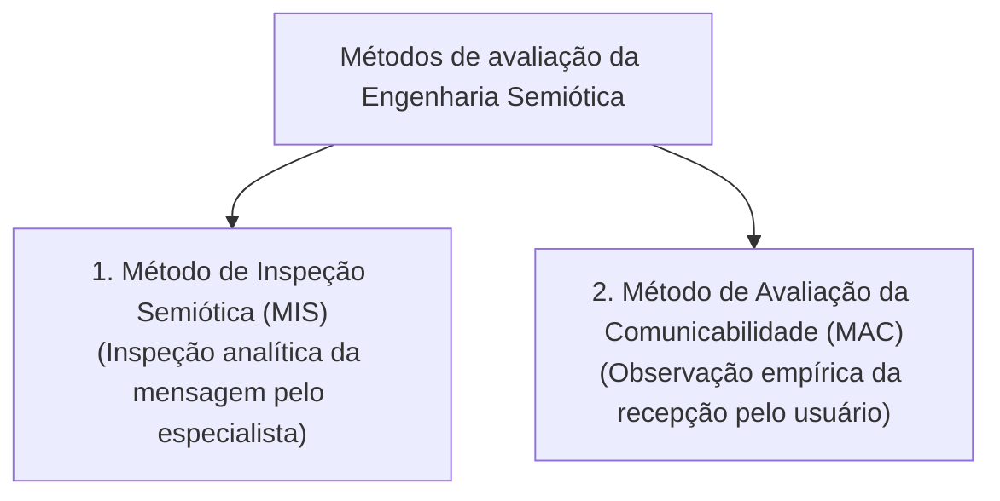
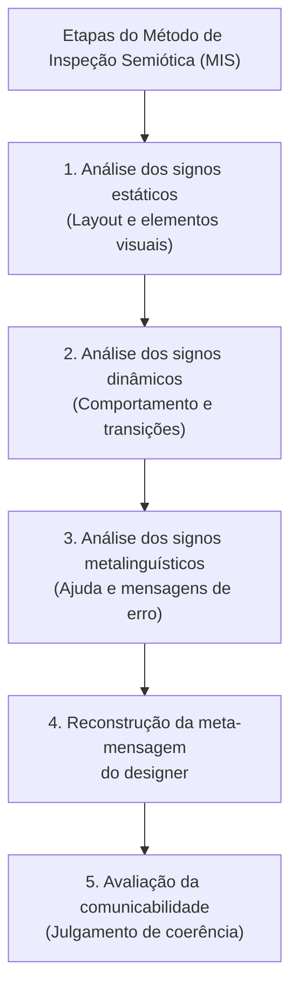
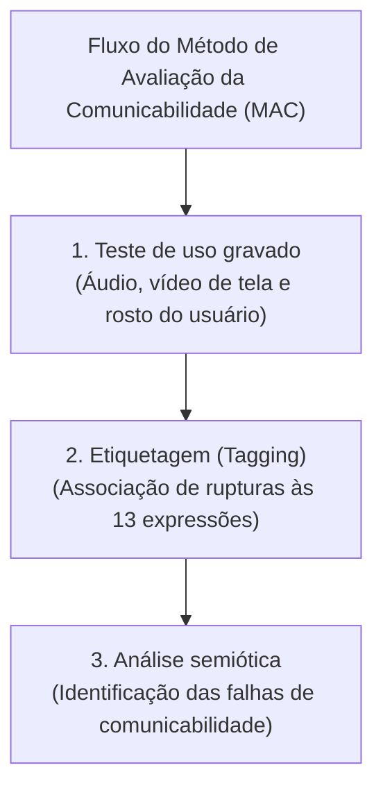

# Avaliação da comunicabilidade: Método de Inspeção Semiótica (MIS) e Método de Avaliação da Comunicabilidade (MAC)

## Introdução (intuição e analogia do cotidiano)

Pense na experiência de seguir um **manual de montagem de um móvel complexo**:
1. O designer do móvel tentou enviar uma mensagem para você através das peças e do manual explicativo: *"Este é o móvel que projetei, estas são as ferramentas que você deve usar e estes são os passos para montá-lo"*.
2. Se as ilustrações do manual forem ambíguas ou os parafusos não tiverem indicação clara, você comete erros de montagem, hesita diante das peças e diz em voz alta: *"Ué, mas o que é para fazer aqui?"* ou *"Socorro, montei ao contrário!"*.

Na teoria de Interação Humano-Computador (IHC), a **Engenharia Semiótica** (desenvolvida pela professora Clarisse Sieckenius de Souza na PUC-Rio) conceitua o sistema interativo como um **artefato de metacomunicação**: o software é a mensagem que o designer envia ao usuário sobre como o sistema funciona e para que ele serve. 

Para avaliar a qualidade dessa conversa entre o designer e o usuário final — atributo denominado **comunicabilidade** —, a Engenharia Semiótica propõe dois métodos complementares: o **Método de Inspeção Semiótica (MIS)** (método analítico por inspeção de especialistas) e o **Método de Avaliação da Comunicabilidade (MAC)** (método empírico por observação de usuários reais).

---

## 1. O atributo de comunicabilidade e a metacomunicação

A **comunicabilidade** é a propriedade do software de transmitir ao usuário, de forma clara, completa e eficaz, a **intenção de design**, o alcance da aplicação e a lógica correta de interação.

- **Meta-mensagem do designer:** *"Este é o meu entendimento de quem você é, do que você precisa e quer fazer, de que maneira pode e deve fazer, e por que."*
- **Falha de comunicabilidade:** ocorre quando há ruído ou quebra na transmissão dessa mensagem, fazendo o usuário interpretar incorretamente a função de um botão, perder o rumo da navegação ou não entender a resposta dada pela tela.

---

## 2. Método 1: Método de Inspeção Semiótica (MIS)

O **Método de Inspeção Semiótica (MIS)** é um método analítico de avaliação no qual **especialistas em IHC** inspecionam a interface para reconstruir e avaliar a coerência da meta-mensagem enviada pelo designer ao usuário.

- **Quem participa:** especialistas e avaliadores de IHC (não exige a presença de usuários reais no momento da inspeção).

### Os três tipos de signos analisados no MIS

O avaliador percorre a interface dividindo sua análise em três categorias de signos:

1. **Signos estáticos:** elementos visuais permanentes na tela (layout, agrupamento de campos, esquemas de cores, ícones estáticos, tipografia e rótulos de texto). Comunicam o que está disponível na tela em um determinado estado estático.
2. **Signos dinâmicos:** elementos que se alteram ao longo do tempo em resposta à interação do usuário (animações, barras de progresso, alteração do cursor, feedback de cliques e transições entre páginas). Comunicam como o sistema responde e muda de estado.
3. **Signos metalinguísticos:** signos nos quais o sistema fala explicitamente sobre si mesmo ou sobre outros signos da interface (mensagens de erro explicativas, caixas de ajuda, *tooltips*, tutoriais de introdução e documentação). Comunicam como interpretar os demais elementos em situações de dúvida.

### Protocolo de execução do MIS (5 etapas)

A aplicação do MIS segue o protocolo padronizado em 5 etapas sequenciais:

| Etapa do protocolo | Atividade e tarefa do avaliador |
| :--- | :--- |
| **1. Análise dos signos estáticos** | Inspecionar a estrutura estática da interface (layout, agrupamento visual, esquemas de cores, rótulos e ícones). |
| **2. Análise dos signos dinâmicos** | Executar os fluxos de tarefas e observar o comportamento dinâmico e as transições do sistema no tempo. |
| **3. Análise dos signos metalinguísticos** | Inspecionar elementos em que o sistema fala sobre si (ajuda, mensagens de erro, *tooltips* e tutoriais). |
| **4. Reconstrução da meta-mensagem** | Sintetizar as análises anteriores e redigir a frase consolidada da meta-mensagem transmitida pelo designer. |
| **5. Avaliação da comunicabilidade** | Julgar a coerência geral da mensagem, identificando contradições, ambiguidades e omissões na comunicação. |

---

## 3. Método 2: Método de Avaliação da Comunicabilidade (MAC)

O **Método de Avaliação da Comunicabilidade (MAC)** é um método empírico de observação no qual **usuários reais** são gravados executando tarefas no sistema, e o avaliador categoriza e etiqueta as rupturas de comunicação ocorridas durante a interação.

- **Quem participa:** usuários reais (executando tarefas) + avaliadores de IHC (observando e realizando a codificação dos dados).

### Protocolo de execução do MAC (4 fases)

A realização do MAC segue um protocolo operacional em 4 fases integradas:

| Fase do protocolo | Atuação e tarefas dos atores envolvidos |
| :--- | :--- |
| **1. Preparação** | **Avaliadores:** definem o perfil de usuário, elaboram os cenários de tarefas e configuram a gravação de áudio, vídeo e tela. |
| **2. Teste de uso e gravação** | **Usuários reais:** executam as tarefas no sistema sem interferência direta do avaliador enquanto são gravados. |
| **3. Etiquetagem (*Tagging*)** | **Avaliadores:** analisam as gravações e atribuem cada hesitação ou ruptura visual/verbal a uma das 13 expressões comunicativas. |
| **4. Consolidação e diagnóstico** | **Avaliadores:** quantificam a frequência das etiquetas, identificam as falhas de metacomunicação e geram o relatório de recomendações. |

### As 13 Expressões Comunicativas (Etiquetas do MAC)

Quando o usuário encontra um ruído de comunicação na interface, ele manifesta hesitação, dúvida ou reação verbal/comportamental. No MAC, essas manifestações são mapeadas rigorosamente em **13 expressões comunicativas padronizadas**:

| Expressão do MAC | Significado e reação típica do usuário | Natureza da falha |
| :--- | :--- | :--- |
| **"O que é isso?"** | O usuário não compreende o significado ou a função de um elemento visual na tela. | Dúvida sobre signo estático |
| **"O que aconteceu?"** | O usuário se surpreende com um comportamento ou resultado inesperado do sistema. | Ruído no signo dinâmico |
| **"E agora?"** | O usuário fica desorientado sobre qual deve ser a sua próxima ação no fluxo. | Falha no guia de navegação |
| **"Onde estou?"** | O usuário perde a noção da sua localização dentro da estrutura/arquitetura do sistema. | Perda de senso de lugar |
| **"Ops!"** | O usuário comete um pequeno lapso inadvertido e tenta corrigir no mesmo instante. | Lapso de interação leve |
| **"Ah, não!"** | O usuário comete uma ação equivocada de alto impacto ou destrutiva por engano. | Erro grave de interação |
| **"Socorro!"** | O usuário entra em pânico ou desespero e busca imediatamente botões de cancelamento ou ajuda. | Busca por saída de emergência |
| **"Assim não dá!"** | O usuário manifesta extrema frustração com a lentidão ou rigidez da interface. | Frustração com a usabilidade |
| **"Por que não funciona?"** | O usuário tenta repetidamente executar uma ação e o sistema não responde ou não permite. | Bloqueio de ação |
| **"Ué, mas o que é..."** | O usuário percebe uma contradição visual ou lógica na resposta apresentada pela tela. | Incoerência de metacomunicação |
| **"Desisto!"** | O usuário abandona definitivamente a tentativa de concluir a tarefa por incapacidade de avançar. | Falha crítica de comunicabilidade |
| **"Já sei!"** | O usuário descobre com sucesso a lógica do sistema e alcança um *insight* correto de uso. | Sucesso na aprendizagem |
| **"Não, obrigado!"** | O usuário recusa intencionalmente uma opção, recurso ou atalho oferecido pela interface. | Rejeição de recurso |

---

## 4. Matriz comparativa: MIS vs. MAC

| Dimensão de análise | Método de Inspeção Semiótica (MIS) | Método de Avaliação da Comunicabilidade (MAC) |
| :--- | :--- | :--- |
| **Natureza do método** | Analítico (Avaliação por inspeção) | Empírico (Avaliação por observação) |
| **Quem participa** | Especialistas em IHC | Usuários reais + Avaliadores como observadores |
| **Foco da análise** | A mensagem **planejada e emitida** pelo designer na interface | A mensagem **recebida e interpretada** pelo usuário real |
| **Instrumento de análise** | Análise de signos estáticos, dinâmicos e metalinguísticos | Gravadores de sessão + 13 Etiquetas de Expressões Comunicativas |
| **Artefato gerado** | Reconstrução da meta-mensagem e relatório de comunicabilidade | Gráficos de frequência de expressões e pontos de quebra do fluxo |
| **Momento ideal** | Fase inicial e intermediária (protótipos e telas) | Fase final e somativa (protótipos de alta fidelidade/sistema) |

---

## Conclusão e integração prática

O **Método de Inspeção Semiótica (MIS)** e o **Método de Avaliação da Comunicabilidade (MAC)** formam a dupla metodológica central da Engenharia Semiótica.

Enquanto o MIS permite aos especialistas inspecionar a interface e garantir que a meta-mensagem do designer seja rica, clara e sem contradições antes do lançamento, o MAC observa o usuário real em ação, utilizando as 13 expressões comunicativas para identificar exatamente em quais momentos a conversa entre o designer e o usuário falhou na prática.

---

## Referências bibliográficas

- DE SOUZA, Clarisse Sieckenius. **The Semiotic Engineering of Human-Computer Interfaces**. Cambridge: MIT Press, 2005.
- DE SOUZA, Clarisse Sieckenius; LEITÃO, Carla Faria. **Semiotic Engineering Methods for Scientific Research in Human-Computer Interaction**. Synthesis Lectures on Human-Centered Informatics, Morgan & Claypool Publishers, 2009.
- PRATES, Raquel Oliveira; BARBOSA, Simone Diniz Junqueira. [Avaliação de interfaces de usuário — conceitos e métodos](http://www.inf.puc-rio.br/~inf1403/docs/JAI2003_PratesBarbosa_avaliacao.pdf). In: **Jornada de Atualização em Informática do Congresso da Sociedade Brasileira de Computação (JAI/SBC)**. 2003. p. 28. Acesso em: ==15/07/2021==.

---

## Material complementar

- DE SOUZA, Clarisse S.; LEITÃO, Carla F.; PRATES, Raquel O.; SILVA, Elton J. [The semiotic inspection method](https://doi.org/10.1145/1298023.1298044). In: **Proceedings of the VII Brazilian Symposium on Human Factors in Computing Systems (IHC '06)**. New York: ACM, 2006. p. 148-157. DOI: 10.1145/1298023.1298044. Acesso em: ==15/07/2021==.
- PONCIANO, Lesandro; PEREIRA, Thiago E. [Characterising volunteers' task execution patterns across projects on multi-project citizen science platforms](https://doi.org/10.1145/3357155.3358441). In: **Proceedings of the 18th Brazilian Symposium on Human Factors in Computing Systems (IHC '19)**. New York: ACM, 2019. Article 16, p. 1-11. DOI: 10.1145/3357155.3358441. Acesso em: ==15/07/2021==.

---

## Artigos relacionados e navegação

- **Artigo anterior:** [[20. Avaliação por inspeção - avaliação heurística e percurso cognitivo]]
- **Próximo artigo:** [[22. Avaliação da acessibilidade - diretrizes da wcag e conformidade em sistemas interativos]]
- **Resumo da disciplina:** [[00. Design de Interacao - Resumo]]
- **Página inicial do vault:** [[index]]
