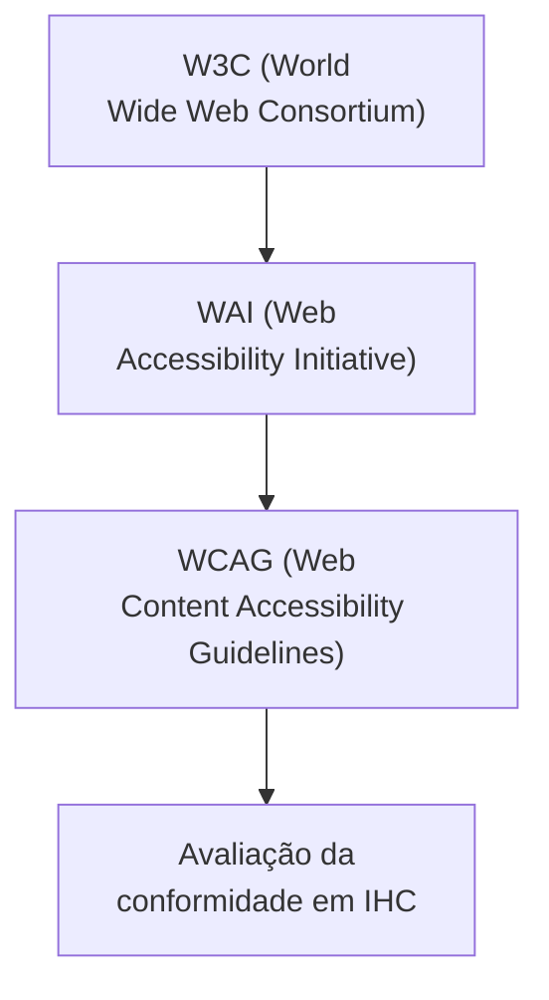
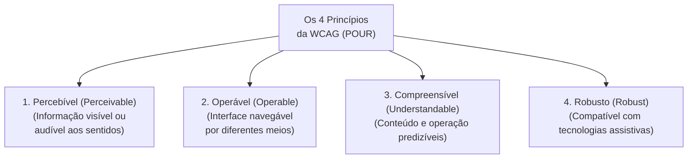
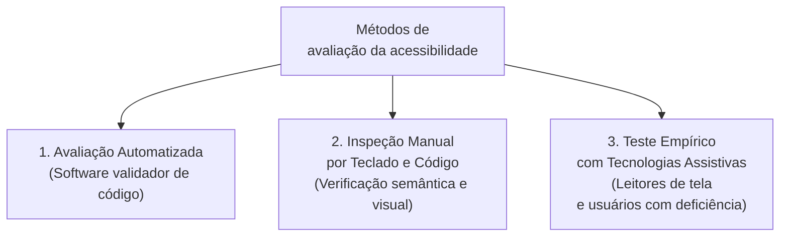

# Avaliação da acessibilidade: diretrizes da WCAG e conformidade em sistemas interativos

## Introdução (intuição e analogia do cotidiano)

Pense na infraestrutura arquitetônica de um **edifício público moderno**:
1. Para garantir o acesso de todas as pessoas, o prédio conta com uma rampa suave ao lado da escadaria principal, portas automáticas com largura adequada para cadeiras de rodas, elevadores com aviso sonoro de andares e botões em Braille, além de sinalização em piso tátil para pessoas com deficiência visual.
2. Nenhuma dessas adaptações prejudica os demais frequentadores do edifício; pelo contrário, uma mãe com carrinho de bebê ou um entregador com carga também se beneficiam da rampa e das portas automáticas.

Em Interação Humano-Computador (IHC), a **acessibilidade** no ambiente digital segue a mesma lógica de inclusão universal. Avaliar a acessibilidade de um sistema interativo significa verificar se ele foi projetado e codificado de forma a permitir que qualquer pessoa — independentemente de limitações visuais, auditivas, motoras ou cognitivas — consiga perceber, entender, navegar e interagir com o software com autonomia e dignidade.

---

## 1. O que é a avaliação de acessibilidade e o papel do W3C / WCAG

A **acessibilidade na Web (*Web Accessibility*)** é o conjunto de princípios, técnicas e padrões que visam remover barreiras de uso em sites e aplicações digitais.

A principal referência internacional sobre o tema é o consórcio **W3C (*World Wide Web Consortium*)**, através do seu grupo de trabalho **WAI (*Web Accessibility Initiative*)**, responsável pela criação do documento **WCAG (*Web Content Accessibility Guidelines*)**.

A **WCAG** é um padrão técnico estruturado que define diretrizes e critérios de sucesso testáveis para avaliar a acessibilidade de páginas Web, documentos e aplicações digitais.

---

## 2. Os quatro princípios fundamentais da WCAG (POUR / POCR)

A WCAG está organizada em torno de **quatro princípios fundamentais** que a interface e o conteúdo digital devem obrigatoriamente satisfazer:

### Detalhamento dos quatro princípios

1. **Percebível (*Perceivable*):**
   - *Conceito:* a informação e os componentes da interface devem ser apresentados aos usuários em formas que eles possam perceber com seus sentidos (visão, audição ou tátil).
   - *Requisitos típicos:* fornecer alternativa em texto para qualquer conteúdo não textual (atributo `alt` em imagens), disponibilizar legendas e audiodescrição para vídeos, e garantir contraste de cor adequado entre o texto e o fundo (taxa mínima de 4.5:1).

2. **Operável (*Operable*):**
   - *Conceito:* os componentes de interface e a navegação devem ser operáveis física e logicamente por qualquer dispositivo de entrada.
   - *Requisitos típicos:* permitir que **toda a funcionalidade seja acessível via teclado** (sem exigir o uso de mouse), dar tempo suficiente para leitura e uso, e evitar elementos piscantes que possam induzir convulsões.

3. **Compreensível (*Understandable*):**
   - *Conceito:* a informação e a operação da interface devem ser claras, legíveis e previsíveis.
   - *Requisitos típicos:* tornar o texto legível e compreensível (definir o idioma da página no HTML com `lang="pt-BR"`), fazer as páginas funcionarem de forma previsível (sem mudanças bruscas de contexto ao focar um campo) e ajudar os usuários a evitar e corrigir erros em formulários.

4. **Robusto (*Robust*):**
   - *Conceito:* o conteúdo deve ser suficientemente robusto para poder ser interpretado de forma confiável por uma ampla variedade de agentes de usuário, incluindo **tecnologias assistivas**.
   - *Requisitos típicos:* utilizar HTML semântico válido (`<header>`, `<nav>`, `<main>`, `<footer>`), estruturar formulários com rótulos explícitos (`<label for="...">`) e utilizar atributos **WAI-ARIA** quando necessário para comunicar o papel e o estado dos componentes para leitores de tela.

---

## 3. Níveis de conformidade da WCAG (A, AA e AAA)

Os critérios de sucesso da WCAG são classificados em **três níveis de conformidade**, refletindo o grau de acessibilidade atingido pela aplicação:

| Nível de conformidade | Característica e impacto | Exemplo de requisito |
| :--- | :--- | :--- |
| **Nível A** | **Mínimo obrigatório:** atende às barreiras mais críticas. Sem este nível, certos grupos são impedidos de usar o sistema. | Todas as imagens possuem texto alternativo (`alt`); a navegação por teclado não fica presa em um "loop". |
| **Nível AA** | **Padrão recomendado:** atende às barreiras principais. É o nível exigido por legislações e normas governamentais internacionais e nacionais (LBI e eMAG no Brasil). | Contraste de cor mínimo de 4.5:1 em textos normais; foco visual claramente destacado ao navegar via teclado. |
| **Nível AAA** | **Excelência máxima:** nível mais rigoroso e especializado de acessibilidade total. | Contraste de cor elevado (7:1); tradução completa do conteúdo em Língua de Sinais (LIBRAS) em vídeos. |

---

## 4. Métodos e ferramentas para avaliação de acessibilidade

A avaliação da acessibilidade em IHC deve combinar estratégias automatizadas, inspeções manuais por especialistas e testes com usuários reais.

### a. Avaliação automatizada (Softwares validadores)
- **Como funciona:** softwares e extensões de navegador (ex.: WAVE, axe DevTools, Lighthouse, eMAG Validador) escaneiam o código HTML em busca de erros sintáticos de acessibilidade.
- **Vantagens:** varredura instantânea de centenas de páginas, identificando falta de `alt`, baixo contraste e falta de marcação de idioma.
- **Limitações:** ferramentas automáticas detectam apenas entre **30% a 40%** dos critérios da WCAG (um robô consegue checar se o atributo `alt` existe, mas não se a descrição da imagem faz sentido no contexto).

### b. Inspeção manual (Navegação por teclado e análise semântica)
- **Como funciona:** o especialista em IHC percorre a interface utilizando apenas a tecla `Tab`, `Shift+Tab`, `Enter` e `Barra de Espaço`, verificando se o indicador visual de foco fica evidente e se nenhum elemento fica inacessível sem o mouse.
- **Verificações essenciais:**
  - Testar o zoom da tela em **200%** para garantir que o layout se adapta sem sobreposição de textos ou perda de conteúdo.
  - Verificar se a estrutura de cabeçalhos (`<h1>` até `<h6>`) segue uma hierarquia lógica sem pular níveis.

### c. Teste empírico com tecnologias assistivas
- **Como funciona:** avaliação realizada com o uso de **leitores de tela** (ex.: NVDA ou JAWS no Windows, VoiceOver no Mac/iOS, TalkBack no Android) ou conduzida com a participação de **usuários com deficiência**.
- **Vantagem:** valida se a experiência de uso real é fluida e funcional, indo além da simples conformidade formal do código.

---

## 5. Matriz comparativa dos métodos de avaliação de acessibilidade

| Tipo de avaliação | Ferramentas / Atores envolvidos | O que consegue detectar | Principal limitação |
| :--- | :--- | :--- | :--- |
| **Automatizada** | WAVE, axe DevTools, Lighthouse | Falta de `alt`, baixo contraste, falta de atributo `lang`, HTML inválido | Não avalia o contexto, o sentido das descrições ou a lógica do fluxo |
| **Inspeção manual** | Especialista em IHC + Teclado | Foco invisível, ordem de tabulação ilógica, zoom quebrado, rótulos confusos | Exige conhecimento especializado das diretrizes da WCAG |
| **Empírica assistiva** | Usuários com deficiência + Leitores de tela | Experiência de uso real, frustração atitudinal e ruídos de leitura | Exige recrutamento especializado e maior tempo de aplicação |

---

## Conclusão e integração prática

A **avaliação da acessibilidade** não deve ser vista como uma etapa final de auditoria isolada, mas sim como uma dimensão contínua de qualidade integrada a todo o ciclo de design e desenvolvimento de software.

Ao aplicar as diretrizes da **WCAG (Princípios POUR / POCR)** e combinar validações automatizadas com inspeções manuais de teclado e testes empíricos com leitores de tela, a equipe de IHC garante que a aplicação seja verdadeiramente inclusiva, democrática e em conformidade com as exigências legais e ergonômicas contemporâneas.

---

## Referências bibliográficas

- BRASIL. **Lei Nº 13.146, de 6 de Julho de 2015 (Lei Brasileira de Inclusão da Pessoa com Deficiência - LBI)**. Brasília: Presidência da República, 2015.
- GOVERNO FEDERAL DO BRASIL. **eMAG - Modelo de Acessibilidade em Governo Eletrônico**. Brasília: MPOG, 2014.
- WORLD WIDE WEB CONSORTIUM (W3C). **Web Content Accessibility Guidelines (WCAG) 2.1**. W3C Recommendation, 2018.
- WORLD WIDE WEB CONSORTIUM (W3C). **Web Content Accessibility Guidelines (WCAG) 2.2**. W3C Recommendation, 2023.

---

## Material complementar

- WORLD WIDE WEB CONSORTIUM (W3C). [Diretrizes de Acessibilidade para Conteúdo Web (WCAG) 2.1](https://www.w3c.br/traducoes/wcag/wcag21-pt-BR/#abstract). Tradução oficial para o português do Brasil. Acesso em: ==15/07/2021==.
- W3C BRASIL. [Acessibilidade web: Custo ou Benefício](https://www.youtube.com/watch?v=hFI4CuxQjSA). Vídeo explicativo sobre problemas e soluções de acessibilidade web. Acesso em: ==15/07/2021==.

---

## Artigos relacionados e navegação

- **Artigo anterior:** [[21. Avaliação da comunicabilidade - método de inspeção semiótica mis e método de avaliação da comunicabilidade mac]]
- **Próximo artigo:** [[23. Teste de usabilidade - método empírico formal de avaliação por observação]]
- **Resumo da disciplina:** [[00. Design de Interacao - Resumo]]
- **Página inicial do vault:** [[index]]
