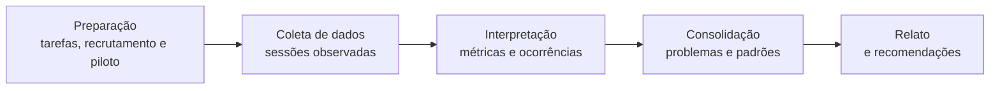
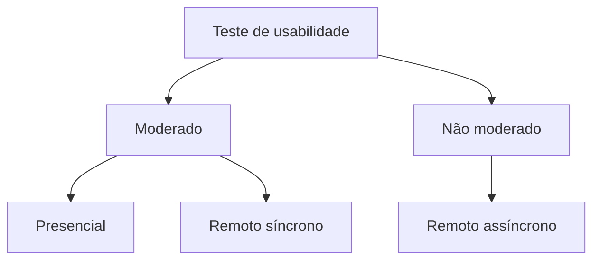
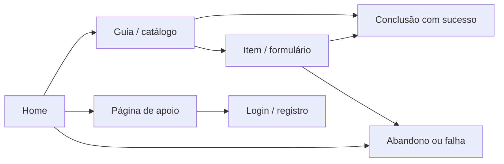

# Teste de usabilidade: método empírico formal de avaliação por observação

## Teste de usabilidade observa pessoas realizando tarefas reais

Pense no processo de **teste de rodagem (*test-drive*) de um novo protótipo de automóvel**:
1. Antes de iniciar a produção em massa, a montadora não se limita a inspecionar o motor no papel ou a pedir para engenheiros olharem para o painel parado. Ela convida motoristas reais com perfis variados para dirigir o carro em uma pista de testes controlada.
2. Enquanto o motorista dirige, os avaliadores observam se ele encontra facilmente os comandos no painel, se hesita ao trocar a marcha, se comete erros de manobra e se expressa desconforto ao longo do trajeto.

Em Interação Humano-Computador (IHC), o **teste de usabilidade (*usability testing*)** é a aplicação formal desse princípio de observação empírica. Em vez de supor como a interface funcionará, a equipe de design convida pessoas representativas do público-alvo real para executar tarefas concretas no software em um ambiente controlado, registrando de forma sistemática o desempenho, os erros, o tempo gasto e a satisfação do usuário.

---

## Participantes, tarefas, observação e métricas estruturam o teste

O **teste de usabilidade** é um método empírico de avaliação fundamentado estritamente na **observação** direta do comportamento do usuário. Nele, **usuários reais** utilizam o sistema para realizar **tarefas pré-definidas**, enquanto a equipe de IHC registra dados quantitativos e qualitativos sobre a interação.

- **Definição de critérios:** os objetivos específicos da avaliação é que determinam quais **critérios de usabilidade** devem ser medidos (ex.: taxa de sucesso, tempo gasto, frequência de erros ou satisfação percebida).
- **Perguntas fundamentais que o teste permite responder:**
  - *Quantos erros os usuários cometem nas primeiras sessões de uso?*
  - *Quantos usuários conseguiram completar com sucesso determinadas tarefas?*

| Elemento do teste | Papel |
| :--- | :--- |
| Participantes representativos | Aproximar o teste dos perfis de uso relevantes |
| Tarefas realistas | Criar situações orientadas a objetivos concretos |
| Observação e registro | Capturar comportamento, dificuldades e estratégias |
| Métricas e diagnóstico | Organizar evidências de eficácia, eficiência, satisfação e problemas encontrados |

### O teste avalia a interface, não o participante
A premissa ética e metodológica mais importante em qualquer teste de usabilidade é deixar cristalino para o participante que **o sistema é que está sendo testado, e nunca o usuário**. Se o participante não conseguir concluir uma tarefa ou cometer um erro, a falha é exclusivamente do design da interface.

---

## Pensamento em voz alta revela raciocínios durante ou após a tarefa

A técnica de coleta de dados qualitativos mais utilizada durante o teste de usabilidade é o **Protocolo do Pensamento em Voz Alta (*Think-Aloud Protocol*)**, introduzido em IHC por Clayton Lewis e popularizado por Jakob Nielsen.

- **Como funciona:** o participante é instruído a verbalizar continuamente seus pensamentos, expectativas, dúvidas, confusões e razões de ação enquanto navega na interface (ex.: *"Estou procurando o botão de salvar, mas só vejo um ícone de engrenagem... acho que vou clicar nele para ver se abre uma lista"*).
- **Principal benefício:** revela o **modelo mental** do usuário em tempo real, permitindo identificar a causa exata de uma desorientação visual que não seria detectada apenas olhando para a movimentação do ponteiro do mouse.

| Modalidade de *think aloud* | Como funciona |
| :--- | :--- |
| Concorrente | O participante verbaliza pensamentos enquanto executa a tarefa |
| Retrospectiva | O participante comenta a experiência depois, frequentemente apoiado por gravação da sessão |

---

## Teste de usabilidade segue preparação, coleta, análise e relato

O protocolo formal do teste de usabilidade organiza a avaliação em **cinco atividades encadeadas**, desde a preparação inicial até o relato final dos resultados:

### Atividades do protocolo

| Atividade do protocolo | Tarefas operacionais executadas pela equipe |
| :--- | :--- |
| **Preparação** | - Definir tarefas para os participantes executarem. - Definir o perfil dos participantes e recrutá-los. - Preparar material para observar e registrar o uso. - **Executar um teste-piloto** (validação prévia do roteiro e equipamentos). |
| **Coleta de dados** | - Observar e registrar a performance e a opinião dos participantes durante sessões de uso controladas. |
| **Interpretação** | - Reunir, contabilizar e sumarizar os dados coletados dos participantes. |
| **Consolidação dos resultados** | - Consolidar os dados brutos compilados em diagnósticos claros de usabilidade. |
### Teste-piloto valida roteiro e condições de coleta

Dentro da atividade de **Preparação**, a realização de **1 a 2 testes-piloto** com colegas ou usuários de teste antes do início oficial da coleta de dados é uma boa prática indispensável. O teste-piloto serve para:
- Ajustar a clareza e a ambiguidade da redação dos cenários de tarefas.
- Calibrar o tempo total previsto para cada sessão de teste.
- Verificar o funcionamento técnico dos softwares e equipamentos de gravação de áudio, vídeo e tela.
- Treinar a postura neutra do facilitador e a condução da técnica de *think-aloud*.

---

## Testes podem ser moderados, não moderados, presenciais ou remotos

Os testes de usabilidade podem ser conduzidos segundo diferentes arranjos de moderação e localização:

| Modalidade | Como funciona | Vantagens | Desvantagens |
| :--- | :--- | :--- | :--- |
| **Moderado (Presencial ou Remoto)** | Um facilitador acompanha o participante em tempo real, orienta o *think-aloud* e faz perguntas de esclarecimento. | Permite aprofundar dúvidas na hora e orientar a técnica de *think-aloud*. | Maior custo de tempo do facilitador e agendamento individual. |
| **Não Moderado (Remoto assíncrono)** | O usuário realiza tarefas de forma autônoma na sua própria rotina por meio de plataformas especializadas (ex.: Maze, UserTesting). | Coleta rápida com amostras maiores e custo operacional reduzido. | Impossibilidade de tirar dúvidas do usuário no momento do bloqueio. |

---

---

## Eye tracking registra padrões de atenção visual

O **rastreamento ocular (*Eye Tracking*)** é uma técnica avançada de observação fisiológica utilizada durante os testes de usabilidade para registrar com precisão para onde o usuário olha, por quanto tempo fixa o olhar e qual a ordem de exploração visual da interface.

| Conceito de eye tracking | O que representa |
| :--- | :--- |
| Fixação | Período em que o olhar permanece relativamente estável em uma região |
| Sacada | Movimento rápido do olhar entre fixações |
| Área de interesse (AOI) | Região definida pelo pesquisador para agregar métricas |
| Heatmap | Visualização agregada da distribuição de atenção/fixações |
| Scanpath | Sequência espacial e temporal de fixações e movimentos |

### Fixações, sacadas e áreas de interesse

1. **Fixações (*Fixations*):** momentos em que os olhos do usuário permanecem relativamente parados sobre um elemento da tela (com duração típica entre 200 e 300 milissegundos). É durante a fixação que o cérebro processa a informação visual.
2. **Sacadas (*Saccades*):** movimentos oculares ultrarrápidos entre duas fixações consecutivas. Durante a sacada, a visão fica temporariamente reprimida e não há retenção de informação visual.
3. **Áreas de Interesse (*AOI - Areas of Interest*):** regiões delimitadas pelo pesquisador na interface (ex.: um botão de ação *CTA*, um banner de oferta ou uma foto de produto) para calcular métricas como o **Tempo até a Primeira Fixação (*Time to First Fixation - TTFF*)** e o **Tempo Total de Permanência (*Total Dwell Time*)**.

---

### Mapas de calor, scanpaths e outras visualizações

O **mapa de calor (*heatmap*)** é a representação gráfica mais consagrada dos dados de rastreamento ocular. Ele sobrepõe manchas de cores graduadas sobre a imagem da interface:

- **Cores quentes (vermelho e amarelo):** representam as zonas de **alta concentração de fixações oculares**, ou seja, os elementos visuais que atraíram a atenção visual do usuário por mais tempo ou com maior frequência.
- **Cores frias (verde e azul):** representam zonas de **baixa concentração visual**, onde o usuário olhou apenas de relance.
- **Áreas sem cor (transparentes):** indicam elementos que foram completamente **ignorados** pelo usuário durante a navegação (um fenômeno comum em casos de cegueira a banners ou *banner blindness*).

| Tipo de visualização | O que representa | Aplicação prática em IHC |
| :--- | :--- | :--- |
| **Mapa de calor de atenção (*Fixation Heatmap*)** | Agregação das áreas com maior densidade de fixações oculares. | Avaliar se os botões principais e informações críticas estão recebendo atenção visual. |
| **Caminho do olhar (*Gaze Plot / Scanpath*)** | Círculos numerados conectados por linhas mostrando a **ordem cronológica** da navegação visual. | Identificar padrões de leitura (ex.: **Padrão em F** em textos longos ou **Padrão em Z** em *landing pages*). |
---

## Clickstream revela caminhos e abandonos na navegação

A **análise de *Clickstream*** (ou fluxo de cliques) é uma técnica de observação quantitativa que registra a **trilha e a sequência exata de páginas, telas e links** navegados por cada participante durante a execução de uma tarefa.

### O que o clickstream permite observar

1. **Reconstrução da jornada real do usuário:** permite mapear o caminho exato percorrido na arquitetura de informação, revelando se o usuário seguiu o fluxo ideal pensado pelo designer ou se tomou atalhos ou desvios inesperados.
2. **Identificação de pontos de abandono (*Drop-off points*):** através de diagramas de fluxo (como o **Diagrama de Sankey**), a equipe identifica em qual página específica ocorreu a maior taxa de falhas (*Task Complete: Failure*) ou desorientação.
3. **Mapeamento de rotas de sucesso vs. falha:** compara a estrutura dos caminhos que resultaram em **sucesso** (*Success URL / Task Complete*) com os caminhos que levaram ao **erro ou desistência**, fornecendo subsídios quantitativos para o redesign de fluxos de navegação.

---

## Eficácia, eficiência e satisfação orientam as métricas

Durante a execução do teste, para **cada tarefa realizada por cada participante**, a equipe de avaliação deve **medir e registrar sistematicamente**:

- **O grau de sucesso da execução:** verificação se a tarefa foi concluída com sucesso total sem ajuda, concluída com ajuda ou não concluída.
- **O total de erros cometidos:** contagem absoluta de equívocos de interação praticados durante o percurso.
- **Quantos erros de cada tipo ocorreram:** categorização dos lapsos e erros (ex.: cliques em elementos estáticos, preenchimento de campos com formato inválido ou caminhos equivocados na navegação).
- **Quanto tempo foi necessário para concluí-la:** tempo exato (em segundos ou minutos) desde o início da leitura do cenário até a conclusão final da tarefa.

### Dimensões de medição da ISO 9241-11

Esses dados medidos alinham-se diretamente às três dimensões de usabilidade da norma **ISO 9241-11**:

| Dimensão de usabilidade | O que mede no teste | Parâmetros e métricas registradas |
| :--- | :--- | :--- |
| **Eficácia (*Effectiveness*)** | A capacidade do usuário de concluir as tarefas e alcançar as metas pretendidas com precisão. | - Grau de sucesso da execução (%) - Total de erros cometidos - Quantos erros de cada tipo ocorreram |
| **Eficiência (*Efficiency*)** | A quantidade de recursos (tempo e esforço) investidos para atingir as metas. | - Tempo necessário para concluir cada tarefa - Número de cliques e passos executados - Tempo de recuperação de erros |
| **Satisfação (*Satisfaction*)** | O conforto, a aceitação e a atitude positiva percebidos pelo usuário durante a interação. | - Pontuação final no questionário SUS (0 a 100) - Pontuação em escalas Likert de facilidade percebida (SEQ) - Comentários qualitativos espontâneos |

---

## Tamanho da amostra depende do objetivo do teste

O modelo clássico de **Nielsen e Landauer** descreve retornos decrescentes na descoberta de problemas em testes qualitativos. Sob a premissa frequentemente citada de que um único participante encontra, em média, cerca de 31% dos problemas detectáveis naquele contexto, cinco participantes levariam o modelo a uma expectativa próxima de 85% de descoberta.

| Aspecto | Como interpretar |
| :--- | :--- |
| **Cinco participantes** | É um ponto de partida frequente para rodadas qualitativas e formativas, não uma regra universal de amostragem. |
| **~85% dos problemas** | É uma estimativa produzida pelas premissas do modelo, não uma garantia para qualquer interface ou população. |
| **Quando aumentar a amostra** | Quando há múltiplos perfis, tarefas muito distintas, baixa probabilidade de ocorrência dos problemas ou necessidade de estimativas quantitativas. |
| **Estratégia iterativa** | Pequenas rodadas sucessivas, seguidas de correções e novos testes, podem gerar mais aprendizado do que concentrar todo o orçamento em uma única rodada. |

O tamanho adequado da amostra depende, portanto, do **objetivo da pesquisa**, da heterogeneidade dos usuários e tarefas e do tipo de evidência desejada.

---

## Fases e entregáveis do teste de usabilidade

| Fase | Atuação principal | Atividades operacionais | Entregável / Artefato gerado |
| :--- | :--- | :--- | :--- |
| **1. Preparação** | Facilitador e Designer | Definição de métricas, recrutamento, cenários de tarefas e **teste-piloto** | Roteiro do teste, cenários e teste-piloto |
| **2. Coleta de dados** | Participante e Facilitador | Recepção, assinatura do TCLE e execução com *Think-Aloud* | Gravações de áudio/vídeo/tela e TCLE |
| **3. Interpretação** | Analista de IHC | Sumarização do grau de sucesso, erros cometidos e tempos por tarefa | Planilha de métricas consolidadas |
| **4. Consolidação** | Equipe de UX/IHC | Agrupamento dos problemas de usabilidade por gravidade e causa raiz | Diagnóstico de barreiras de usabilidade |
| **5. Relato** | Facilitador e Analista | Redação do relatório final com recomendações de redesign | Relatório final de teste de usabilidade |

---

## Testes transformam comportamento observado em evidência para redesign

O **teste de usabilidade** representa a prova de fogo de qualquer interface interativa. Ao observar o comportamento de usuários reais em tarefas realistas, a equipe de IHC substitui achismos e preferências pessoais por evidências empíricas concretas.

Combinado com métricas rigorosas de **eficácia, eficiência e satisfação**, o teste de usabilidade orienta o redesign iterativo da aplicação, garantindo que o produto final seja intuitivo, produtivo e agradável de usar.

---

## Referências bibliográficas

- DUMAS, Joseph S.; REDISH, Janice C. **A Practical Guide to Usability Testing**. Revised ed. Intellect Books, 1999.
- NIELSEN, Jakob. **Usability Engineering**. San Diego: Academic Press, 1994.
- RUBIN, Jeffrey; CHISNELL, Dana. **Handbook of Usability Testing: How to Plan, Design, and Conduct Effective Tests**. 2. ed. Indianapolis: Wiley Publishing, 2008.

---

## Material complementar

- BROOKE, John. [SUS: A 'Quick and Dirty' Usability Scale](https://www.usability.gov/how-to-and-tools/methods/system-usability-scale.html). Artigo de referência sobre a escala SUS para avaliação de satisfação. Acesso em: ==15/07/2021==.
- NIELSEN NORMAN GROUP. [Why You Only Need to Test with 5 Users](https://www.nngroup.com/articles/why-you-only-need-to-test-with-5-users/). Artigo clássico sobre o tamanho ideal de amostra em testes de usabilidade. Acesso em: ==15/07/2021==.
- USABILITY.GOV. [Eye Tracking](https://www.usability.gov/how-to-and-tools/methods/eye-tracking.html). Guia prático sobre a aplicação do rastreamento ocular (*eye tracking*) em avaliações de usabilidade. Acesso em: ==15/07/2021==.
- WANG, Gang; ZHANG, Xinyi; TANG, Shiliang; WILSON, Christo; ZHENG, Haitao; ZHAO, Ben Y. [Clickstream User Behavior Models](https://doi.org/10.1145/3068332). **ACM Transactions on the Web (TWEB)**, v. 11, n. 4, p. 21:1-21:37, 2017. DOI: 10.1145/3068332. Acesso em: ==15/07/2021==.

---

## Artigos relacionados

- **Artigo anterior:** [[22. Avaliação da acessibilidade - diretrizes da wcag e conformidade em sistemas interativos]]
- **Próximo artigo:** [[24. Avaliação por investigação - método system usability scale sus]]
- **Resumo da disciplina:** [[00. Design de Interacao - Resumo]]
- **Página inicial do vault:** [[index]]
