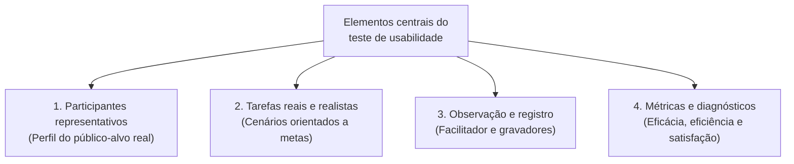
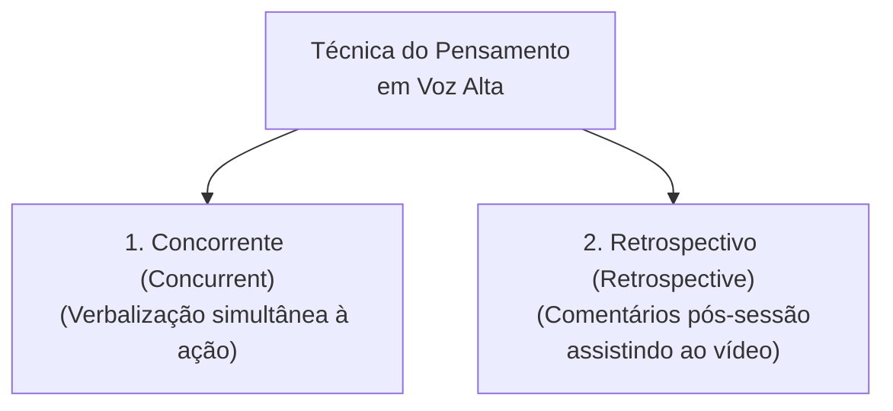
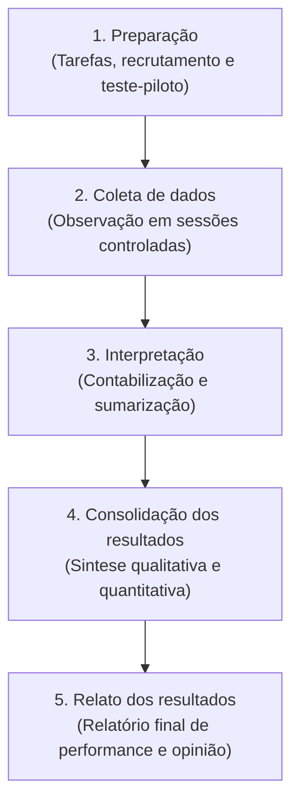
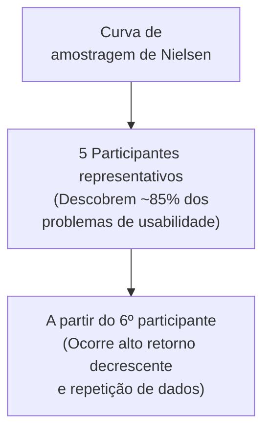

# Teste de usabilidade: método empírico formal de avaliação por observação

## Introdução (intuição e analogia do cotidiano)

Pense no processo de **teste de rodagem (*test-drive*) de um novo protótipo de automóvel**:
1. Antes de iniciar a produção em massa, a montadora não se limita a inspecionar o motor no papel ou a pedir para engenheiros olharem para o painel parado. Ela convida motoristas reais com perfis variados para dirigir o carro em uma pista de testes controlada.
2. Enquanto o motorista dirige, os avaliadores observam se ele encontra facilmente os comandos no painel, se hesita ao trocar a marcha, se comete erros de manobra e se expressa desconforto ao longo do trajeto.

Em Interação Humano-Computador (IHC), o **teste de usabilidade (*usability testing*)** é a aplicação formal desse princípio de observação empírica. Em vez de supor como a interface funcionará, a equipe de design convida pessoas representativas do público-alvo real para executar tarefas concretas no software em um ambiente controlado, registrando de forma sistemática o desempenho, os erros, o tempo gasto e a satisfação do usuário.

---

## 1. O que é o teste de usabilidade e seus elementos centrais

O **teste de usabilidade** é um método empírico de avaliação fundamentado estritamente na **observação** direta do comportamento do usuário. Nele, **usuários reais** utilizam o sistema para realizar **tarefas pré-definidas**, enquanto a equipe de IHC registra dados quantitativos e qualitativos sobre a interação.

- **Definição de critérios:** os objetivos específicos da avaliação é que determinam quais **critérios de usabilidade** devem ser medidos (ex.: taxa de sucesso, tempo gasto, frequência de erros ou satisfação percebida).
- **Perguntas fundamentais que o teste permite responder:**
  - *Quantos erros os usuários cometem nas primeiras sessões de uso?*
  - *Quantos usuários conseguiram completar com sucesso determinadas tarefas?*

### Regra fundamental do teste de usabilidade
A premissa ética e metodológica mais importante em qualquer teste de usabilidade é deixar cristalino para o participante que **o sistema é que está sendo testado, e nunca o usuário**. Se o participante não conseguir concluir uma tarefa ou cometer um erro, a falha é exclusivamente do design da interface.

---

## 2. A técnica do Pensamento em Voz Alta (*Think-Aloud Protocol*)

A técnica de coleta de dados qualitativos mais utilizada durante o teste de usabilidade é o **Protocolo do Pensamento em Voz Alta (*Think-Aloud Protocol*)**, introduzido em IHC por Clayton Lewis e popularizado por Jakob Nielsen.

- **Como funciona:** o participante é instruído a verbalizar continuamente seus pensamentos, expectativas, dúvidas, confusões e razões de ação enquanto navega na interface (ex.: *"Estou procurando o botão de salvar, mas só vejo um ícone de engrenagem... acho que vou clicar nele para ver se abre uma lista"*).
- **Principal benefício:** revela o **modelo mental** do usuário em tempo real, permitindo identificar a causa exata de uma desorientação visual que não seria detectada apenas olhando para a movimentação do ponteiro do mouse.

---

## 3. Protocolo formal de execução do Teste de Usabilidade

O protocolo formal do teste de usabilidade organiza a avaliação em **cinco atividades encadeadas**, desde a preparação inicial até o relato final dos resultados:

### Atividades e tarefas do protocolo do teste de usabilidade

| Atividade do protocolo | Tarefas operacionais executadas pela equipe |
| :--- | :--- |
| **Preparação** | - Definir tarefas para os participantes executarem. - Definir o perfil dos participantes e recrutá-los. - Preparar material para observar e registrar o uso. - **Executar um teste-piloto** (validação prévia do roteiro e equipamentos). |
| **Coleta de dados** | - Observar e registrar a performance e a opinião dos participantes durante sessões de uso controladas. |
| **Interpretação** | - Reunir, contabilizar e sumarizar os dados coletados dos participantes. |
| **Consolidação dos resultados** | - Consolidar os dados brutos compilados em diagnósticos claros de usabilidade. |
| **Relato dos resultados** | - Relatar a performance e a opinião dos participantes em relatório final estruturado. |

---

## 4. Medição e avaliação no teste de usabilidade

Durante a execução do teste, para **cada tarefa realizada por cada participante**, a equipe de avaliação deve **medir e registrar sistematicamente**:

- **O grau de sucesso da execução:** verificação se a tarefa foi concluída com sucesso total sem ajuda, concluída com ajuda ou não concluída.
- **O total de erros cometidos:** contagem absoluta de equívocos de interação praticados durante o percurso.
- **Quantos erros de cada tipo ocorreram:** categorização dos lapsos e erros (ex.: cliques em elementos estáticos, preenchimento de campos com formato inválido ou caminhos equivocados na navegação).
- **Quanto tempo foi necessário para concluí-la:** tempo exato (em segundos ou minutos) desde o início da leitura do cenário até a conclusão final da tarefa.

### Dimensões de medição segundo a ISO 9241-11

Esses dados medidos alinham-se diretamente às três dimensões de usabilidade da norma **ISO 9241-11**:

| Dimensão de usabilidade | O que mede no teste | Parâmetros e métricas registradas |
| :--- | :--- | :--- |
| **Eficácia (*Effectiveness*)** | A capacidade do usuário de concluir as tarefas e alcançar as metas pretendidas com precisão. | - Grau de sucesso da execução (%) - Total de erros cometidos - Quantos erros de cada tipo ocorreram |
| **Eficiência (*Efficiency*)** | A quantidade de recursos (tempo e esforço) investidos para atingir as metas. | - Tempo necessário para concluir cada tarefa - Número de cliques e passos executados - Tempo de recuperação de erros |
| **Satisfação (*Satisfaction*)** | O conforto, a aceitação e a atitude positiva percebidos pelo usuário durante a interação. | - Pontuação final no questionário SUS (0 a 100) - Pontuação em escalas Likert de facilidade percebida (SEQ) - Comentários qualitativos espontâneos |

---

## 5. Quantos participantes são necessários? (A regra dos 5 usuários)

Um dos achados empíricos mais influentes de Jakob Nielsen e Tom Landauer é a curva de descoberta de problemas de usabilidade:

- **A regra dos 5 usuários:** testar com **5 participantes representativos** de um mesmo grupo de perfil é suficiente para identificar cerca de **85% dos problemas de usabilidade** de uma interface.
- **Recomendação de processo:** é muito mais vantajoso e econômico realizar **vários testes iterativos com 5 usuários** ao longo das fases de prototipagem do que realizar um único teste maciço com 30 usuários no final do projeto.

---

## 6. Matriz resumida das fases e entregáveis do Teste de Usabilidade

| Fase | Atuação principal | Atividades operacionais | Entregável / Artefato gerado |
| :--- | :--- | :--- | :--- |
| **1. Planejamento** | Facilitador e Designer | Definição de métricas, recrutamento e redação dos cenários de tarefas | Roteiro do teste e cenários de tarefas |
| **2. Preparação** | Facilitador e Participante | Recepção, esclarecimento das regras éticas e assinatura do TCLE | TCLE assinado e questionário pré-teste |
| **3. Execução** | Participante, Facilitador e Observador | Execução das tarefas com *Think-Aloud* e gravação de áudio/vídeo/tela | Gravações de sessão e planilha de métricas |
| **4. Pós-teste** | Facilitador e Analista de IHC | Aplicação de questionário SUS, síntese de barreiras e recomendações | Relatório consolidado de teste de usabilidade |

---

## Conclusão e integração prática

O **teste de usabilidade** representa a prova de fogo de qualquer interface interativa. Ao observar o comportamento de usuários reais em tarefas realistas, a equipe de IHC substitui achismos e preferências pessoais por evidências empíricas concretas.

Combinado com métricas rigorosas de **eficácia, eficiência e satisfação**, o teste de usabilidade orienta o redesign iterativo da aplicação, garantindo que o produto final seja intuitivo, produtivo e agradável de usar.

---

## Referências bibliográficas

- DUMAS, Joseph S.; REDISH, Janice C. **A Practical Guide to Usability Testing**. Revised ed. Intellect Books, 1999.
- NIELSEN, Jakob. **Usability Engineering**. San Diego: Academic Press, 1994.
- RUBIN, Jeffrey; CHISNELL, Dana. **Handbook of Usability Testing: How to Plan, Design, and Conduct Effective Tests**. 2. ed. Indianapolis: Wiley Publishing, 2008.

---

## Artigos relacionados e navegação

- **Artigo anterior:** [[22. Avaliação da acessibilidade - diretrizes da wcag e conformidade em sistemas interativos]]
- **Resumo da disciplina:** [[00. Design de Interacao - Resumo]]
- **Página inicial do vault:** [[index]]
