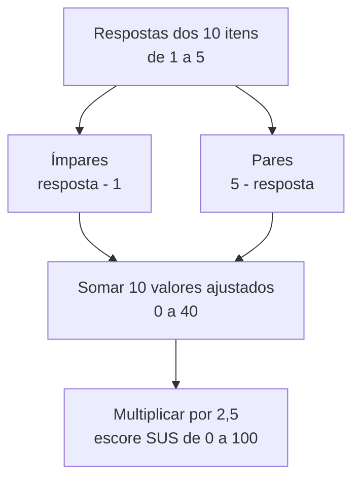

# Avaliação por investigação: método System Usability Scale (SUS)

## SUS transforma percepção de usabilidade em um escore padronizado

Pense na experiência de responder a uma **pesquisa de satisfação pós-atendimento em um hotel ou restaurante**:
1. Após usufruir do serviço, você é convidado a responder a poucas perguntas diretas com notas de 1 a 5 sobre o atendimento, o conforto e a facilidade de acesso.
2. A administração do estabelecimento não está observando você comer ou dormir; ela está **investigando a sua percepção e opinião subjetiva** pós-experiência para calcular um índice consolidado de satisfação do cliente.

Em Interação Humano-Computador (IHC), a **avaliação por investigação** busca capturar os sentimentos, atitudes e julgamentos dos usuários em relação ao sistema. Dentre as várias técnicas de investigação (questionários, entrevistas e grupos focais), o **System Usability Scale (SUS)** destaca-se como o método quantitativo mais consagrado no mundo para mensurar a **usabilidade percebida** de uma aplicação.

---

## SUS é um questionário breve de usabilidade percebida

A **avaliação por investigação (*Survey/Investigation Evaluation*)** é a família de métodos em IHC focada em coletar as opiniões, preferências e atitudes relatadas pelos próprios usuários após interagirem com o software.

Criado por **John Brooke em 1986**, o **System Usability Scale (SUS)** é um questionário padronizado composto por **10 afirmações** com respostas baseadas em uma **escala de Likert de 5 pontos** (variando de *1 = Discordo totalmente* a *5 = Concordo totalmente*).

| Característica do SUS | Descrição |
| :--- | :--- |
| Instrumento | 10 afirmações |
| Resposta | Escala Likert de 5 pontos |
| Polaridade | Itens positivos e negativos alternados |
| Resultado | Escore ajustado de 0 a 100 |
| Interpretação | Requer comparação com referências normativas ou benchmarks |

### Características do instrumento
- **Rápido e simples:** pode ser respondido em menos de 3 minutos.
- **Independente de tecnologia:** pode avaliar softwares desktop, aplicativos móveis, sites, sistemas corporativos e até hardware.
- **Escore único de 0 a 100:** gera um número global de fácil interpretação por gestores e designers.

---

## Dez itens alternam formulações positivas e negativas

Para evitar que o usuário responda com automatismo (marcando a mesma nota em todas as perguntas sem ler), as 10 afirmações do SUS alternam-se rigorosamente entre **visões positivas (itens ímpares)** e **visões negativas (itens pares)**:

| Item | Afirmação do questionário SUS | Orientação do item |
| :---: | :--- | :---: |
| **1** | Eu acho que gostaria de usar este sistema frequentemente. | Positiva |
| **2** | Eu achei o sistema desnecessariamente complexo. | Negativa |
| **3** | Eu achei o sistema fácil de usar. | Positiva |
| **4** | Eu acho que precisaria de ajuda de um suporte técnico para usar este sistema. | Negativa |
| **5** | Eu achei que as várias funções deste sistema estavam bem integradas. | Positiva |
| **6** | Eu achei que havia muita inconsistência neste sistema. | Negativa |
| **7** | Eu imagino que a maioria das pessoas aprenderia a usar este sistema muito rapidamente. | Positiva |
| **8** | Eu achei o sistema muito pesado / complicado de usar. | Negativa |
| **9** | Eu me senti muito confiante usando o sistema. | Positiva |
| **10** | Eu precisei aprender muitas coisas antes de conseguir usar este sistema. | Negativa |

---

## O escore SUS ajusta os itens e produz uma escala de 0 a 100

A conversão das respostas em uma pontuação final de **0 a 100** não é uma simples média aritmética, mas sim o resultado de um algoritmo de pontuação ajustada:

### Cálculo passo a passo
1. Para cada pergunta positiva (1, 3, 5, 7, 9), subtrai-se **1** da nota dada pelo usuário (faixa ajustada de 0 a 4).
2. Para cada pergunta negativa (2, 4, 6, 8, 10), subtrai-se a nota dada pelo usuário de **5** (faixa ajustada de 0 a 4).
3. Somam-se todos os 10 valores ajustados (obtendo um número de 0 a 40).
4. Multiplica-se a soma por **2,5** para obter o **Escore Global SUS** (de 0 a 100).

> **Atenção:** o SUS produz um **escore de 0 a 100**, mas esse número não é uma porcentagem nem um percentil por si só. Para falar em percentil, o escore precisa ser comparado a uma base normativa de resultados SUS.

---

## O escore SUS precisa de referências normativas para ser interpretado

Estudos normativos permitem interpretar o escore SUS por meio de referências como adjetivos, aceitabilidade, notas por letras e percentis. Um valor em torno de **68 pontos** é frequentemente usado como benchmark médio em grandes conjuntos de avaliações, mas os pontos de corte variam conforme a base e o esquema de interpretação adotado.

*A interpretação do escore é apresentada na tabela abaixo; os pontos de corte dependem do referencial normativo adotado.*

| Faixa de pontuação SUS | Classificação de aceitabilidade | Classificação por letras | Nível de usabilidade percebida |
| :---: | :--- | :---: | :--- |
| **0 a 50** | Inaceitável (*Unacceptable*) | **F** | Usabilidade terrível; alta frustração do usuário. |
| **51 a 68** | Marginal / Aceitável baixa | **D / C** | Usabilidade fraca; exige melhorias urgentes. |
| **68** | Média da indústria (*Average*) | **C** | Ponto de corte; usabilidade razoável. |
| **69 a 80** | Boa (*Acceptable / Good*) | **B** | Boa usabilidade; usuários satisfeitos. |
| **80.3 a 100** | Excelente (*Best Imaginable*) | **A / A+** | Usabilidade de classe mundial; promovida pelos usuários. |

---

## SUS é comparável e rápido, mas não diagnostica problemas específicos

| Dimensão | Atributos e características do SUS |
| :--- | :--- |
| **Vantagens** | - **Baixo custo e rapidez:** aplicação em menos de 3 minutos. - **Confiabilidade e comparabilidade:** possui ampla evidência de uso e permite comparação entre versões e benchmarks; com amostras pequenas, porém, a incerteza da estimativa precisa ser considerada. - **Benchmarking:** facilita a comparação direta entre versões pré e pós-redesign. |
| **Limitações** | - **Não diagnostica falhas específicas:** mostra *quanto* o sistema é usável, mas não aponta *onde* estão os erros de interface. - **Exige combinação metodológica:** deve ser aplicado em conjunto com o teste de usabilidade para identificar a causa raiz dos problemas. |

---

## SUS complementa métodos que explicam onde e por que surgem problemas

A **avaliação por investigação com o método SUS** é um dos instrumentos padronizados mais utilizados para medir quantitativamente a usabilidade percebida.

Ao aplicar as 10 afirmações alternadas logo após um teste de usabilidade ou uma sessão de uso real, a equipe de desenvolvimento obtém uma métrica padronizada, comparável e cientificamente validada para atestar a qualidade e a aceitação do sistema interativo.

---

## Referências bibliográficas

- BANGOR, Aaron; KORTUM, Philip T.; MILLER, James T. [An Empirical Evaluation of the System Usability Scale](https://doi.org/10.1080/10447310802205776). **International Journal of Human-Computer Interaction**, v. 24, n. 6, p. 574-594, 2008. DOI: 10.1080/10447310802205776. Acesso em: ==15/07/2021==.
- BROOKE, John. [SUS: A 'Quick and Dirty' Usability Scale](https://www.usability.gov/how-to-and-tools/methods/system-usability-scale.html). In: JORDAN, Patrick W. et al. (Ed.). **Usability Evaluation in Industry**. London: Taylor & Francis, 1996. p. 189-194. Acesso em: ==15/07/2021==.

---

## Material complementar

- PUC MINAS. [Proposta, Prototipação e Avaliação de Aplicação para Colaboração e Compartilhamento entre Torcedores](http://bib.pucminas.br:8080/pergamumweb/vinculos/000043/0000430f.pdf). Trabalho de conclusão de curso aplicando a avaliação de usabilidade pelo método SUS. Belo Horizonte: PUC Minas. Acesso em: ==15/07/2021==.
- PUC MINAS. [SAPFI: um sistema de alerta para evitar aglomerações em filas de espera de praças de alimentação](http://bib.pucminas.br:8080/pergamumweb/vinculos/000096/000096a6.pdf). Trabalho de conclusão de curso aplicando a avaliação de usabilidade pelo método SUS. Belo Horizonte: PUC Minas. Acesso em: ==15/07/2021==.

---

## Artigos relacionados

- **Artigo anterior:** [[23. Teste de usabilidade - método empírico formal de avaliação por observação]]
- **Resumo da disciplina:** [[00. Design de Interacao - Resumo]]
- **Página inicial do vault:** [[index]]
