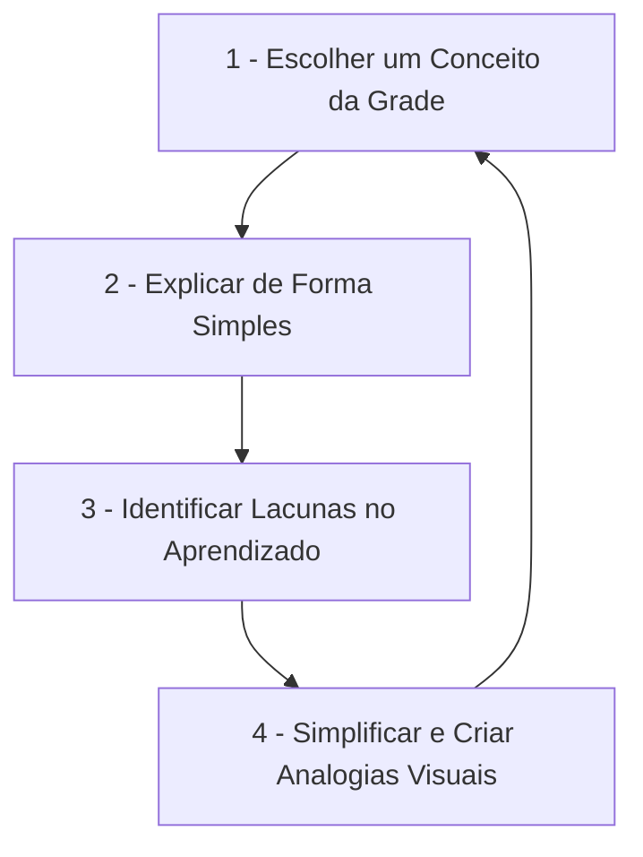

# Sobre mim e diretrizes do vault

> [!IMPORTANT] Instrução Obrigatória para Agentes de IA
> **ESTE ARQUIVO (mim.md) É DE LEITURA OBRIGATÓRIA PARA TODOS OS AGENTES DE IA.**
> Antes de criar, modificar, mover arquivos ou interagir com este vault, leia e siga rigorosamente as diretrizes e regras definidas neste documento.

Bem-vindo ao meu repositório de estudos acadêmicos da PUC Minas. Este espaço foi projetado para consolidar meu aprendizado no curso de Tecnologia em Análise e Desenvolvimento de Sistemas (ADS), combinando minha perspectiva de Designer com o Método Feynman de aprendizado ativo.

---

## Diretrizes e regras do vault (instruções para agentes de ia)

Todas as interações, criações de arquivos e edições no vault devem obedecer às seguintes regras:

1. **Registro de Histórico no `log.md` (Ordem Decrescente Obrigatória)**:
 * Toda criação, edição, movimentação ou exclusão de nota deve ser registrada imediatamente no arquivo `log.md` na raiz do vault.
 * As alterações mais recentes DEVEM ficar no topo da lista.

2. **Lint de Links Automatizado**:
 * Sempre rodar a verificação de integridade de links (linter) após criar, mover, renomear ou modificar arquivos no vault.
 * Garantir 0 links quebrados e 0 erros de sintaxe em tabelas.

3. **Capitalização Estrita em Português (Sentence Case)**:
 * Em TODOS os títulos de notas e cabeçalhos (`#`, `##`, `###`, `####`), apenas a primeira palavra deve ter a inicial maiúscula (ex: `## 1. Programação modular: conceitos de encapsulamento`).
 * Palavras subsequentes devem ser minúsculas, exceto se forem nomes próprios ou marcas de tecnologia (ex: `SQL`, `Python`, `Java`, `React`, `Git`, `Figma`, `VS Code`, `Node.js`, `API`, `JSON`, `PUC Minas`).

4. **Prevenção de Links Quebrados em Tabelas e Compatibilidade de WikiLinks**:
 * **Formato Geral Obrigatório**: Todos os WikiLinks devem incluir o caminho relativo da pasta e um rótulo de texto usando o pipe (ex: `[[pasta/subpasta/NomeDaNota\|Nome da Nota]]`). Nunca use links diretos sem rótulo.
 * **Fora de Tabelas**: Use o pipe simples (`|`) para separar o caminho e o rótulo.
 * **Dentro de Tabelas**: Use obrigatoriamente o pipe escapado (`\|`) para que o parser do Markdown não interprete o pipe do link como um separador de colunas.

5. **Método Feynman Obrigatório**:
 * Explicar conceitos técnicos através de analogias simples e intuitivas do mundo real (baseadas em design, Figma, vida cotidiana ou tecnologia acessível).
 * Esta regra é mandatória para todas as notas de anotação de aula ou resumos explicativos criados por IA neste vault.
 * Incluir uma seção de `## Resumo para memorizar` ao final de cada nota de conceito.

6. **Interconexão de Links (Cross-linking Exaustivo)**:
 * Ligar o máximo de artigos e conceitos possíveis a cada nova inserção de conteúdo. Toda vez que criar ou atualizar uma nota, garanta o máximo de links cruzados (WikiLinks) ativos com outros artigos do vault.

7. **Proibição Absoluta de Emojis**:
 * Nenhum emoji deve ser adicionado aos arquivos do vault (títulos, tabelas ou texto), mantendo a estética minimalista e textual.

8. **Estrutura Temporária de Pastas (Primeiro Período)**:
 * Atualmente, as matérias do primeiro período estão mantidas diretamente na raiz desta pasta `puc`.
 * Futuramente, essas matérias serão divididas e organizadas em pastas de períodos (ex: `1-periodo/`, `2-periodo/`). Agentes não devem mover essas pastas até que explicitamente solicitado pelo usuário.

---

## Perfil
* **Nome:** Leonardo Ruas Santos
* **Profissão:** Designer
* **Formação Acadêmica:**
 * Graduação em Comunicação (Publicidade)
 * Graduação em Design de Produto
 * MBA em Gestão de Negócios
 * Graduação em Tecnologia em Análise e Desenvolvimento de Sistemas - ADS (Ingressando no 2º semestre de 2026 na PUC Minas - EAD)
* **Superpoder:** Pensamento visual e visão de negócios. Consigo conectar código, experiência do usuário (UX/UI) e visão estratégica de produto.

---

## Grade curricular de estudos (1º período)

Atualmente estou cursando as seguintes disciplinas e microfundamentos no meu primeiro período:

1. **Programação Modular**
 * Estudo de modularidade, encapsulamento, reutilização de código e abstração.
2. **Modelagem de Dados**
 * Projeto conceitual, lógico e físico de banco de dados, diagramas entidade-relacionamento (DER).
3. **Manipulação de Dados com SQL**
 * Consultas DDL, DML, DQL e DCL em bancos de dados relacionais.
4. **Algoritmos e Estruturas de Dados**
 * Análise Big O, estruturas lineares e não lineares, busca e ordenação.
5. **Desenvolvimento Web Back-End**
 * APIs RESTful, requisições HTTP, rotas, persistência e arquitetura cliente-servidor.
6. **Projeto: Desenvolvimento de uma Aplicação Interativa**
 * Projeto prático integrando front-end, back-end e banco de dados.
7. **Engenharia de Requisitos de Software**
 * Elicitação, especificação (User Stories) e validação de escopo.
8. **Design de Interação**
 * Heurísticas de usabilidade (Nielsen), acessibilidade e arquitetura de informação.
9. **Fundamentos de Redes de Computadores**
 * Modelo OSI, pilha TCP/IP, roteamento e protocolos (DNS, HTTP, IP).
10. **Competências Comportamentais: Liderança**
 * Soft skills, comunicação assertiva, CNV e gestão de equipes.
11. **Desafios Contemporâneos: Sociedade, Diversidade e Ética**
 * Ética aplicada na tecnologia, acessibilidade digital e impactos sociais da IA.

---

## O método Feynman de estudo

O método consiste em aprender explicando um conceito complexo da forma mais simples possível, como se estivesse ensinando para um leigo.

> [!TIP] Dica de Renderização (Mermaid no Obsidian)
> Evite iniciar o texto de blocos do Mermaid com números seguidos de ponto (ex: `1.`), pois o parser do Obsidian tenta interpretá-los como listas de Markdown e retorna o erro `Unsupported markdown: list`. Prefira usar traços (ex: `1 -`).

1. **Escolha do tema:** Escolho um tópico (ex: JOINs no SQL ou complexidade Big O).
2. **Explicação Simples (Para uma "criança"):** Escrevo a explicação usando termos comuns, evitando jargões técnicos exagerados.
3. **Correção de Lacunas:** Se eu não conseguir explicar de forma simples, significa que não entendi bem. Volto aos microfundamentos da PUC para preencher essa lacuna.
4. **Analogias de Design:** Traduzo os conceitos abstratos de tecnologia em analogias visuais baseadas no meu dia a dia de design (Figma, layouts, fluxos de interface).
